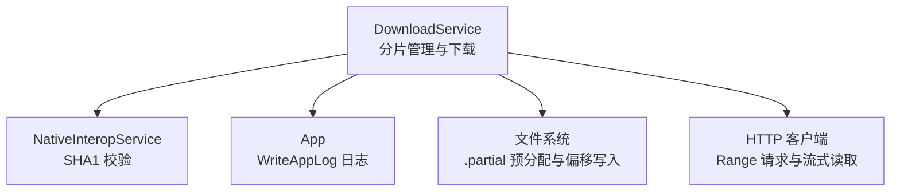
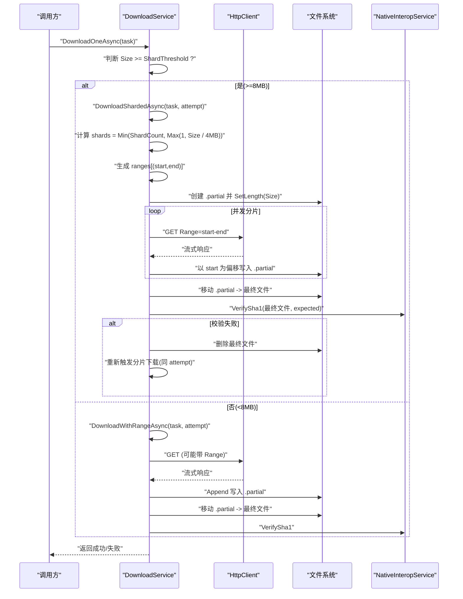
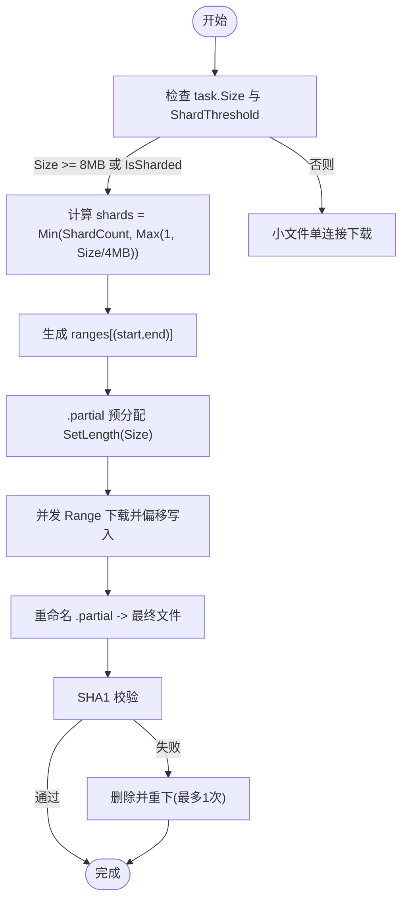
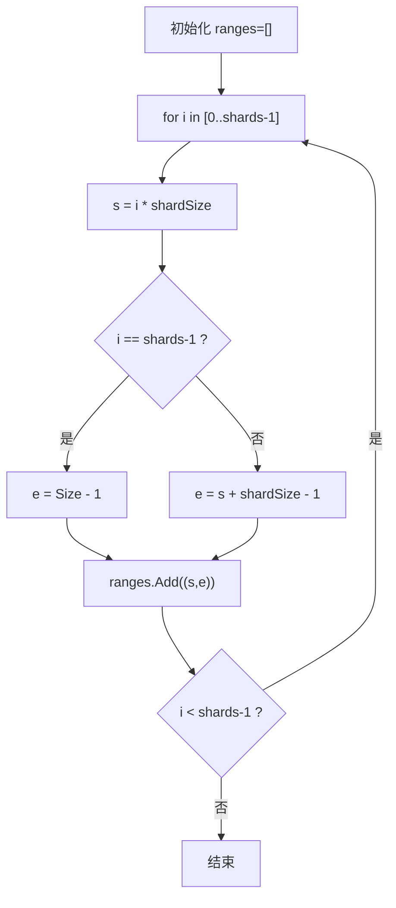
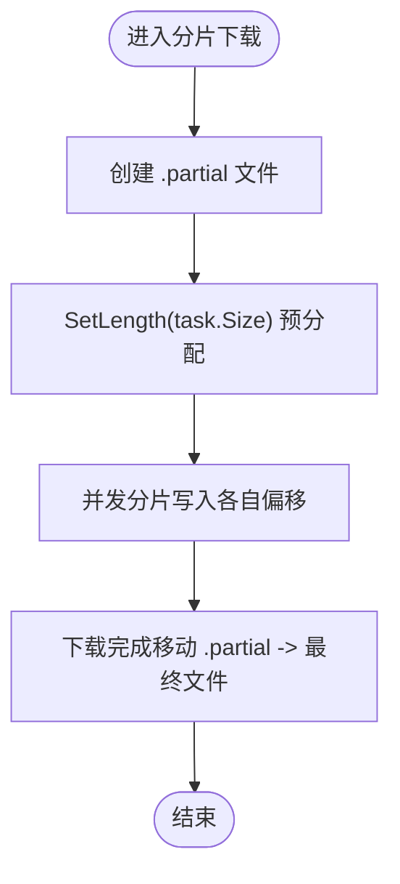
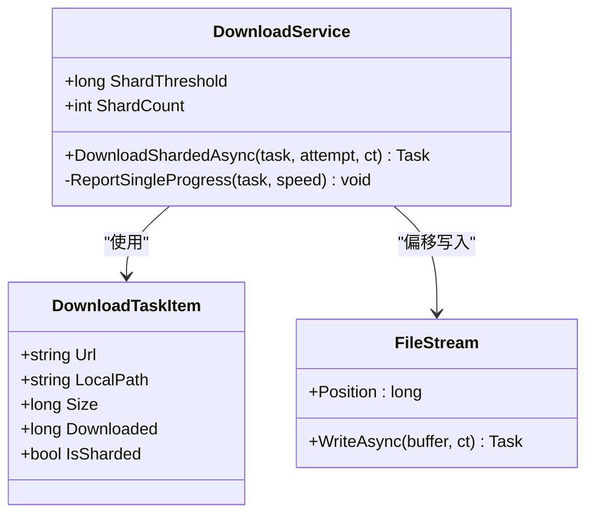
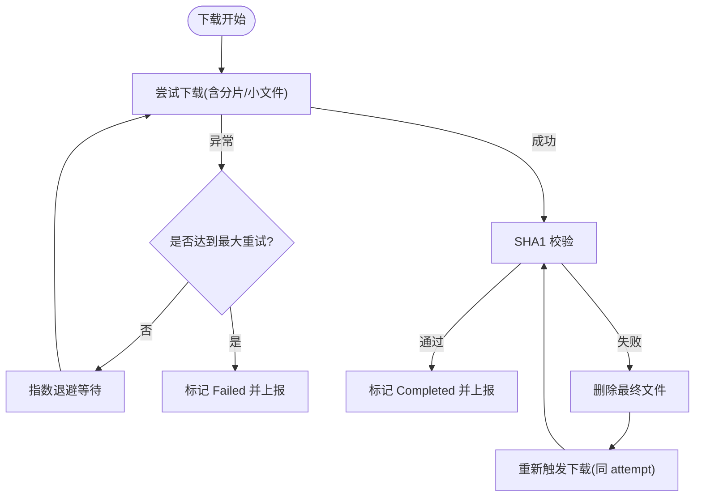
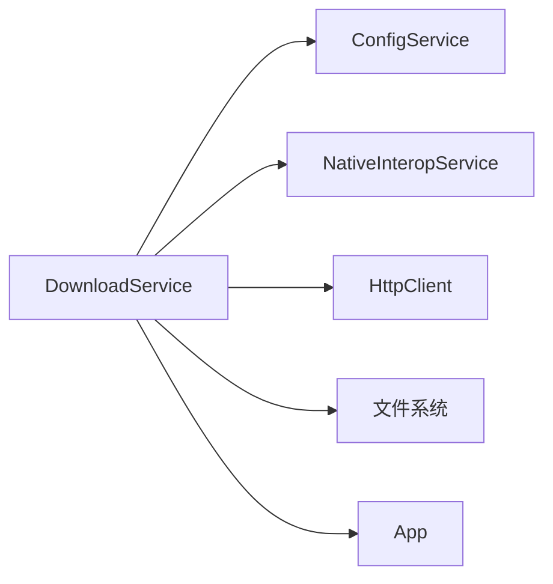

# 分片管理

<cite>
**本文引用的文件**   
- [DownloadService.cs](file://src/FufuLauncher/Services/DownloadService.cs)
- [NativeInteropService.cs](file://src/FufuLauncher/Services/NativeInteropService.cs)
- [App.xaml.cs](file://src/FufuLauncher/App.xaml.cs)
</cite>

## 目录
1. [简介](#简介)
2. [项目结构](#项目结构)
3. [核心组件](#核心组件)
4. [架构总览](#架构总览)
5. [详细组件分析](#详细组件分析)
6. [依赖关系分析](#依赖关系分析)
7. [性能考量](#性能考量)
8. [故障排查指南](#故障排查指南)
9. [结论](#结论)

## 简介
本文件聚焦于下载服务中的“分片管理”机制，系统性说明：
- 分片阈值判断逻辑（8MB）
- 分片数量的动态计算（基于文件大小与 ShardCount 配置）
- 分片范围 ranges 的生成算法
- .partial 临时文件的预分配机制（SetLength）
- 并发下载时的文件偏移定位
- 错误处理与恢复策略
- DownloadShardedAsync 方法中的关键计算与流程

## 项目结构
与分片管理直接相关的代码集中在下载服务与辅助服务中：
- 下载服务：负责任务调度、分片计算、并发下载、进度上报、校验与重试
- 原生交互服务：提供 SHA1 校验能力（优先 C++ 实现，失败回退托管实现）
- 应用入口：提供日志写入等基础设施



图表来源
- [DownloadService.cs:453-547](file://src/FufuLauncher/Services/DownloadService.cs#L453-L547)
- [NativeInteropService.cs:38-55](file://src/FufuLauncher/Services/NativeInteropService.cs#L38-L55)
- [App.xaml.cs:39-42](file://src/FufuLauncher/App.xaml.cs#L39-L42)

章节来源
- [DownloadService.cs:1-120](file://src/FufuLauncher/Services/DownloadService.cs#L1-L120)
- [NativeInteropService.cs:1-214](file://src/FufuLauncher/Services/NativeInteropService.cs#L1-L214)
- [App.xaml.cs:1-207](file://src/FufuLauncher/App.xaml.cs#L1-L207)

## 核心组件
- DownloadTaskItem：下载任务数据模型，包含 URL、本地路径、期望大小、已下载字节、状态、类别、是否分片等
- DownloadService：下载引擎，包含分片阈值、分片数量、并发信号量、全局进度统计、断点续传、SHA1 校验、重试与指数退避
- NativeInteropService：封装 C++ 哈希计算与 ZIP 操作，具备自动回退到托管实现的健壮性
- App：应用生命周期与日志基础设施

章节来源
- [DownloadService.cs:28-46](file://src/FufuLauncher/Services/DownloadService.cs#L28-L46)
- [DownloadService.cs:56-114](file://src/FufuLauncher/Services/DownloadService.cs#L56-L114)
- [NativeInteropService.cs:20-55](file://src/FufuLauncher/Services/NativeInteropService.cs#L20-L55)
- [App.xaml.cs:25-42](file://src/FufuLauncher/App.xaml.cs#L25-L42)

## 架构总览
分片下载的整体流程如下：
- 根据文件大小与阈值判断是否走分片路径
- 若进入分片路径，则计算分片数与每个分片的起止范围
- 预分配 .partial 文件，避免后续扩展带来的性能开销
- 并发发起 Range 请求，各分片按自身起始偏移写入 .partial
- 全部完成后重命名为最终文件，并进行 SHA1 校验；失败则删除并重下一次



图表来源
- [DownloadService.cs:295-366](file://src/FufuLauncher/Services/DownloadService.cs#L295-L366)
- [DownloadService.cs:453-547](file://src/FufuLauncher/Services/DownloadService.cs#L453-L547)
- [NativeInteropService.cs:38-55](file://src/FufuLauncher/Services/NativeInteropService.cs#L38-L55)

## 详细组件分析

### 分片阈值与分片数量计算
- 阈值：ShardThreshold 默认 8MB（8 * 1024 * 1024），当 task.Size >= 阈值或 IsSharded 时进入分片路径
- 分片数量：shards = Math.Min(ShardCount, (int)Math.Max(1, task.Size / (4L * 1024 * 1024)))，确保至少 1 个分片，且不超过配置的 ShardCount
- 分片大小：shardSize = task.Size / shards，最后一个分片补齐剩余字节



图表来源
- [DownloadService.cs:79-82](file://src/FufuLauncher/Services/DownloadService.cs#L79-L82)
- [DownloadService.cs:305-317](file://src/FufuLauncher/Services/DownloadService.cs#L305-L317)
- [DownloadService.cs:480-490](file://src/FufuLauncher/Services/DownloadService.cs#L480-L490)
- [DownloadService.cs:492-496](file://src/FufuLauncher/Services/DownloadService.cs#L492-L496)
- [DownloadService.cs:542-547](file://src/FufuLauncher/Services/DownloadService.cs#L542-L547)

章节来源
- [DownloadService.cs:79-82](file://src/FufuLauncher/Services/DownloadService.cs#L79-L82)
- [DownloadService.cs:305-317](file://src/FufuLauncher/Services/DownloadService.cs#L305-L317)
- [DownloadService.cs:480-490](file://src/FufuLauncher/Services/DownloadService.cs#L480-L490)

### 分片范围 ranges 的生成算法
- 对 i 从 0 到 shards-1：
  - start = i * shardSize
  - end = (i == shards-1) ? task.Size - 1 : (s + shardSize - 1)
- 保证所有分片覆盖 [0, Size-1]，无重叠、无遗漏



图表来源
- [DownloadService.cs:484-490](file://src/FufuLauncher/Services/DownloadService.cs#L484-L490)

章节来源
- [DownloadService.cs:484-490](file://src/FufuLauncher/Services/DownloadService.cs#L484-L490)

### .partial 临时文件的预分配机制
- 在分片下载前，使用 FileStream.Create 打开 .partial，并调用 SetLength(task.Size) 预先分配完整文件大小
- 优势：避免多次扩展导致的碎片化与系统调用开销，提升并发写入稳定性
- 小文件路径采用 Append 模式写入 .partial，最后统一重命名



图表来源
- [DownloadService.cs:492-496](file://src/FufuLauncher/Services/DownloadService.cs#L492-L496)
- [DownloadService.cs:447-450](file://src/FufuLauncher/Services/DownloadService.cs#L447-L450)

章节来源
- [DownloadService.cs:492-496](file://src/FufuLauncher/Services/DownloadService.cs#L492-L496)
- [DownloadService.cs:447-450](file://src/FufuLauncher/Services/DownloadService.cs#L447-L450)

### 并发下载的文件偏移定位机制
- 每个分片独立打开 .partial，设置 Position = start，确保写入不重叠
- 使用 FileShare.Write 允许其他分片同时写入不同区段
- 每分片内循环 ReadAsync/WriteAsync，累计 task.Downloaded 并上报全局进度



图表来源
- [DownloadService.cs:453-547](file://src/FufuLauncher/Services/DownloadService.cs#L453-L547)
- [DownloadService.cs:516-538](file://src/FufuLauncher/Services/DownloadService.cs#L516-L538)

章节来源
- [DownloadService.cs:453-547](file://src/FufuLauncher/Services/DownloadService.cs#L453-L547)
- [DownloadService.cs:516-538](file://src/FufuLauncher/Services/DownloadService.cs#L516-L538)

### DownloadShardedAsync 的分片计算与流程
- 获取 URL（支持源切换与降级）
- 若 Size 未知，执行 HEAD 请求获取 Content-Length
- 计算 shards 与 ranges
- 预分配 .partial
- 并发 Range 下载，偏移写入
- 完成后重命名并报告进度

```mermaid
sequenceDiagram
participant DS as "DownloadService"
participant HTTP as "HttpClient"
participant FS as "文件系统"
DS->>DS : "GetSourceUrl(url, attempt)"
alt Size <= 0
DS->>HTTP : "HEAD 请求获取 Content-Length"
HTTP-->>DS : "Content-Length"
end
DS->>DS : "shards = Min(ShardCount, Max(1, Size/4MB))"
DS->>DS : "生成 ranges"
DS->>FS : "Create .partial + SetLength(Size)"
par 并发分片
DS->>HTTP : "GET Range=start-end"
HTTP-->>DS : "流式响应"
DS->>FS : "Position=start; WriteAsync(...)"
end
DS->>FS : "Move .partial -> 最终文件"
DS-->>DS : "ReportSingleProgress"
```

图表来源
- [DownloadService.cs:453-547](file://src/FufuLauncher/Services/DownloadService.cs#L453-L547)

章节来源
- [DownloadService.cs:453-547](file://src/FufuLauncher/Services/DownloadService.cs#L453-L547)

### 错误处理与恢复策略
- 异常捕获与重试：外层 DownloadOneAsync 对异常进行捕获，记录日志并指数退避重试（默认 3 次）
- SHA1 校验失败：删除最终文件，重置 Downloaded=0，再次触发对应下载路径（分片或小文件）
- 取消与暂停：通过 CancellationToken 控制，更新任务状态为 Cancelled/Paused
- 网络容错：首字节超时保护（30s）、HttpClient 总超时（5min）、源切换（Mojang/BMCLAPI）



图表来源
- [DownloadService.cs:305-366](file://src/FufuLauncher/Services/DownloadService.cs#L305-L366)
- [DownloadService.cs:583-590](file://src/FufuLauncher/Services/DownloadService.cs#L583-L590)

章节来源
- [DownloadService.cs:305-366](file://src/FufuLauncher/Services/DownloadService.cs#L305-L366)
- [DownloadService.cs:583-590](file://src/FufuLauncher/Services/DownloadService.cs#L583-L590)

## 依赖关系分析
- DownloadService 依赖：
  - ConfigService：获取下载源配置（Mojang/BMCLAPI）
  - NativeInteropService：SHA1 校验（优先 C++，失败回退托管）
  - HttpClient：网络请求与流式读取
  - 文件系统：.partial 预分配、偏移写入、重命名
  - App：日志写入
- 耦合与内聚：
  - 分片逻辑集中在 DownloadService，职责清晰
  - 校验逻辑通过 NativeInteropService 解耦，具备可替换性与回退能力
  - 日志通过 App 集中管理，降低 IO 阻塞



图表来源
- [DownloadService.cs:56-114](file://src/FufuLauncher/Services/DownloadService.cs#L56-L114)
- [NativeInteropService.cs:38-55](file://src/FufuLauncher/Services/NativeInteropService.cs#L38-L55)
- [App.xaml.cs:39-42](file://src/FufuLauncher/App.xaml.cs#L39-L42)

章节来源
- [DownloadService.cs:56-114](file://src/FufuLauncher/Services/DownloadService.cs#L56-L114)
- [NativeInteropService.cs:38-55](file://src/FufuLauncher/Services/NativeInteropService.cs#L38-L55)
- [App.xaml.cs:39-42](file://src/FufuLauncher/App.xaml.cs#L39-L42)

## 性能考量
- 分片阈值 8MB：大文件自动分片，提升吞吐与并行度
- 分片大小 4MB：均衡分片粒度，避免过多小分片导致连接开销过大
- .partial 预分配：减少文件扩展的系统调用与碎片化
- 并发写入：各分片独立偏移写入，避免锁竞争
- 进度上报节流：200ms 级别上报，降低 UI 刷新压力
- 指数退避重试：缓解瞬时网络抖动

[本节为通用指导，不直接分析具体文件]

## 故障排查指南
- 磁盘空间不足：批量下载前会检查可用空间，预留 1GB 缓冲
- 无法获取文件大小：HEAD 请求失败将抛异常并跳过分片下载
- 服务端不支持断点续传：返回 200 而非 206 时，自动从头下载
- SHA1 校验失败：删除文件并重下一次，仍失败则标记失败
- 日志查看：通过 App.ReadAppLog() 获取 app.log 内容

章节来源
- [DownloadService.cs:222-261](file://src/FufuLauncher/Services/DownloadService.cs#L222-L261)
- [DownloadService.cs:469-478](file://src/FufuLauncher/Services/DownloadService.cs#L469-L478)
- [DownloadService.cs:410-416](file://src/FufuLauncher/Services/DownloadService.cs#L410-L416)
- [DownloadService.cs:583-590](file://src/FufuLauncher/Services/DownloadService.cs#L583-L590)
- [App.xaml.cs:62-73](file://src/FufuLauncher/App.xaml.cs#L62-L73)

## 结论
该分片管理机制通过明确的阈值判断、合理的分片数量计算、精确的范围生成与预分配策略，实现了高效稳定的大文件并发下载。结合断点续传、SHA1 校验、指数退避重试与源切换，整体具备较强的鲁棒性与可扩展性。建议在生产环境中根据实际网络与磁盘特性微调 ShardCount 与 ShardThreshold，以获得最佳吞吐与稳定性。