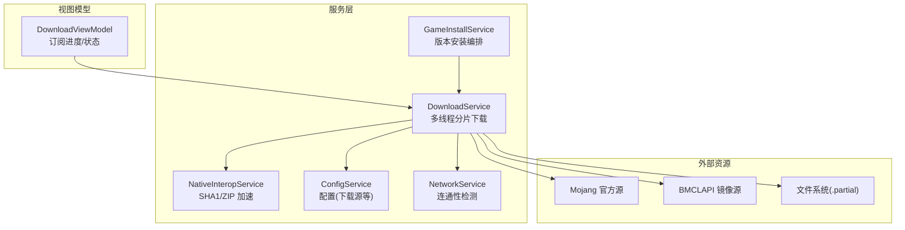
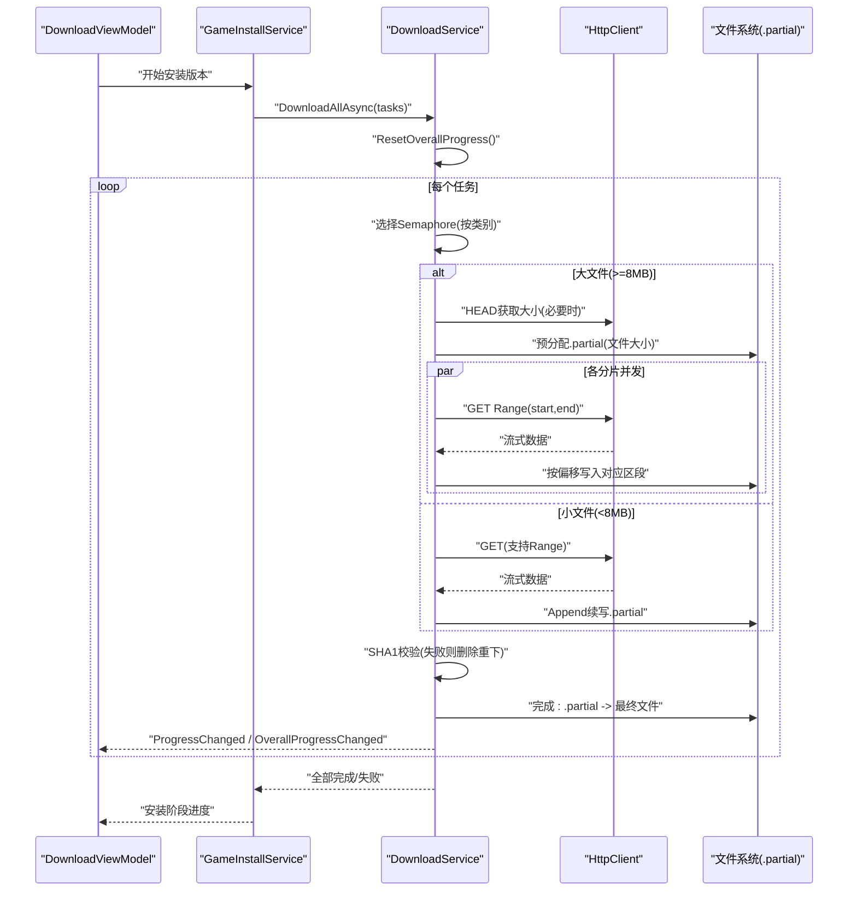
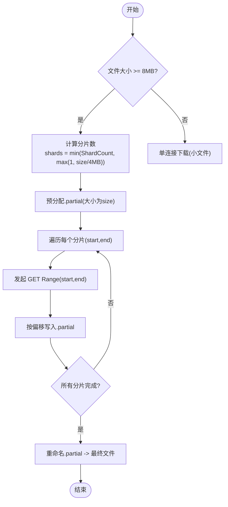
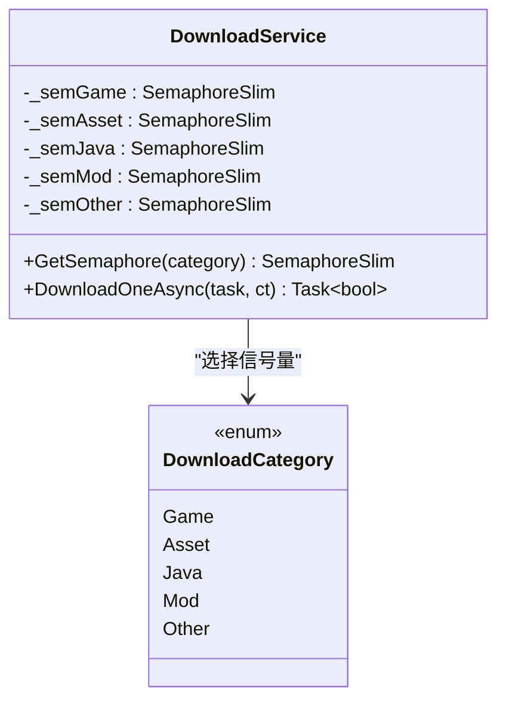
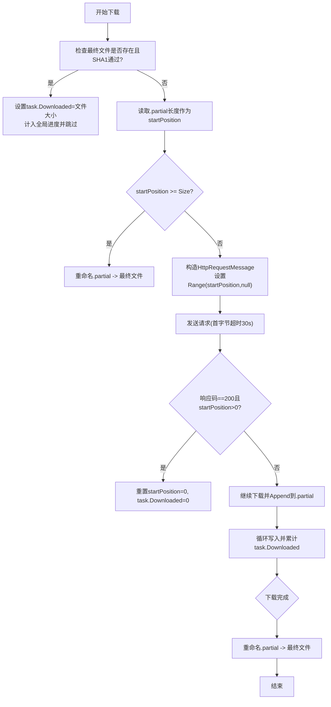
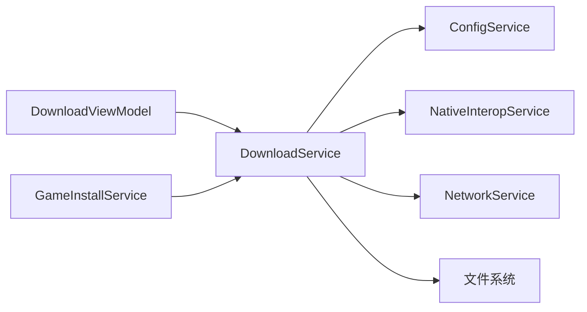

# 多线程分片下载引擎

<cite>
**本文引用的文件**   
- [DownloadService.cs](file://src/FufuLauncher/Services/DownloadService.cs)
- [GameInstallService.cs](file://src/FufuLauncher/Services/GameInstallService.cs)
- [NativeInteropService.cs](file://src/FufuLauncher/Services/NativeInteropService.cs)
- [ConfigService.cs](file://src/FufuLauncher/Services/ConfigService.cs)
- [NetworkService.cs](file://src/FufuLauncher/Services/NetworkService.cs)
- [DownloadViewModel.cs](file://src/FufuLauncher/ViewModels/DownloadViewModel.cs)
</cite>

## 目录
1. [简介](#简介)
2. [项目结构](#项目结构)
3. [核心组件](#核心组件)
4. [架构总览](#架构总览)
5. [详细组件分析](#详细组件分析)
6. [依赖关系分析](#依赖关系分析)
7. [性能考量与优化建议](#性能考量与优化建议)
8. [故障排查指南](#故障排查指南)
9. [结论](#结论)

## 简介
本文件为“可爱的芙芙”启动器的多线程分片下载引擎提供系统化、可落地的技术文档。重点覆盖：
- 分片下载的触发条件（>=8MB 自动分片）与分片数量计算逻辑
- 并发控制机制（基于 SemaphoreSlim 的类别隔离与独立队列互不阻塞）
- 断点续传实现（.partial 临时文件管理、已下载字节数记录、Range 请求）
- 进度跟踪机制（单文件字节级进度 + 全局总进度的双重报告系统）
- 大文件与小文件的差异化策略，以及分片并发写入的安全机制
- 性能优化建议与最佳实践

## 项目结构
下载相关代码集中在 Services 层，UI 通过 ViewModel 订阅事件进行展示；网络连通性检测由 NetworkService 提供；哈希校验通过 NativeInteropService 调用原生 DLL 或回退到托管实现。



图表来源
- [DownloadService.cs:56-114](file://src/FufuLauncher/Services/DownloadService.cs#L56-L114)
- [GameInstallService.cs:50-80](file://src/FufuLauncher/Services/GameInstallService.cs#L50-L80)
- [NativeInteropService.cs:20-55](file://src/FufuLauncher/Services/NativeInteropService.cs#L20-L55)
- [ConfigService.cs:13-48](file://src/FufuLauncher/Services/ConfigService.cs#L13-L48)
- [NetworkService.cs:18-33](file://src/FufuLauncher/Services/NetworkService.cs#L18-L33)

章节来源
- [DownloadService.cs:1-114](file://src/FufuLauncher/Services/DownloadService.cs#L1-L114)
- [GameInstallService.cs:1-80](file://src/FufuLauncher/Services/GameInstallService.cs#L1-L80)
- [NativeInteropService.cs:1-55](file://src/FufuLauncher/Services/NativeInteropService.cs#L1-L55)
- [ConfigService.cs:1-48](file://src/FufuLauncher/Services/ConfigService.cs#L1-L48)
- [NetworkService.cs:1-33](file://src/FufuLauncher/Services/NetworkService.cs#L1-L33)

## 核心组件
- DownloadTaskItem：描述单个下载任务（URL、本地路径、SHA1、大小、已下载字节、状态、重试次数、类别、是否分片）。
- DownloadProgressInfo：封装单文件或全局的进度信息（总量、已下载、速度、剩余时间、百分比）。
- DownloadService：下载引擎核心，负责分片/非分片下载、断点续传、并发控制、重试、校验、双进度上报。
- GameInstallService：安装流程编排，生成下载任务并驱动下载与修复。
- NativeInteropService：高性能 SHA1 计算与 ZIP 操作，失败时回退到托管实现。
- ConfigService：下载源（Mojang/BMCLAPI）、Java 镜像等配置。
- NetworkService：连通性检测（Mojang/BMCLAPI），辅助诊断。
- DownloadViewModel：订阅下载事件，更新 UI 子进度与全局总进度。

章节来源
- [DownloadService.cs:28-54](file://src/FufuLauncher/Services/DownloadService.cs#L28-L54)
- [DownloadService.cs:56-114](file://src/FufuLauncher/Services/DownloadService.cs#L56-L114)
- [GameInstallService.cs:50-80](file://src/FufuLauncher/Services/GameInstallService.cs#L50-L80)
- [NativeInteropService.cs:20-55](file://src/FufuLauncher/Services/NativeInteropService.cs#L20-L55)
- [ConfigService.cs:13-48](file://src/FufuLauncher/Services/ConfigService.cs#L13-L48)
- [NetworkService.cs:18-33](file://src/FufuLauncher/Services/NetworkService.cs#L18-L33)
- [DownloadViewModel.cs:90-129](file://src/FufuLauncher/ViewModels/DownloadViewModel.cs#L90-L129)

## 架构总览
下载引擎采用“按类别隔离并发 + 分片并发写入 + 断点续传 + 双进度上报”的设计。总体流程如下：



图表来源
- [DownloadService.cs:222-261](file://src/FufuLauncher/Services/DownloadService.cs#L222-L261)
- [DownloadService.cs:295-366](file://src/FufuLauncher/Services/DownloadService.cs#L295-L366)
- [DownloadService.cs:368-451](file://src/FufuLauncher/Services/DownloadService.cs#L368-L451)
- [DownloadService.cs:453-547](file://src/FufuLauncher/Services/DownloadService.cs#L453-L547)
- [GameInstallService.cs:83-120](file://src/FufuLauncher/Services/GameInstallService.cs#L83-L120)

## 详细组件分析

### 分片下载触发条件与分片数量计算
- 触发条件：当文件大小 >= 8MB（ShardThreshold = 8 * 1024 * 1024）时，自动进入分片下载模式；若初始未知大小但标记为 IsSharded，也会走分片路径。
- 分片数量计算：shards = min(ShardCount, max(1, fileSize / (4MB)))，确保至少 1 个分片，且不超过 ShardCount（默认 4）。
- 分片范围划分：将 [0, size-1] 均匀切分为 shards 段，最后一段补齐至末尾。



图表来源
- [DownloadService.cs:79-82](file://src/FufuLauncher/Services/DownloadService.cs#L79-L82)
- [DownloadService.cs:310-317](file://src/FufuLauncher/Services/DownloadService.cs#L310-L317)
- [DownloadService.cs:481-490](file://src/FufuLauncher/Services/DownloadService.cs#L481-L490)
- [DownloadService.cs:492-496](file://src/FufuLauncher/Services/DownloadService.cs#L492-L496)
- [DownloadService.cs:504-540](file://src/FufuLauncher/Services/DownloadService.cs#L504-L540)

章节来源
- [DownloadService.cs:79-82](file://src/FufuLauncher/Services/DownloadService.cs#L79-L82)
- [DownloadService.cs:310-317](file://src/FufuLauncher/Services/DownloadService.cs#L310-L317)
- [DownloadService.cs:481-490](file://src/FufuLauncher/Services/DownloadService.cs#L481-L490)

### 并发控制机制（类别隔离与独立队列）
- 使用 SemaphoreSlim 对任务类别进行隔离：Game、Asset、Java、Mod、Other 各自拥有独立的信号量，互不影响。
- 默认并发上限：Game=8、Asset=16、Java=4、Mod=4、Other=4。
- 任务执行前等待信号量，完成后释放，避免跨类别互相阻塞。



图表来源
- [DownloadService.cs:68-73](file://src/FufuLauncher/Services/DownloadService.cs#L68-L73)
- [DownloadService.cs:212-219](file://src/FufuLauncher/Services/DownloadService.cs#L212-L219)
- [DownloadService.cs:295-300](file://src/FufuLauncher/Services/DownloadService.cs#L295-L300)

章节来源
- [DownloadService.cs:68-73](file://src/FufuLauncher/Services/DownloadService.cs#L68-L73)
- [DownloadService.cs:212-219](file://src/FufuLauncher/Services/DownloadService.cs#L212-L219)
- [DownloadService.cs:295-300](file://src/FufuLauncher/Services/DownloadService.cs#L295-L300)

### 断点续传实现原理
- 临时文件：所有下载均写入 LocalPath + ".partial"，完成后再重命名为最终文件，保证原子性。
- 已下载字节记录：task.Downloaded 保存上次已下载字节数；若存在 .partial 且服务端不支持断点续传（返回 200 而非 206），则从头开始。
- Range 请求：小文件使用 Range(start, null) 续传；大文件分片使用 Range(start, end) 精确写入偏移。
- 幂等保护：若最终文件已存在且 SHA1 校验通过，直接跳过下载并计入全局进度。



图表来源
- [DownloadService.cs:368-451](file://src/FufuLauncher/Services/DownloadService.cs#L368-L451)
- [DownloadService.cs:453-547](file://src/FufuLauncher/Services/DownloadService.cs#L453-L547)

章节来源
- [DownloadService.cs:368-451](file://src/FufuLauncher/Services/DownloadService.cs#L368-L451)
- [DownloadService.cs:453-547](file://src/FufuLauncher/Services/DownloadService.cs#L453-L547)

### 进度跟踪机制（单文件 + 全局总进度）
- 单文件进度：ProgressChanged 事件，包含 TotalBytes、DownloadedBytes、SpeedBytesPerSec、EstimatedRemaining。
- 全局总进度：OverallProgressChanged 事件，聚合多批次下载累计字节，节流 150ms 上报，避免 UI 卡顿；下载完成强制触发一次。
- 进度上报时机：每写入一定缓冲后累计 deltaBytes，并调用 AddOverallDownloadedBytes(deltaBytes)。

```mermaid
sequenceDiagram
participant DS as "DownloadService"
participant VM as "DownloadViewModel"
DS->>VM : "ProgressChanged(单文件进度)"
DS->>DS : "AddOverallDownloadedBytes(delta)"
DS-->>VM : "OverallProgressChanged(全局总进度)"
Note over DS,VM : "节流150ms; 完成时强制触发"
```

图表来源
- [DownloadService.cs:84-97](file://src/FufuLauncher/Services/DownloadService.cs#L84-L97)
- [DownloadService.cs:134-169](file://src/FufuLauncher/Services/DownloadService.cs#L134-L169)
- [DownloadService.cs:428-451](file://src/FufuLauncher/Services/DownloadService.cs#L428-L451)
- [DownloadService.cs:549-560](file://src/FufuLauncher/Services/DownloadService.cs#L549-L560)
- [DownloadViewModel.cs:90-129](file://src/FufuLauncher/ViewModels/DownloadViewModel.cs#L90-L129)

章节来源
- [DownloadService.cs:84-97](file://src/FufuLauncher/Services/DownloadService.cs#L84-L97)
- [DownloadService.cs:134-169](file://src/FufuLauncher/Services/DownloadService.cs#L134-L169)
- [DownloadService.cs:428-451](file://src/FufuLauncher/Services/DownloadService.cs#L428-L451)
- [DownloadService.cs:549-560](file://src/FufuLauncher/Services/DownloadService.cs#L549-L560)
- [DownloadViewModel.cs:90-129](file://src/FufuLauncher/ViewModels/DownloadViewModel.cs#L90-L129)

### 大文件与小文件的不同下载策略
- 小文件（<8MB）：单连接下载，使用 Append 模式续写 .partial，简单高效。
- 大文件（>=8MB）：多 Range 分片并发下载，预分配 .partial 并按偏移写入，最大化吞吐。
- 大小未知处理：必要时 HEAD 请求获取 Content-Length；若无法获取则放弃分片。

章节来源
- [DownloadService.cs:368-451](file://src/FufuLauncher/Services/DownloadService.cs#L368-L451)
- [DownloadService.cs:453-547](file://src/FufuLauncher/Services/DownloadService.cs#L453-L547)

### 分片并发写入的安全机制
- 预分配 .partial 文件，各分片以 FileMode.Open + FileAccess.Write + FileShare.Write 打开，设置 Position=start，确保写入区间不重叠。
- 共享读、分区写，避免竞争；同时通过 lock(progressLock) 保护 task.Downloaded 累加与全局进度上报。

章节来源
- [DownloadService.cs:492-496](file://src/FufuLauncher/Services/DownloadService.cs#L492-L496)
- [DownloadService.cs:516-538](file://src/FufuLauncher/Services/DownloadService.cs#L516-L538)

### 失败重试与指数退避
- 每次下载尝试失败后，记录错误并重试，最多 MaxRetry 次（默认 3）。
- 指数退避：1s、2s、4s... 避免瞬时拥塞。
- SHA1 校验失败：删除文件并重下一次（沿用当前 attempt 的源降级策略）。

章节来源
- [DownloadService.cs:305-366](file://src/FufuLauncher/Services/DownloadService.cs#L305-L366)
- [DownloadService.cs:319-334](file://src/FufuLauncher/Services/DownloadService.cs#L319-L334)

### 下载源切换与容错
- 根据配置选择 Mojang 或 BMCLAPI；首次失败后自动降级到 BMCLAPI 国内镜像。
- 强制替换规则覆盖常见 Mojang 域名到 BMCLAPI。

章节来源
- [DownloadService.cs:171-210](file://src/FufuLauncher/Services/DownloadService.cs#L171-L210)
- [ConfigService.cs:13-48](file://src/FufuLauncher/Services/ConfigService.cs#L13-L48)

## 依赖关系分析
- DownloadService 依赖：
  - ConfigService：获取下载源配置
  - NativeInteropService：SHA1 校验
  - HttpClient：网络请求（带超时与连接限制）
  - 文件系统：读写 .partial 与最终文件
- GameInstallService 依赖 DownloadService 编排下载任务，并在需要时触发修复重下。
- DownloadViewModel 订阅 DownloadService 的事件，更新 UI。



图表来源
- [DownloadService.cs:56-114](file://src/FufuLauncher/Services/DownloadService.cs#L56-L114)
- [GameInstallService.cs:50-80](file://src/FufuLauncher/Services/GameInstallService.cs#L50-L80)
- [DownloadViewModel.cs:90-129](file://src/FufuLauncher/ViewModels/DownloadViewModel.cs#L90-L129)

章节来源
- [DownloadService.cs:56-114](file://src/FufuLauncher/Services/DownloadService.cs#L56-L114)
- [GameInstallService.cs:50-80](file://src/FufuLauncher/Services/GameInstallService.cs#L50-L80)
- [DownloadViewModel.cs:90-129](file://src/FufuLauncher/ViewModels/DownloadViewModel.cs#L90-L129)

## 性能考量与优化建议
- 并发度调优：
  - 根据网络带宽与磁盘 IO 调整各类别 Semaphore 上限（如 Asset=16 适合大量小资源）。
  - 大文件分片数 ShardCount 可根据服务器并发限制与客户端 CPU/IO 能力调整。
- 网络优化：
  - 保持 User-Agent 以避免限流；合理设置 HttpClient 超时与 MaxConnectionsPerServer。
  - 优先使用 BMCLAPI 国内镜像提升稳定性。
- 磁盘优化：
  - 预分配 .partial 减少碎片；使用异步 I/O（useAsync=true）提高吞吐。
  - 缓冲区大小 64KB 平衡内存与 IO 效率。
- 进度上报：
  - 节流 150ms 降低 UI 刷新频率，避免卡顿；完成时强制触发保证最终一致性。
- 校验与修复：
  - 下载完成后立即 SHA1 校验，失败自动重下，保障完整性。
  - 安装后二次校验缺失/损坏文件并自动修复。

[本节为通用指导，不直接分析具体文件]

## 故障排查指南
- 进度条不动：
  - 检查是否已正确 ResetOverallProgress 与 AddOverallTotalBytes；确认节流未阻止最终触发。
- 断点续传无效：
  - 确认服务端支持 Range（206）；若返回 200 会从头下载。
  - 检查 .partial 文件是否存在且大小与 task.Downloaded 一致。
- 下载失败频繁：
  - 查看指数退避日志；尝试切换下载源（Mojang/BMCLAPI）。
  - 检查磁盘空间不足（CheckDiskSpace 预留 1GB 缓冲）。
- SHA1 校验失败：
  - 确认 NativeInteropService 可用（DLL 缺失会回退托管实现）；检查文件路径与权限。

章节来源
- [DownloadService.cs:264-293](file://src/FufuLauncher/Services/DownloadService.cs#L264-L293)
- [DownloadService.cs:305-366](file://src/FufuLauncher/Services/DownloadService.cs#L305-L366)
- [DownloadService.cs:368-451](file://src/FufuLauncher/Services/DownloadService.cs#L368-L451)
- [NativeInteropService.cs:20-55](file://src/FufuLauncher/Services/NativeInteropService.cs#L20-L55)

## 结论
该多线程分片下载引擎通过类别隔离的并发控制、智能的分片策略、健壮的断点续传与双进度上报机制，实现了高吞吐、高可靠、用户体验友好的下载体验。结合源切换与自动降级、失败重试与指数退避、完整性校验与自动修复，整体具备较强的鲁棒性与可维护性。建议在大规模部署中持续监控并发度、网络延迟与磁盘 IO，按需调优参数以获得最佳性能。

[本节为总结性内容，不直接分析具体文件]