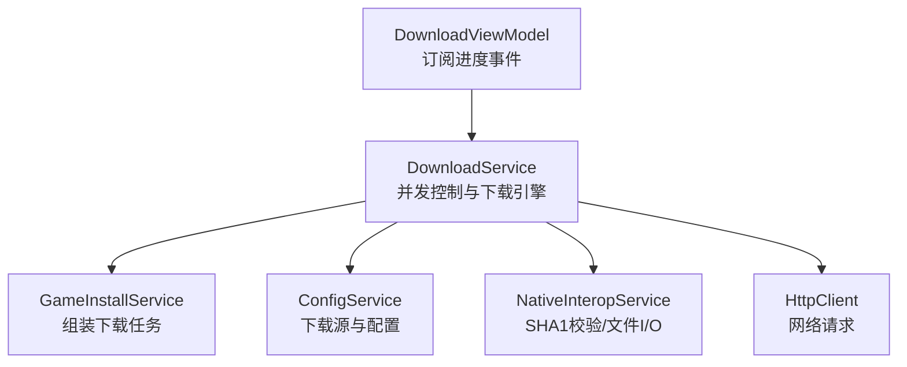
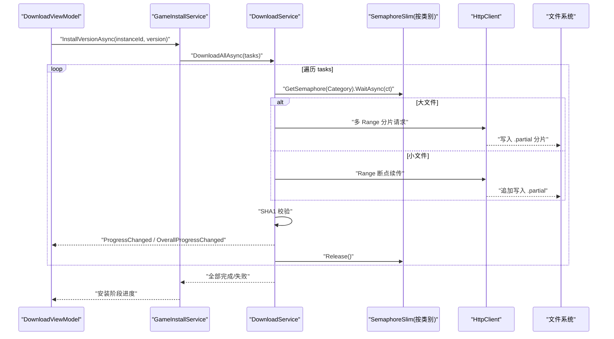
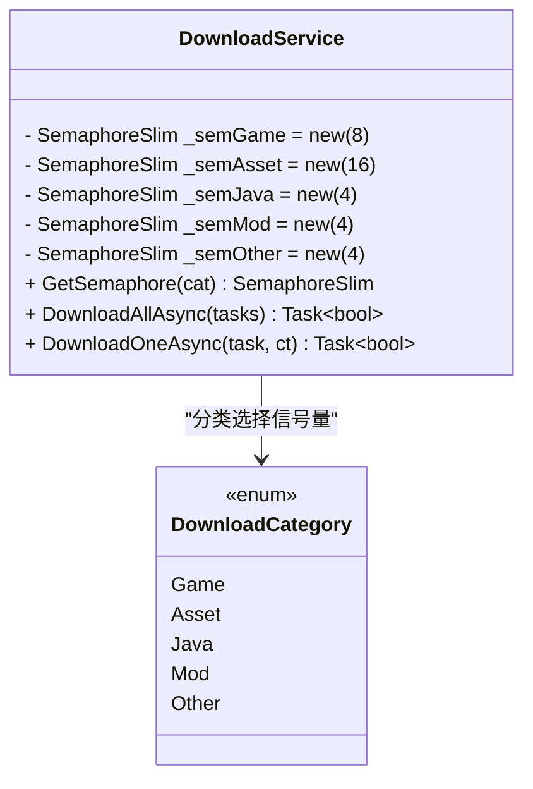
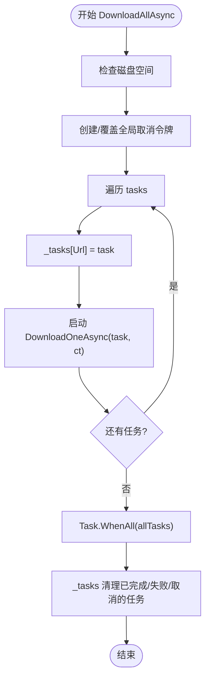
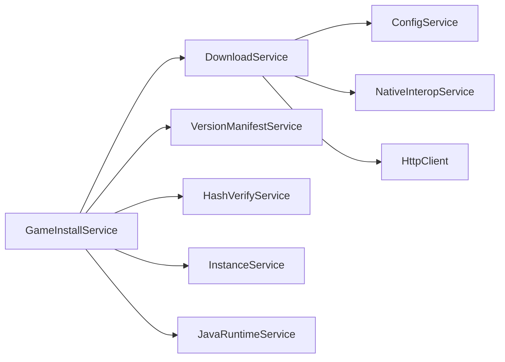

# 并发控制

<cite>
**本文引用的文件**   
- [DownloadService.cs](file://src/FufuLauncher/Services/DownloadService.cs)
- [GameInstallService.cs](file://src/FufuLauncher/Services/GameInstallService.cs)
- [ConfigService.cs](file://src/FufuLauncher/Services/ConfigService.cs)
- [NativeInteropService.cs](file://src/FufuLauncher/Services/NativeInteropService.cs)
- [DownloadViewModel.cs](file://src/FufuLauncher/ViewModels/DownloadViewModel.cs)
</cite>

## 目录
1. [简介](#简介)
2. [项目结构](#项目结构)
3. [核心组件](#核心组件)
4. [架构总览](#架构总览)
5. [详细组件分析](#详细组件分析)
6. [依赖关系分析](#依赖关系分析)
7. [性能考量](#性能考量)
8. [故障排查指南](#故障排查指南)
9. [结论](#结论)

## 简介
本文件聚焦于下载子系统在多线程环境下的并发控制实现，重点说明：
- 基于 DownloadCategory 的独立信号量管理（Game:8、Asset:16、Java:4、Mod:4、Other:4）
- 任务调度算法与队列管理机制，确保不同类别的下载任务互不阻塞
- 并发安全保证：线程安全的进度更新与文件操作
- 取消令牌 CancellationToken 的传递与任务中断机制
- GetSemaphore 方法的分类逻辑与 SemaphoreSlim 的正确使用（WaitAsync 与 Release 配对）
- _tasks 字典的线程安全访问（ConcurrentDictionary）
- 分片下载与断点续传策略对吞吐与稳定性的提升

## 项目结构
下载并发控制的核心位于 Services 层的 DownloadService，配合 GameInstallService 构建任务列表并调用批量下载；UI 层通过 DownloadViewModel 订阅进度事件。配置由 ConfigService 提供，文件校验与 I/O 加速由 NativeInteropService 提供。

图表来源
- [DownloadService.cs:56-114](file://src/FufuLauncher/Services/DownloadService.cs#L56-L114)
- [GameInstallService.cs:83-240](file://src/FufuLauncher/Services/GameInstallService.cs#L83-L240)
- [ConfigService.cs:13-48](file://src/FufuLauncher/Services/ConfigService.cs#L13-L48)
- [NativeInteropService.cs:38-73](file://src/FufuLauncher/Services/NativeInteropService.cs#L38-L73)

章节来源
- [DownloadService.cs:1-114](file://src/FufuLauncher/Services/DownloadService.cs#L1-L114)
- [GameInstallService.cs:1-240](file://src/FufuLauncher/Services/GameInstallService.cs#L1-L240)
- [ConfigService.cs:1-48](file://src/FufuLauncher/Services/ConfigService.cs#L1-L48)
- [NativeInteropService.cs:1-73](file://src/FufuLauncher/Services/NativeInteropService.cs#L1-L73)

## 核心组件
- DownloadTaskItem：描述单个下载任务（URL、本地路径、SHA1、大小、已下载字节、状态、重试次数、类别等）
- DownloadProgressInfo：单文件进度信息（总字节、已下载、速度、剩余时间）
- DownloadService：并发控制与下载引擎（信号量、分片下载、断点续传、重试、校验、全局进度）
- GameInstallService：根据版本清单生成下载任务，按类别标记（Game/Asset），并驱动下载流程
- ConfigService：提供下载源（Mojang/BMCLAPI）与相关配置
- NativeInteropService：高性能 SHA1 计算与 ZIP 解压打包（原生 DLL + 托管 fallback）

章节来源
- [DownloadService.cs:28-54](file://src/FufuLauncher/Services/DownloadService.cs#L28-L54)
- [DownloadService.cs:56-114](file://src/FufuLauncher/Services/DownloadService.cs#L56-L114)
- [GameInstallService.cs:123-240](file://src/FufuLauncher/Services/GameInstallService.cs#L123-L240)
- [ConfigService.cs:13-48](file://src/FufuLauncher/Services/ConfigService.cs#L13-L48)
- [NativeInteropService.cs:38-73](file://src/FufuLauncher/Services/NativeInteropService.cs#L38-L73)

## 架构总览
下载服务采用“按类别隔离并发”的策略：每个 DownloadCategory 拥有独立的 SemaphoreSlim，从而避免不同类别任务互相阻塞。任务进入 DownloadAllAsync 后，逐个启动 DownloadOneAsync，内部根据 Category 选择对应信号量进行 WaitAsync，完成后 Release。

图表来源
- [DownloadService.cs:222-261](file://src/FufuLauncher/Services/DownloadService.cs#L222-L261)
- [DownloadService.cs:295-366](file://src/FufuLauncher/Services/DownloadService.cs#L295-L366)
- [DownloadService.cs:369-451](file://src/FufuLauncher/Services/DownloadService.cs#L369-L451)
- [DownloadService.cs:454-547](file://src/FufuLauncher/Services/DownloadService.cs#L454-L547)
- [GameInstallService.cs:238-240](file://src/FufuLauncher/Services/GameInstallService.cs#L238-L240)

## 详细组件分析

### 基于 DownloadCategory 的独立信号量管理
- 类别枚举：Game、Asset、Java、Mod、Other
- 信号量实例：_semGame(8)、_semAsset(16)、_semJava(4)、_semMod(4)、_semOther(4)
- 获取逻辑：GetSemaphore(cat) 根据类别返回对应信号量，确保同类型任务共享同一并发限制，不同类型互不影响

图表来源
- [DownloadService.cs:69-73](file://src/FufuLauncher/Services/DownloadService.cs#L69-L73)
- [DownloadService.cs:212-219](file://src/FufuLauncher/Services/DownloadService.cs#L212-L219)

章节来源
- [DownloadService.cs:45](file://src/FufuLauncher/Services/DownloadService.cs#L45)
- [DownloadService.cs:69-73](file://src/FufuLauncher/Services/DownloadService.cs#L69-L73)
- [DownloadService.cs:212-219](file://src/FufuLauncher/Services/DownloadService.cs#L212-L219)

### 任务调度算法与队列管理机制
- 任务入队：DownloadAllAsync 将每个任务加入 _tasks（ConcurrentDictionary<string, DownloadTaskItem>），并启动 DownloadOneAsync
- 调度策略：无显式队列，采用“任务即协程”模式，通过信号量控制并发度
- 类别隔离：不同 Category 的任务各自等待对应信号量，互不阻塞
- 完成清理：当任务状态为 Completed/Failed/Cancelled 时从 _tasks 移除

图表来源
- [DownloadService.cs:222-261](file://src/FufuLauncher/Services/DownloadService.cs#L222-L261)

章节来源
- [DownloadService.cs:222-261](file://src/FufuLauncher/Services/DownloadService.cs#L222-L261)

### 并发安全保证
- 线程安全的任务集合：_tasks 使用 ConcurrentDictionary，支持多线程安全读写
- 线程安全的进度更新：
  - 单文件进度：ReportSingleProgress 触发 ProgressChanged 事件
  - 全局总进度：AddOverallDownloadedBytes 使用锁保护累计变量，节流上报，避免 UI 卡顿
- 文件操作安全：
  - 小文件：Append 写入 .partial，完成后原子重命名为最终文件
  - 大文件分片：预分配 .partial 文件，各分片按偏移写入，避免竞争
- 校验与修复：SHA1 校验失败删除并重下，最多一次额外重试

章节来源
- [DownloadService.cs:76](file://src/FufuLauncher/Services/DownloadService.cs#L76)
- [DownloadService.cs:140-169](file://src/FufuLauncher/Services/DownloadService.cs#L140-L169)
- [DownloadService.cs:369-451](file://src/FufuLauncher/Services/DownloadService.cs#L369-L451)
- [DownloadService.cs:454-547](file://src/FufuLauncher/Services/DownloadService.cs#L454-L547)
- [DownloadService.cs:584-590](file://src/FufuLauncher/Services/DownloadService.cs#L584-L590)

### 取消令牌的使用与任务中断机制
- 全局取消令牌：_cts 在每次 DownloadAllAsync 前覆盖，旧令牌先 Cancel，避免失控
- 传播方式：ct 贯穿 DownloadOneAsync、DownloadWithRangeAsync、DownloadShardedAsync
- 每请求超时：per-request CTS 设置 30 秒首字节超时，防止连接卡死
- 中断处理：捕获 OperationCanceledException，将任务状态置为 Cancelled 并返回 false

章节来源
- [DownloadService.cs:66](file://src/FufuLauncher/Services/DownloadService.cs#L66)
- [DownloadService.cs:240-243](file://src/FufuLauncher/Services/DownloadService.cs#L240-L243)
- [DownloadService.cs:295-366](file://src/FufuLauncher/Services/DownloadService.cs#L295-L366)
- [DownloadService.cs:405-406](file://src/FufuLauncher/Services/DownloadService.cs#L405-L406)
- [DownloadService.cs:472-474](file://src/FufuLauncher/Services/DownloadService.cs#L472-L474)
- [DownloadService.cs:511-512](file://src/FufuLauncher/Services/DownloadService.cs#L511-L512)

### GetSemaphore 方法与 SemaphoreSlim 使用
- 分类逻辑：GetSemaphore(cat) 根据 Category 返回对应信号量
- WaitAsync 与 Release 配对：DownloadOneAsync 中 await sem.WaitAsync(ct)，finally 块中 sem.Release()，确保异常路径也能释放
- 并发限制：
  - Game: 8
  - Asset: 16
  - Java: 4
  - Mod: 4
  - Other: 4

章节来源
- [DownloadService.cs:212-219](file://src/FufuLauncher/Services/DownloadService.cs#L212-L219)
- [DownloadService.cs:295-366](file://src/FufuLauncher/Services/DownloadService.cs#L295-L366)

### 分片下载与断点续传
- 阈值：>=8MB 自动分片（可配置 ShardThreshold），否则单连接 Range 下载
- 分片策略：根据文件大小计算分片数与范围，预分配 .partial 文件，并发写入不重叠区段
- 断点续传：优先读取 .partial 长度作为起始位置；若服务端不支持断点（返回 200），则从头开始
- 进度上报：每 200ms 计算速度并上报，避免频繁 UI 刷新

章节来源
- [DownloadService.cs:79-82](file://src/FufuLauncher/Services/DownloadService.cs#L79-L82)
- [DownloadService.cs:369-451](file://src/FufuLauncher/Services/DownloadService.cs#L369-L451)
- [DownloadService.cs:454-547](file://src/FufuLauncher/Services/DownloadService.cs#L454-L547)

### 全局总进度与节流
- 累计变量：_overallTotalBytes、_overallDownloadedBytes、_lastOverallReportBytes、_lastOverallReportMs
- 节流策略：150ms 内合并上报，下载完成强制触发，保证视觉平滑与最终一致性
- 事件：OverallProgressChanged 向 UI 推送总进度、速度与剩余时间

章节来源
- [DownloadService.cs:92-98](file://src/FufuLauncher/Services/DownloadService.cs#L92-L98)
- [DownloadService.cs:140-169](file://src/FufuLauncher/Services/DownloadService.cs#L140-L169)

### 下载源切换与降级
- 默认源：BMCLAPI（国内镜像）
- 降级策略：官方源失败后自动切换到 BMCLAPI，避免超时崩溃
- URL 替换：ForceBmclUrl 针对 Mojang 域名进行映射

章节来源
- [ConfigService.cs:16](file://src/FufuLauncher/Services/ConfigService.cs#L16)
- [DownloadService.cs:172-210](file://src/FufuLauncher/Services/DownloadService.cs#L172-L210)

### UI 集成与进度展示
- DownloadViewModel 订阅 ProgressChanged、OverallProgressChanged、TaskCompleted、TaskFailed
- 子进度条显示当前文件进度与速度，总进度条显示整体下载情况
- 安装阶段进度由 GameInstallService 的 ProgressChanged 驱动

章节来源
- [DownloadViewModel.cs:90-146](file://src/FufuLauncher/ViewModels/DownloadViewModel.cs#L90-L146)
- [GameInstallService.cs:446-455](file://src/FufuLauncher/Services/GameInstallService.cs#L446-L455)

## 依赖关系分析
- DownloadService 依赖：
  - ConfigService：下载源配置
  - NativeInteropService：SHA1 校验与 I/O 加速
  - HttpClient：网络请求
- GameInstallService 依赖：
  - VersionManifestService：版本清单解析
  - DownloadService：执行下载
  - HashVerifyService：校验（内部委托给 NativeInteropService）
  - InstanceService：实例目录管理
  - JavaRuntimeService：自动下载 Java 运行时

图表来源
- [DownloadService.cs:56-114](file://src/FufuLauncher/Services/DownloadService.cs#L56-L114)
- [GameInstallService.cs:69-80](file://src/FufuLauncher/Services/GameInstallService.cs#L69-L80)

章节来源
- [DownloadService.cs:56-114](file://src/FufuLauncher/Services/DownloadService.cs#L56-L114)
- [GameInstallService.cs:69-80](file://src/FufuLauncher/Services/GameInstallService.cs#L69-L80)

## 性能考量
- 分片并发：大文件分片提升吞吐，合理设置 ShardCount（默认 4）与 ShardThreshold（默认 8MB）
- 信号量隔离：不同类别独立并发限制，避免资源争用
- 节流上报：150ms 合并进度上报，降低 UI 压力
- 连接超时：per-request 30 秒首字节超时，防止慢连接占用资源
- 文件 I/O：异步流式读写，减少内存占用与阻塞

[本节为通用指导，无需引用具体文件]

## 故障排查指南
- 下载失败：
  - 检查网络与下载源（Mojang/BMCLAPI）
  - 查看日志中的重试次数与错误信息
  - 确认磁盘空间充足（CheckDiskSpace）
- 进度不更新：
  - 确认 OverallProgressChanged 是否被订阅
  - 检查节流逻辑与 TotalBytes 是否正确上报
- 文件校验失败：
  - 确认 SHA1 正确性（NativeInteropService.ComputeFileSHA1）
  - 删除损坏文件后重新下载
- 取消无效：
  - 检查 CancellationToken 是否正确传递
  - 确认 per-request CTS 未提前取消

章节来源
- [DownloadService.cs:264-293](file://src/FufuLauncher/Services/DownloadService.cs#L264-L293)
- [DownloadService.cs:340-366](file://src/FufuLauncher/Services/DownloadService.cs#L340-L366)
- [DownloadService.cs:584-590](file://src/FufuLauncher/Services/DownloadService.cs#L584-L590)

## 结论
该下载系统通过“按类别独立信号量”、“分片并发下载”、“断点续传”、“全局进度节流”以及“取消令牌贯穿”等机制，实现了高吞吐、强一致性与良好用户体验的并发控制。不同类别任务互不阻塞，关键数据结构与 I/O 操作均具备线程安全保障，适合在复杂网络环境下稳定运行。

[本节为总结，无需引用具体文件]