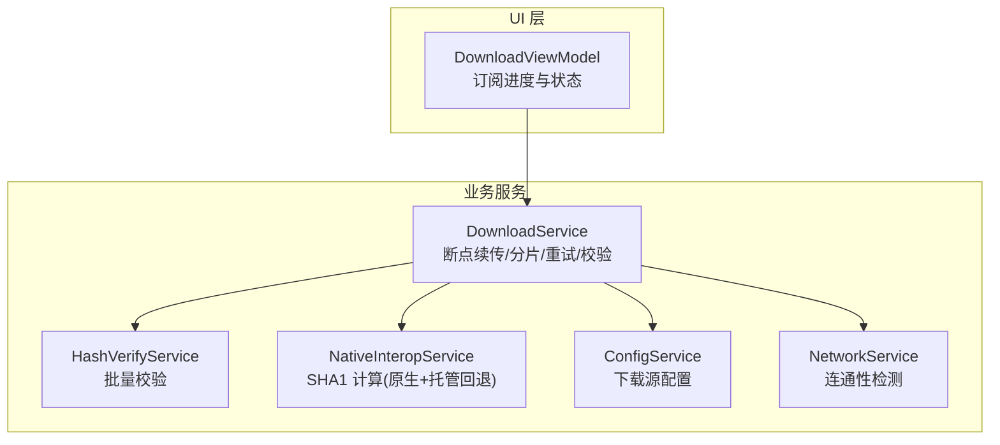
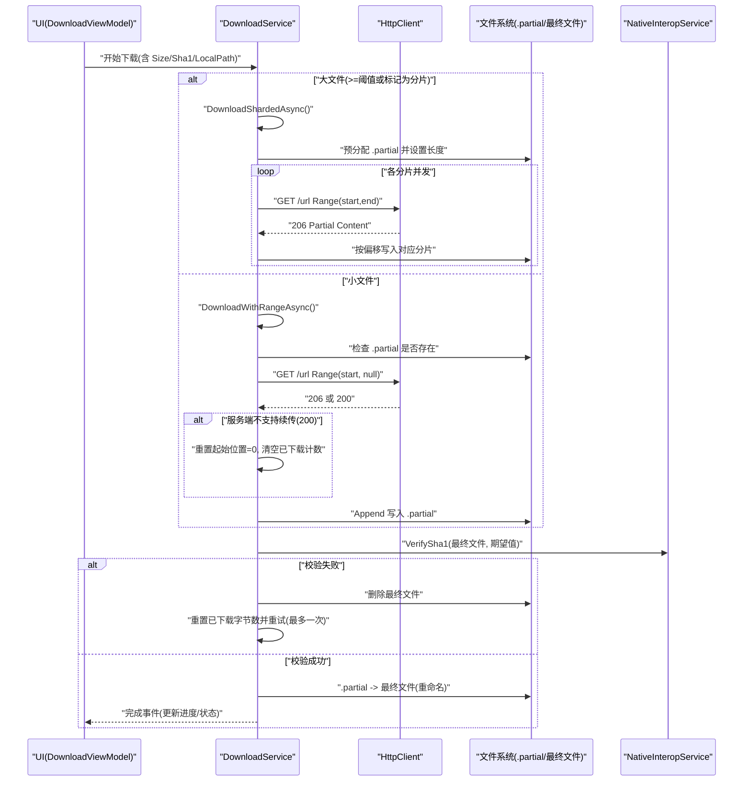
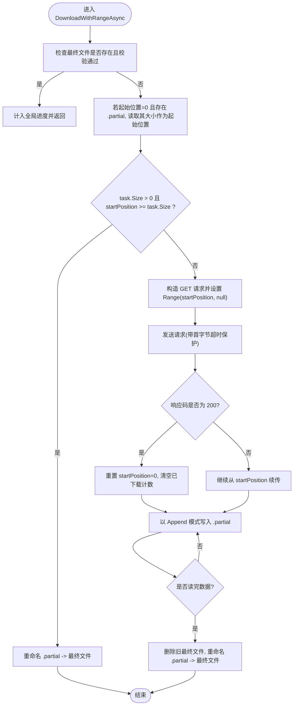
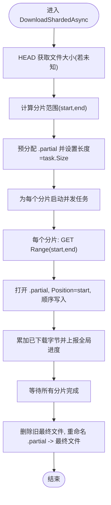
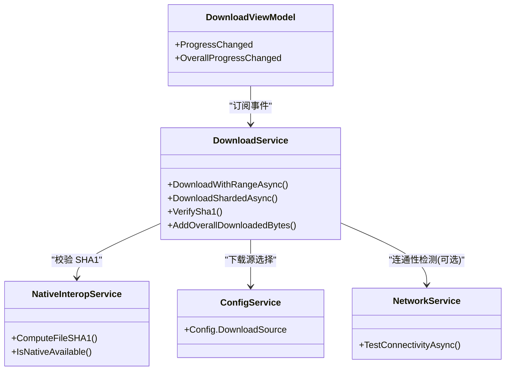

# 断点续传

<cite>
**本文引用的文件**   
- [DownloadService.cs](file://src/FufuLauncher/Services/DownloadService.cs)
- [NetworkService.cs](file://src/FufuLauncher/Services/NetworkService.cs)
- [HashVerifyService.cs](file://src/FufuLauncher/Services/HashVerifyService.cs)
- [NativeInteropService.cs](file://src/FufuLauncher/Services/NativeInteropService.cs)
- [ConfigService.cs](file://src/FufuLauncher/Services/ConfigService.cs)
- [DownloadViewModel.cs](file://src/FufuLauncher/ViewModels/DownloadViewModel.cs)
</cite>

## 目录
1. [简介](#简介)
2. [项目结构](#项目结构)
3. [核心组件](#核心组件)
4. [架构总览](#架构总览)
5. [详细组件分析](#详细组件分析)
6. [依赖关系分析](#依赖关系分析)
7. [性能考量](#性能考量)
8. [故障排查指南](#故障排查指南)
9. [结论](#结论)
10. [附录](#附录)

## 简介
本文件系统性说明下载服务中的断点续传实现原理与工程实践，覆盖以下要点：
- .partial 临时文件的管理策略、已下载字节数的记录与恢复机制
- HTTP Range 请求的使用与服务端兼容性处理（200 vs 206）
- 边界情况处理：文件损坏检测、重新下载逻辑与进度重置
- 断点信息的持久化与恢复策略（基于 .partial 与任务状态）
- DownloadWithRangeAsync 的断点续传流程详解
- 分片下载中的断点续传：预分配文件与偏移写入支持大文件续传
- VerifySha1 在断点续传中的作用与完整性保障

## 项目结构
与断点续传直接相关的代码集中在下载服务与校验服务中，UI 层通过事件订阅展示进度。关键文件如下：
- 下载服务：DownloadService.cs（多线程、分片、断点续传、重试、SHA1 校验）
- 网络连通检测：NetworkService.cs（可选，用于源可用性探测）
- 哈希校验服务：HashVerifyService.cs（批量校验与修复建议）
- 原生交互：NativeInteropService.cs（高性能 SHA1 计算与托管回退）
- 配置服务：ConfigService.cs（下载源选择等）
- UI 视图模型：DownloadViewModel.cs（订阅下载进度与状态）

图表来源
- [DownloadService.cs:1-592](file://src/FufuLauncher/Services/DownloadService.cs#L1-L592)
- [HashVerifyService.cs:1-85](file://src/FufuLauncher/Services/HashVerifyService.cs#L1-L85)
- [NativeInteropService.cs:1-214](file://src/FufuLauncher/Services/NativeInteropService.cs#L1-L214)
- [ConfigService.cs:1-148](file://src/FufuLauncher/Services/ConfigService.cs#L1-L148)
- [NetworkService.cs:1-95](file://src/FufuLauncher/Services/NetworkService.cs#L1-L95)
- [DownloadViewModel.cs:1-307](file://src/FufuLauncher/ViewModels/DownloadViewModel.cs#L1-L307)

章节来源
- [DownloadService.cs:1-592](file://src/FufuLauncher/Services/DownloadService.cs#L1-L592)
- [DownloadViewModel.cs:1-307](file://src/FufuLauncher/ViewModels/DownloadViewModel.cs#L1-L307)

## 核心组件
- DownloadTaskItem：描述单个下载任务（URL、本地路径、期望 SHA1、大小、已下载字节数、状态、类别、是否分片）。
- DownloadProgressInfo：单文件/全局进度信息（总字节、已下载字节、速度、剩余时间）。
- DownloadService：核心下载引擎，包含断点续传、分片并发、重试、SHA1 校验、全局进度统计。
- HashVerifyService：批量校验文件完整性，返回需重下列表。
- NativeInteropService：提供高性能 SHA1 计算（优先原生 DLL，失败回退到托管实现）。
- ConfigService：管理下载源（Mojang/BMCLAPI）等配置。
- NetworkService：探测官方源与镜像源的连通性与延迟。

章节来源
- [DownloadService.cs:28-114](file://src/FufuLauncher/Services/DownloadService.cs#L28-L114)
- [HashVerifyService.cs:13-85](file://src/FufuLauncher/Services/HashVerifyService.cs#L13-L85)
- [NativeInteropService.cs:20-74](file://src/FufuLauncher/Services/NativeInteropService.cs#L20-L74)
- [ConfigService.cs:13-48](file://src/FufuLauncher/Services/ConfigService.cs#L13-L48)
- [NetworkService.cs:18-95](file://src/FufuLauncher/Services/NetworkService.cs#L18-L95)

## 架构总览
下图展示了断点续传在主流程中的位置与交互关系，包括小文件单连接续传与大文件分片续传两条路径，以及 SHA1 校验与重试机制。

图表来源
- [DownloadService.cs:369-451](file://src/FufuLauncher/Services/DownloadService.cs#L369-L451)
- [DownloadService.cs:454-547](file://src/FufuLauncher/Services/DownloadService.cs#L454-L547)
- [NativeInteropService.cs:38-55](file://src/FufuLauncher/Services/NativeInteropService.cs#L38-L55)

## 详细组件分析

### DownloadWithRangeAsync 断点续传流程
- 起始位置确定：优先使用 task.Downloaded；若为 0 且存在 .partial，则以 .partial 文件大小作为起始位置。
- 幂等跳过：若最终文件已存在且 SHA1 校验通过，则直接视为已完成并计入全局进度。
- 已完成的处理：若 task.Size > 0 且 startPosition >= task.Size，则将 .partial 重命名为最终文件并结束。
- Range 请求构造：当 startPosition > 0 时设置 RangeHeaderValue(startPosition, null)。
- 服务端兼容：若返回 200（非 206），说明不支持断点续传，将起始位置重置为 0 并清空已下载计数，从头开始。
- 流式写入：以 Append 模式打开 .partial，循环读取响应流并写入，累计已下载字节并上报全局进度。
- 完成与重命名：下载完成后删除可能存在的最终文件，再将 .partial 重命名为最终文件。

图表来源
- [DownloadService.cs:369-451](file://src/FufuLauncher/Services/DownloadService.cs#L369-L451)

章节来源
- [DownloadService.cs:369-451](file://src/FufuLauncher/Services/DownloadService.cs#L369-L451)

### 分片下载中的断点续传（大文件）
- 阈值判断：当 task.Size >= ShardThreshold 或 IsSharded=true 时走分片路径。
- 获取总大小：若未知，先 HEAD 请求获取 Content-Length。
- 分片范围计算：根据 ShardCount 与文件大小计算每个分片的 start/end。
- 预分配 .partial：创建 .partial 文件并 SetLength(task.Size)，确保后续并发写入不重叠。
- 并发写入：每个分片独立发起 Range(start,end) 请求，以读写方式打开 .partial 并将 Position 设置为 start，顺序写入各自区间。
- 进度聚合：并发累加 task.Downloaded 并上报全局进度，节流控制频率。
- 完成与重命名：所有分片完成后删除旧最终文件，重命名 .partial 为最终文件。

图表来源
- [DownloadService.cs:454-547](file://src/FufuLauncher/Services/DownloadService.cs#L454-L547)

章节来源
- [DownloadService.cs:454-547](file://src/FufuLauncher/Services/DownloadService.cs#L454-L547)

### 断点续传的边界情况处理
- 文件损坏检测：下载完成后调用 VerifySha1 进行完整性校验；失败则删除最终文件、重置已下载字节数并重试一次。
- 重新下载逻辑：校验失败后自动触发重新下载（沿用当前 attempt 的源降级策略），避免重复无效下载。
- 进度重置机制：当服务端返回 200（不支持续传）时，重置 startPosition 与 task.Downloaded，保证从头开始。
- 磁盘空间检查：批量下载前校验可用空间，不足则提示用户并中止。
- 取消与暂停：通过 CancellationToken 与状态机控制任务生命周期，避免资源泄露。

章节来源
- [DownloadService.cs:319-334](file://src/FufuLauncher/Services/DownloadService.cs#L319-L334)
- [DownloadService.cs:391-416](file://src/FufuLauncher/Services/DownloadService.cs#L391-L416)
- [DownloadService.cs:264-293](file://src/FufuLauncher/Services/DownloadService.cs#L264-L293)
- [DownloadService.cs:568-581](file://src/FufuLauncher/Services/DownloadService.cs#L568-L581)

### 断点信息的持久化与恢复策略
- 临时文件策略：使用 .partial 后缀保存未完成的数据，避免污染最终文件；完成后再原子重命名。
- 已下载字节记录：task.Downloaded 反映内存中的累计字节；若重启后无外部持久化，则依赖 .partial 文件大小恢复起始位置。
- 恢复机制：每次进入下载流程时，若 startPosition=0 且存在 .partial，则以 .partial 长度作为起始位置继续下载。
- 幂等优化：若最终文件存在且校验通过，直接跳过下载并计入全局进度，提升重装/断点续传体验。

章节来源
- [DownloadService.cs:384-396](file://src/FufuLauncher/Services/DownloadService.cs#L384-L396)
- [DownloadService.cs:375-382](file://src/FufuLauncher/Services/DownloadService.cs#L375-L382)

### VerifySha1 的作用与完整性保障
- 作用：在下载完成后对最终文件进行 SHA1 校验，确保内容完整与一致性。
- 实现：优先调用原生 DLL 计算 SHA1（高性能），失败自动回退到托管实现（纯 .NET）。
- 集成：校验失败会删除最终文件并触发一次重新下载；成功后才重命名 .partial 为最终文件。

章节来源
- [DownloadService.cs:583-590](file://src/FufuLauncher/Services/DownloadService.cs#L583-L590)
- [NativeInteropService.cs:38-74](file://src/FufuLauncher/Services/NativeInteropService.cs#L38-L74)

### HTTP Range 请求与服务端兼容性（200 vs 206）
- Range 头设置：当 startPosition > 0 时设置 RangeHeaderValue(startPosition, null) 表示从指定位置继续。
- 服务端兼容：若服务器返回 200（而非 206），表明不支持断点续传，客户端自动降级为从头下载。
- 大小推断：当 task.Size 未知时，可从响应头 Content-Length 推断总大小，便于进度显示与分片计算。

章节来源
- [DownloadService.cs:399-420](file://src/FufuLauncher/Services/DownloadService.cs#L399-L420)

### UI 与进度展示
- 单文件进度：DownloadService.ProgressChanged 事件推送单文件字节级进度（总大小、已下载、速度、剩余时间）。
- 全局总进度：DownloadService.OverallProgressChanged 事件推送累计进度（多批次合并），解决“进度不跑动”问题。
- 视图模型订阅：DownloadViewModel 订阅上述事件，更新界面显示（子进度条、总进度、速度、状态文本）。

章节来源
- [DownloadService.cs:85-98](file://src/FufuLauncher/Services/DownloadService.cs#L85-L98)
- [DownloadService.cs:117-169](file://src/FufuLauncher/Services/DownloadService.cs#L117-L169)
- [DownloadViewModel.cs:90-146](file://src/FufuLauncher/ViewModels/DownloadViewModel.cs#L90-L146)

## 依赖关系分析
- DownloadService 依赖：
  - NativeInteropService：SHA1 计算（原生优先，托管回退）
  - ConfigService：下载源切换（Mojang/BMCLAPI）
  - NetworkService：可选连通性检测（辅助诊断）
  - 文件系统：.partial 临时文件与最终文件的创建、写入、重命名
- 耦合与内聚：
  - 下载逻辑与校验逻辑解耦（通过接口方法调用）
  - 分片与小文件路径清晰分离，职责单一
  - 全局进度统计与单文件进度统计互不干扰

图表来源
- [DownloadService.cs:369-590](file://src/FufuLauncher/Services/DownloadService.cs#L369-L590)
- [NativeInteropService.cs:38-74](file://src/FufuLauncher/Services/NativeInteropService.cs#L38-L74)
- [ConfigService.cs:13-48](file://src/FufuLauncher/Services/ConfigService.cs#L13-L48)
- [NetworkService.cs:34-76](file://src/FufuLauncher/Services/NetworkService.cs#L34-L76)
- [DownloadViewModel.cs:90-146](file://src/FufuLauncher/ViewModels/DownloadViewModel.cs#L90-L146)

章节来源
- [DownloadService.cs:369-590](file://src/FufuLauncher/Services/DownloadService.cs#L369-L590)
- [NativeInteropService.cs:38-74](file://src/FufuLauncher/Services/NativeInteropService.cs#L38-L74)
- [ConfigService.cs:13-48](file://src/FufuLauncher/Services/ConfigService.cs#L13-L48)
- [NetworkService.cs:34-76](file://src/FufuLauncher/Services/NetworkService.cs#L34-L76)
- [DownloadViewModel.cs:90-146](file://src/FufuLauncher/ViewModels/DownloadViewModel.cs#L90-L146)

## 性能考量
- 分片并发：大文件按分片并发下载，显著提升吞吐；分片数量受 ShardCount 与文件大小限制。
- 流式写入：采用异步流式读写，减少内存占用与阻塞。
- 进度节流：全局进度事件节流（约 150ms），降低 UI 刷新开销。
- 原生加速：SHA1 计算优先使用原生 DLL，失败自动回退托管实现，兼顾性能与稳定性。
- 连接限制：HttpClientHandler 设置 MaxConnectionsPerServer，避免过多连接导致拥塞。

[本节为通用指导，不直接分析具体文件]

## 故障排查指南
- 常见问题定位：
  - 服务端不支持断点续传（返回 200）：客户端自动降级为从头下载，无需人工干预。
  - 校验失败：查看日志与 VerifySha1 结果，确认是否需要重新下载。
  - 磁盘空间不足：批量下载前会检查可用空间，不足时提示用户清理。
  - 网络不可用：使用 NetworkService 测试官方源与镜像源连通性。
- 调试建议：
  - 观察 .partial 文件是否存在与大小变化，确认续传是否生效。
  - 关注 DownloadService 的事件输出（ProgressChanged、OverallProgressChanged、TaskCompleted、TaskFailed）。
  - 检查 ConfigService 的下载源配置是否正确。

章节来源
- [DownloadService.cs:319-334](file://src/FufuLauncher/Services/DownloadService.cs#L319-L334)
- [DownloadService.cs:264-293](file://src/FufuLauncher/Services/DownloadService.cs#L264-L293)
- [NetworkService.cs:34-76](file://src/FufuLauncher/Services/NetworkService.cs#L34-L76)

## 结论
本实现通过 .partial 临时文件、Range 请求、SHA1 校验与分片并发，构建了稳健的断点续传体系。其对 200/206 的兼容、失败重试与完整性校验，确保了在网络波动或服务端差异下的稳定下载体验。UI 层通过事件订阅提供实时进度反馈，整体架构清晰、可扩展性强。

[本节为总结，不直接分析具体文件]

## 附录
- 术语说明：
  - .partial：未完成的临时文件，用于断点续传
  - Range 请求：HTTP 协议中用于部分内容的请求方式
  - 分片下载：将大文件切分为多个片段并发下载
  - SHA1 校验：用于验证文件完整性与一致性

[本节为概念性说明，不直接分析具体文件]