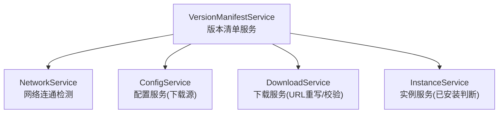
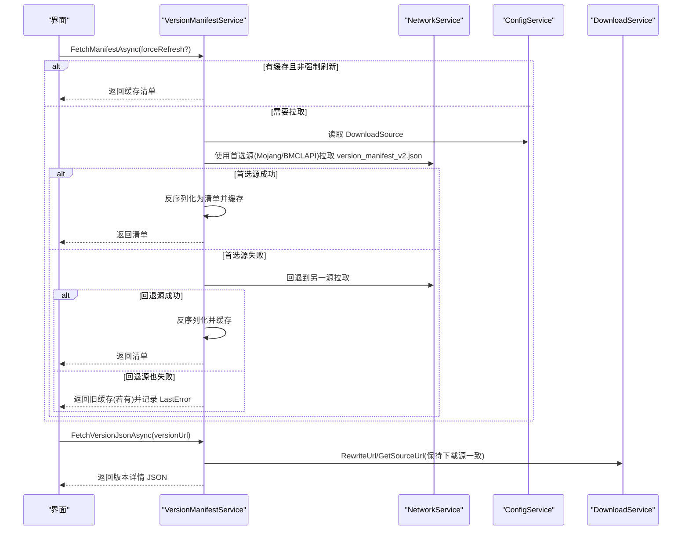
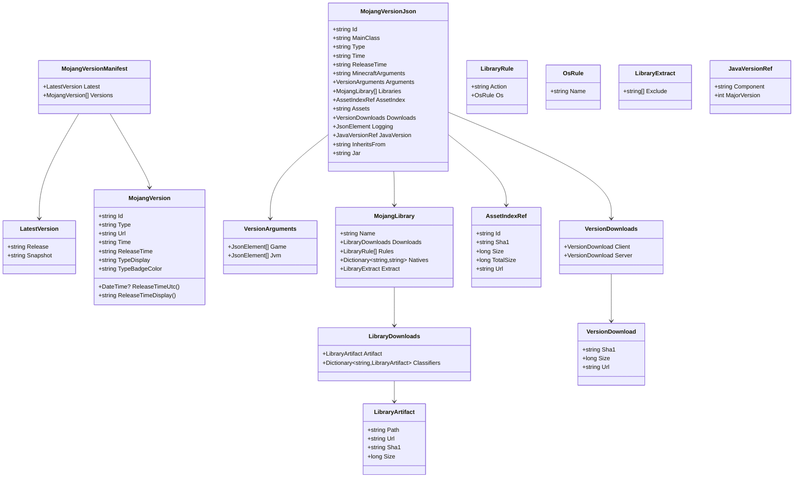
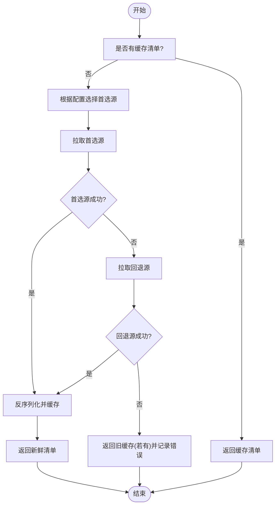
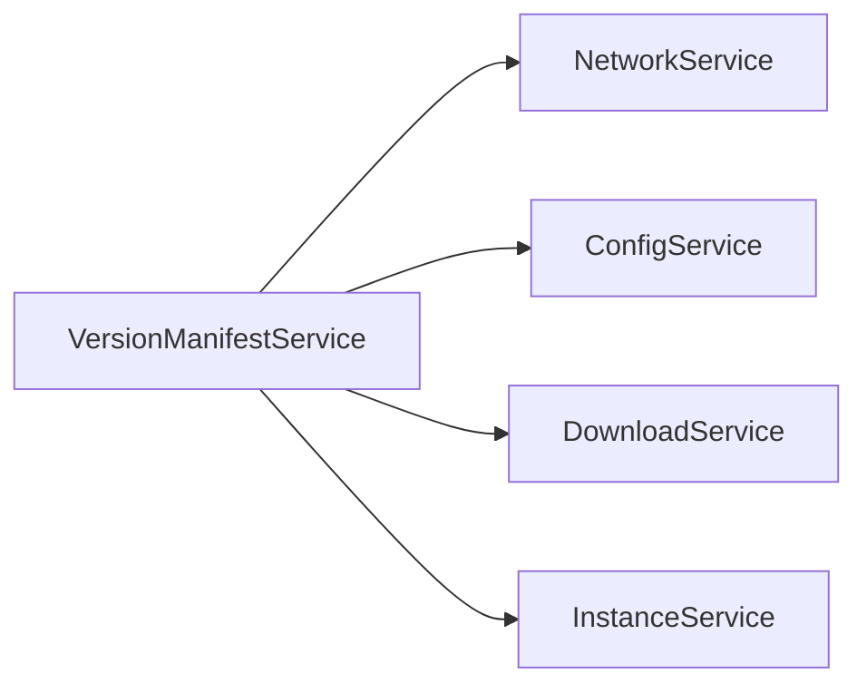

# 版本清单服务

<cite>
**本文引用的文件**   
- [VersionManifestService.cs](file://src/FufuLauncher/Services/VersionManifestService.cs)
- [NetworkService.cs](file://src/FufuLauncher/Services/NetworkService.cs)
- [ConfigService.cs](file://src/FufuLauncher/Services/ConfigService.cs)
- [DownloadService.cs](file://src/FufuLauncher/Services/DownloadService.cs)
- [InstanceService.cs](file://src/FufuLauncher/Services/InstanceService.cs)
</cite>

## 目录
1. [简介](#简介)
2. [项目结构](#项目结构)
3. [核心组件](#核心组件)
4. [架构总览](#架构总览)
5. [详细组件分析](#详细组件分析)
6. [依赖关系分析](#依赖关系分析)
7. [性能考量](#性能考量)
8. [故障排查指南](#故障排查指南)
9. [结论](#结论)
10. [附录](#附录)

## 简介
本文件为“可爱的芙芙启动器”的版本清单服务提供完整技术文档，覆盖以下目标：
- 官方版本清单 API 的调用与解析机制（含国内镜像回退）
- 版本信息的内存缓存策略与更新时间戳
- 版本兼容性检查与依赖关系解析（库、资源索引、Java 版本要求等）
- 版本列表过滤与排序（正式版/快照/Beta/Alpha 区分）
- 版本下载链接生成与校验（URL 重写、SHA1 校验、断点续传）
- 扩展接口与自定义版本源支持建议

## 项目结构
版本清单相关能力集中在 Services 层，关键文件如下：
- VersionManifestService.cs：Mojang 版本清单拉取、解析、缓存、搜索与筛选
- NetworkService.cs：网络连通性检测与元数据端点常量
- ConfigService.cs：配置项（如下载源 BMCLAPI/Mojang）持久化
- DownloadService.cs：下载引擎（URL 重写规则、分片下载、SHA1 校验）
- InstanceService.cs：实例管理（用于判断版本是否已安装）

图表来源
- [VersionManifestService.cs:172-338](file://src/FufuLauncher/Services/VersionManifestService.cs#L172-L338)
- [NetworkService.cs:18-33](file://src/FufuLauncher/Services/NetworkService.cs#L18-L33)
- [ConfigService.cs:81-148](file://src/FufuLauncher/Services/ConfigService.cs#L81-L148)
- [DownloadService.cs:56-210](file://src/FufuLauncher/Services/DownloadService.cs#L56-L210)
- [InstanceService.cs:51-116](file://src/FufuLauncher/Services/InstanceService.cs#L51-L116)

章节来源
- [VersionManifestService.cs:1-338](file://src/FufuLauncher/Services/VersionManifestService.cs#L1-L338)
- [NetworkService.cs:1-95](file://src/FufuLauncher/Services/NetworkService.cs#L1-L95)
- [ConfigService.cs:1-148](file://src/FufuLauncher/Services/ConfigService.cs#L1-L148)
- [DownloadService.cs:1-592](file://src/FufuLauncher/Services/DownloadService.cs#L1-L592)
- [InstanceService.cs:1-253](file://src/FufuLauncher/Services/InstanceService.cs#L1-L253)

## 核心组件
- MojangVersionManifest / LatestVersion / MojangVersion：版本清单根结构与版本条目模型
- MojangVersionJson：具体版本的详细清单（主类、参数、库、资源索引、下载信息、Java 版本要求、继承关系等）
- VersionManifestService：对外暴露清单获取、解析、缓存、搜索、筛选、已安装判断等方法
- NetworkService：定义 Mojang 与 BMCLAPI 元数据端点并提供连通性检测
- ConfigService：提供 DownloadSource 等配置项，控制首选源与 URL 重写行为
- DownloadService：提供 GetSourceUrl 与 ForceBmclUrl 规则，确保下载阶段与清单阶段的 URL 重写一致
- InstanceService：提供实例集合，供 IsVersionInstalled 判断某版本是否已安装

章节来源
- [VersionManifestService.cs:16-171](file://src/FufuLauncher/Services/VersionManifestService.cs#L16-L171)
- [VersionManifestService.cs:172-338](file://src/FufuLauncher/Services/VersionManifestService.cs#L172-L338)
- [NetworkService.cs:18-33](file://src/FufuLauncher/Services/NetworkService.cs#L18-L33)
- [ConfigService.cs:13-79](file://src/FufuLauncher/Services/ConfigService.cs#L13-L79)
- [DownloadService.cs:171-210](file://src/FufuLauncher/Services/DownloadService.cs#L171-L210)
- [InstanceService.cs:27-49](file://src/FufuLauncher/Services/InstanceService.cs#L27-L49)

## 架构总览
版本清单服务通过双源策略（Mojang 官方与 BMCLAPI 国内镜像）保障可用性；在内存中维护最近一次拉取的清单与时间戳；按配置选择首选源并自动回退；对版本 JSON 进行结构化解析，便于后续下载与依赖解析。

图表来源
- [VersionManifestService.cs:205-292](file://src/FufuLauncher/Services/VersionManifestService.cs#L205-L292)
- [NetworkService.cs:31-33](file://src/FufuLauncher/Services/NetworkService.cs#L31-L33)
- [ConfigService.cs:13-79](file://src/FufuLauncher/Services/ConfigService.cs#L13-L79)
- [DownloadService.cs:171-210](file://src/FufuLauncher/Services/DownloadService.cs#L171-L210)

## 详细组件分析

### 版本清单拉取与解析
- 拉取流程
  - 优先根据配置选择首选源（BMCLAPI 或 Mojang），设置短超时以快速失败回退
  - 成功则反序列化为 MojangVersionManifest，更新内存缓存与时间戳
  - 失败则尝试另一源；若仍失败，返回旧缓存并记录 LastError
- 解析模型
  - 清单包含 latest.release/snapshot 与 versions 列表
  - 每个版本条目包含 id、type、url、time、releaseTime 等字段
  - 版本详情包含 mainClass、arguments、libraries、assetIndex、downloads、javaVersion、inheritsFrom 等

图表来源
- [VersionManifestService.cs:16-171](file://src/FufuLauncher/Services/VersionManifestService.cs#L16-L171)

章节来源
- [VersionManifestService.cs:16-171](file://src/FufuLauncher/Services/VersionManifestService.cs#L16-L171)

### 缓存策略与更新时间戳
- 内存缓存
  - CachedManifest：保存最近一次拉取的清单对象
  - CachedManifestUtc：记录拉取时间（UTC），供 UI 显示“最后更新于”
  - ClearCache：清空缓存，切换下载源后确保下次拉取走新源
- 缓存命中
  - 非强制刷新且有缓存时直接返回，避免重复网络请求
- 失败降级
  - 网络全失败时返回旧缓存（不阻塞 UI），同时 LastError 提示用户

章节来源
- [VersionManifestService.cs:172-255](file://src/FufuLauncher/Services/VersionManifestService.cs#L172-L255)

### 版本兼容性检查与依赖关系解析
- 版本详情关键字段
  - mainClass：游戏主类名
  - arguments：JVM 与游戏参数（game/jvm）
  - libraries：依赖库列表（含 classifiers、natives、extract 规则）
  - assetIndex：资源索引引用（id/sha1/url/size）
  - downloads：客户端/服务端下载信息（sha1/size/url）
  - javaVersion：所需 Java 组件与主版本
  - inheritsFrom：父版本继承（用于合并差异）
- 兼容性与依赖解析要点
  - 依据 javaVersion.majorVersion 匹配本机或隔离 Java
  - 依据 libraries.rules 与 natives 映射平台原生库
  - 依据 assetIndex 下载资源索引，再按索引下载资源文件
  - 依据 downloads 下载客户端/服务端 jar，并进行 SHA1 校验
- 继承链处理
  - 当存在 inheritsFrom 时，需向上合并父版本差异，构建最终运行清单

章节来源
- [VersionManifestService.cs:80-171](file://src/FufuLauncher/Services/VersionManifestService.cs#L80-L171)

### 版本列表过滤与排序
- 类型过滤
  - FilterByType(type)：按 type 精确过滤（release/snapshot/old_beta/old_alpha）
- 关键词搜索
  - Search(type?, keyword?, sortByReleaseDesc)：支持可选类型范围与 Id 模糊匹配（大小写不敏感）
  - SearchAll(keyword?, sortByReleaseDesc)：跨类型搜索
- 排序策略
  - 按发布时间倒序（最新在前）或按 Id 倒序
- 类型展示
  - TypeDisplay 提供中文友好名称
  - TypeBadgeColor 提供 UI 角标颜色

章节来源
- [VersionManifestService.cs:294-326](file://src/FufuLauncher/Services/VersionManifestService.cs#L294-L326)

### 版本下载链接生成与验证
- URL 重写规则
  - VersionManifestService.RewriteUrl 与 DownloadService.GetSourceUrl/ForceBmclUrl 保持一致
  - 将 Mojang 域名替换为 BMCLAPI 域名（piston-meta/launchermeta/piston-data/libraries/resources）
- 下载流程
  - 小文件：单连接 Range 断点续传（.partial 临时文件）
  - 大文件：多 Range 分片并发下载（阈值可配，默认 8MB）
  - 完成校验：SHA1 校验失败自动重下（最多 1 次）
- 校验与容错
  - VerifySha1 调用 NativeInteropService 计算文件哈希
  - 指数退避重试，首字节超时保护，全局取消令牌控制

图表来源
- [VersionManifestService.cs:205-255](file://src/FufuLauncher/Services/VersionManifestService.cs#L205-L255)
- [DownloadService.cs:171-210](file://src/FufuLauncher/Services/DownloadService.cs#L171-L210)

章节来源
- [VersionManifestService.cs:274-292](file://src/FufuLauncher/Services/VersionManifestService.cs#L274-L292)
- [DownloadService.cs:171-210](file://src/FufuLauncher/Services/DownloadService.cs#L171-L210)
- [DownloadService.cs:295-592](file://src/FufuLauncher/Services/DownloadService.cs#L295-L592)

### 已安装版本判断
- IsVersionInstalled(versionId, instanceService)
  - 遍历所有实例，比较 VersionId 是否匹配
  - 用于 UI 显示“已安装”徽章

章节来源
- [VersionManifestService.cs:327-336](file://src/FufuLauncher/Services/VersionManifestService.cs#L327-L336)
- [InstanceService.cs:64-92](file://src/FufuLauncher/Services/InstanceService.cs#L64-L92)

### 扩展接口与自定义版本源支持
- 当前实现
  - 双源策略：Mojang 官方与 BMCLAPI 国内镜像
  - 通过 ConfigService.DownloadSource 控制首选源
  - URL 重写规则集中管理，保证清单与下载一致性
- 扩展建议
  - 新增版本源：在 NetworkService 增加常量，并在 VersionManifestService.FetchManifestAsync 中纳入首选/回退逻辑
  - 自定义 URL 重写：在 VersionManifestService.RewriteUrl 与 DownloadService.ForceBmclUrl 同步扩展域名映射
  - 版本源健康检查：复用 NetworkService.TestConnectivityAsync 评估延迟与可用性
  - 本地缓存增强：可将清单持久化至 config.json 或独立文件，结合 ETag/Last-Modified 实现条件请求

章节来源
- [NetworkService.cs:31-33](file://src/FufuLauncher/Services/NetworkService.cs#L31-L33)
- [VersionManifestService.cs:205-292](file://src/FufuLauncher/Services/VersionManifestService.cs#L205-L292)
- [DownloadService.cs:171-210](file://src/FufuLauncher/Services/DownloadService.cs#L171-L210)

## 依赖关系分析
- VersionManifestService 依赖
  - NetworkService：提供元数据端点与连通性检测
  - ConfigService：读取 DownloadSource 决定首选源
  - DownloadService：统一 URL 重写规则，确保下载阶段与清单阶段一致
  - InstanceService：判断版本是否已安装
- 耦合与内聚
  - 版本清单解析与缓存集中在 VersionManifestService，内聚良好
  - URL 重写规则在两个服务中重复实现，需保持同步以避免不一致

图表来源
- [VersionManifestService.cs:172-338](file://src/FufuLauncher/Services/VersionManifestService.cs#L172-L338)
- [NetworkService.cs:18-33](file://src/FufuLauncher/Services/NetworkService.cs#L18-L33)
- [ConfigService.cs:81-148](file://src/FufuLauncher/Services/ConfigService.cs#L81-L148)
- [DownloadService.cs:56-210](file://src/FufuLauncher/Services/DownloadService.cs#L56-L210)
- [InstanceService.cs:51-116](file://src/FufuLauncher/Services/InstanceService.cs#L51-L116)

章节来源
- [VersionManifestService.cs:172-338](file://src/FufuLauncher/Services/VersionManifestService.cs#L172-L338)

## 性能考量
- 网络超时与快速失败
  - 清单拉取使用短超时（8s），避免国内直连 Mojang 长时间等待
- 内存缓存
  - 避免每次切页都发起网络请求，提升响应速度
- 下载优化
  - 大文件分片并发下载，提升吞吐
  - 断点续传减少重复下载
  - 指数退避重试降低瞬时失败影响
- 进度上报节流
  - 全局总进度事件节流 150ms，平衡 UI 流畅度与性能

[本节为通用指导，无需特定文件来源]

## 故障排查指南
- 清单拉取失败
  - 查看 LastError 了解首选源与回退源的错误信息
  - 使用 NetworkService.TestConnectivityAsync 检测两端点连通性与延迟
- 版本详情拉取失败
  - 确认 URL 重写规则是否正确（Mojang/BMCLAPI）
  - 检查网络连接与代理设置
- 下载失败或校验失败
  - 查看任务状态与错误信息，关注 SHA1 校验失败的重试日志
  - 确认磁盘空间充足（CheckDiskSpace）
- 版本已安装判断不准确
  - 确认 InstanceService.Instances 已正确加载，VersionId 大小写一致

章节来源
- [VersionManifestService.cs:205-255](file://src/FufuLauncher/Services/VersionManifestService.cs#L205-L255)
- [NetworkService.cs:34-76](file://src/FufuLauncher/Services/NetworkService.cs#L34-L76)
- [DownloadService.cs:295-592](file://src/FufuLauncher/Services/DownloadService.cs#L295-L592)

## 结论
版本清单服务通过双源策略、内存缓存、结构化解析与一致的 URL 重写规则，提供了稳定高效的 Minecraft 版本管理能力。配合下载服务的断点续传、分片并发与 SHA1 校验，形成完整的版本获取与安装闭环。未来可扩展更多版本源与本地缓存策略，进一步提升可用性与性能。

[本节为总结性内容，无需特定文件来源]

## 附录
- 常用方法速览
  - FetchManifestAsync(forceRefresh)：拉取并缓存版本清单
  - FetchVersionJsonAsync(versionUrl)：拉取指定版本详情
  - FilterByType(type)：按类型过滤版本
  - Search(type?, keyword?, sortByReleaseDesc)：搜索与排序
  - IsVersionInstalled(versionId, instanceService)：判断是否已安装
- 关键配置项
  - ConfigService.Config.DownloadSource：首选下载源（BMCLAPI/Mojang）
  - DownloadService.ShardThreshold/ShardCount：分片阈值与数量
- 数据结构说明
  - MojangVersionManifest/LatestVersion/MojangVersion：清单与版本条目
  - MojangVersionJson 及其子结构：版本详情、库、资源索引、下载信息等

章节来源
- [VersionManifestService.cs:16-338](file://src/FufuLauncher/Services/VersionManifestService.cs#L16-L338)
- [ConfigService.cs:13-79](file://src/FufuLauncher/Services/ConfigService.cs#L13-L79)
- [DownloadService.cs:78-83](file://src/FufuLauncher/Services/DownloadService.cs#L78-L83)