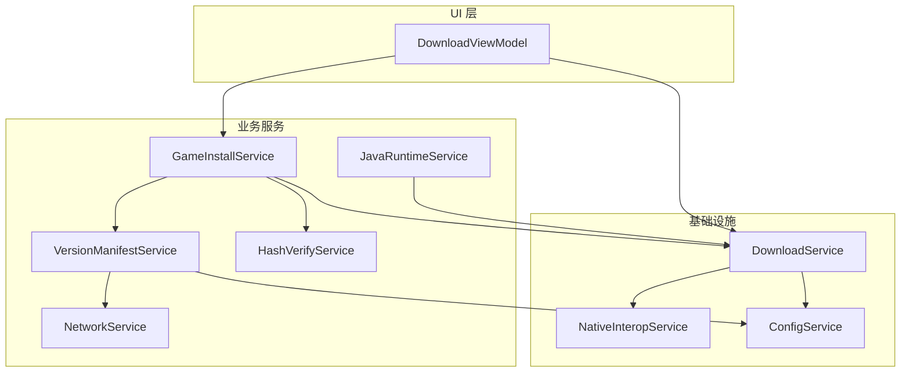
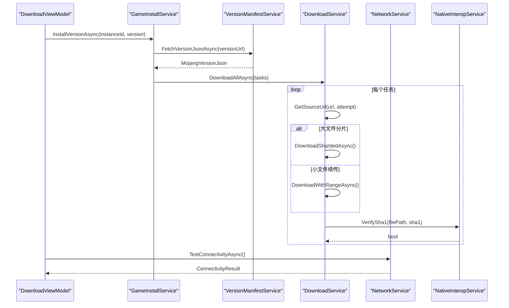
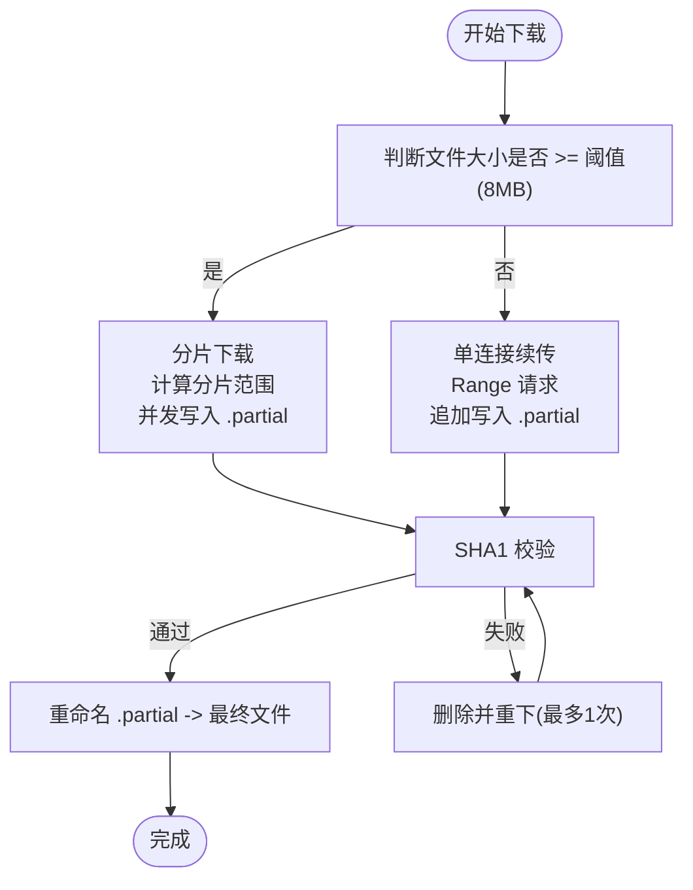
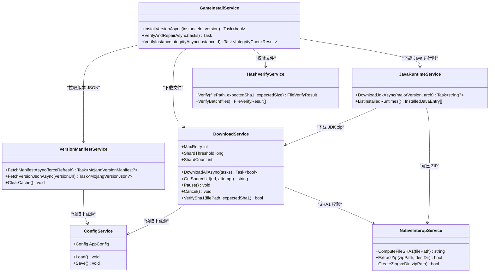

# 网络和下载系统

<cite>
**本文引用的文件**   
- [NetworkService.cs](file://src/FufuLauncher/Services/NetworkService.cs)
- [DownloadService.cs](file://src/FufuLauncher/Services/DownloadService.cs)
- [VersionManifestService.cs](file://src/FufuLauncher/Services/VersionManifestService.cs)
- [ConfigService.cs](file://src/FufuLauncher/Services/ConfigService.cs)
- [NativeInteropService.cs](file://src/FufuLauncher/Services/NativeInteropService.cs)
- [GameInstallService.cs](file://src/FufuLauncher/Services/GameInstallService.cs)
- [JavaRuntimeService.cs](file://src/FufuLauncher/Services/JavaRuntimeService.cs)
- [HashVerifyService.cs](file://src/FufuLauncher/Services/HashVerifyService.cs)
- [DownloadViewModel.cs](file://src/FufuLauncher/ViewModels/DownloadViewModel.cs)
</cite>

## 目录
1. [简介](#简介)
2. [项目结构](#项目结构)
3. [核心组件](#核心组件)
4. [架构总览](#架构总览)
5. [详细组件分析](#详细组件分析)
6. [依赖关系分析](#依赖关系分析)
7. [性能考量与优化建议](#性能考量与优化建议)
8. [故障排查指南](#故障排查指南)
9. [结论](#结论)
10. [附录：监控与调试工具使用](#附录监控与调试工具使用)

## 简介
本文件为“可爱的芙芙启动器”的网络与下载系统的权威技术文档。内容覆盖 HTTP 客户端配置与管理（连接池、超时、重试）、多线程分片下载引擎（任务调度、进度跟踪、断点续传）、下载源管理（官方源与镜像源切换、故障转移、速度优化）、网络错误处理与恢复机制、版本清单服务（元数据获取与缓存策略），以及网络监控与调试方法，并给出性能优化建议与最佳实践。

## 项目结构
网络与下载相关代码集中在 Services 层，配合 ViewModel 层进行 UI 绑定与交互。关键模块如下：
- NetworkService：网络连通性检测与双源延迟测试
- DownloadService：多线程分片断点续传下载引擎
- VersionManifestService：Mojang 版本清单拉取与缓存
- GameInstallService：游戏安装流程编排（含资源索引与资产对象）
- JavaRuntimeService：JDK 运行时管理与下载
- HashVerifyService：文件哈希校验与修复
- NativeInteropService：原生 DLL 加速（SHA1/ZIP）与托管回退
- ConfigService：用户配置（下载源、镜像源等）
- DownloadViewModel：下载页视图模型，订阅下载事件并更新 UI

图表来源
- [DownloadViewModel.cs:1-307](file://src/FufuLauncher/ViewModels/DownloadViewModel.cs#L1-L307)
- [GameInstallService.cs:1-457](file://src/FufuLauncher/Services/GameInstallService.cs#L1-L457)
- [JavaRuntimeService.cs:1-527](file://src/FufuLauncher/Services/JavaRuntimeService.cs#L1-L527)
- [VersionManifestService.cs:1-338](file://src/FufuLauncher/Services/VersionManifestService.cs#L1-L338)
- [HashVerifyService.cs:1-85](file://src/FufuLauncher/Services/HashVerifyService.cs#L1-L85)
- [NetworkService.cs:1-95](file://src/FufuLauncher/Services/NetworkService.cs#L1-L95)
- [DownloadService.cs:1-592](file://src/FufuLauncher/Services/DownloadService.cs#L1-L592)
- [NativeInteropService.cs:1-214](file://src/FufuLauncher/Services/NativeInteropService.cs#L1-L214)
- [ConfigService.cs:1-148](file://src/FufuLauncher/Services/ConfigService.cs#L1-L148)

章节来源
- [DownloadViewModel.cs:1-307](file://src/FufuLauncher/ViewModels/DownloadViewModel.cs#L1-L307)
- [GameInstallService.cs:1-457](file://src/FufuLauncher/Services/GameInstallService.cs#L1-L457)
- [JavaRuntimeService.cs:1-527](file://src/FufuLauncher/Services/JavaRuntimeService.cs#L1-L527)
- [VersionManifestService.cs:1-338](file://src/FufuLauncher/Services/VersionManifestService.cs#L1-L338)
- [HashVerifyService.cs:1-85](file://src/FufuLauncher/Services/HashVerifyService.cs#L1-L85)
- [NetworkService.cs:1-95](file://src/FufuLauncher/Services/NetworkService.cs#L1-L95)
- [DownloadService.cs:1-592](file://src/FufuLauncher/Services/DownloadService.cs#L1-L592)
- [NativeInteropService.cs:1-214](file://src/FufuLauncher/Services/NativeInteropService.cs#L1-L214)
- [ConfigService.cs:1-148](file://src/FufuLauncher/Services/ConfigService.cs#L1-L148)

## 核心组件
- HTTP 客户端配置与管理
  - DownloadService 使用 HttpClientHandler 设置 MaxConnectionsPerServer=64，HttpClient 超时 5 分钟；每个请求可附加 30 秒首字节超时保护；User-Agent 统一设置以避免限流。
  - NetworkService 使用独立 HttpClient，超时 8 秒，用于连通性检测。
  - VersionManifestService 使用独立 HttpClient，超时 8 秒，优先按配置源拉取，失败回退另一源。
  - JavaRuntimeService 使用独立 HttpClient，超时 30 秒，用于 JDK 列表与镜像目录解析。
- 连接池与并发控制
  - DownloadService 按任务类别（Game/Asset/Java/Mod/Other）分别使用 SemaphoreSlim 限制并发，避免跨类别互相阻塞。
  - 大文件自动分片（>=8MB），多 Range 并发写入 .partial 临时文件，完成后重命名为最终文件。
- 超时与重试
  - 单任务指数退避重试（默认最多 3 次），每次失败记录错误信息并重试。
  - 每请求 30 秒首字节超时，防止连接卡死；整体 HttpClient 超时 5 分钟。
- 断点续传
  - 小文件使用单连接 Range 续传；大文件预分配 .partial 并按偏移写入各分片。
  - 若服务端不支持续传返回 200，则自动从头下载。
- 完整性校验
  - 下载完成 SHA1 校验，失败删除后自动重下一次；支持原生 DLL 加速或托管回退。
- 下载源管理
  - 支持 Mojang 官方源与 BMCLAPI 国内镜像源；根据配置与重试次数自动降级到镜像源。
  - URL 重写规则覆盖常见 Mojang/Minecraft 域名，确保镜像可用。
- 进度与统计
  - 单文件进度（子进度条）与全局总进度（所有批次累计）分离，节流上报避免 UI 卡顿。
  - 提供暂停/继续/取消能力，支持任务级状态机。

章节来源
- [DownloadService.cs:1-592](file://src/FufuLauncher/Services/DownloadService.cs#L1-L592)
- [NetworkService.cs:1-95](file://src/FufuLauncher/Services/NetworkService.cs#L1-L95)
- [VersionManifestService.cs:1-338](file://src/FufuLauncher/Services/VersionManifestService.cs#L1-L338)
- [JavaRuntimeService.cs:1-527](file://src/FufuLauncher/Services/JavaRuntimeService.cs#L1-L527)
- [NativeInteropService.cs:1-214](file://src/FufuLauncher/Services/NativeInteropService.cs#L1-L214)
- [ConfigService.cs:1-148](file://src/FufuLauncher/Services/ConfigService.cs#L1-L148)

## 架构总览
下图展示从 UI 到网络与下载的完整调用链，包括版本清单获取、游戏安装、下载引擎与校验、Java 运行时管理等环节。

图表来源
- [DownloadViewModel.cs:1-307](file://src/FufuLauncher/ViewModels/DownloadViewModel.cs#L1-L307)
- [GameInstallService.cs:1-457](file://src/FufuLauncher/Services/GameInstallService.cs#L1-L457)
- [VersionManifestService.cs:1-338](file://src/FufuLauncher/Services/VersionManifestService.cs#L1-L338)
- [DownloadService.cs:1-592](file://src/FufuLauncher/Services/DownloadService.cs#L1-L592)
- [NetworkService.cs:1-95](file://src/FufuLauncher/Services/NetworkService.cs#L1-L95)
- [NativeInteropService.cs:1-214](file://src/FufuLauncher/Services/NativeInteropService.cs#L1-L214)

## 详细组件分析

### HTTP 客户端配置与管理
- DownloadService
  - 连接池：MaxConnectionsPerServer=64，避免过多连接导致端口耗尽。
  - 超时：HttpClient 总超时 5 分钟；每请求 30 秒首字节超时，防止握手/首包卡死。
  - User-Agent：统一设置，降低被限流风险。
  - 重试：指数退避（1s, 2s, 4s...），最大重试次数可配置。
- NetworkService
  - 独立 HttpClient，超时 8 秒，快速探测 Mojang/BMCLAPI 连通性与延迟。
- VersionManifestService
  - 独立 HttpClient，超时 8 秒；优先按配置源拉取，失败回退另一源；本地缓存清单避免频繁网络请求。
- JavaRuntimeService
  - 独立 HttpClient，超时 30 秒；用于 Adoptium API 与华为云镜像目录解析。

章节来源
- [DownloadService.cs:1-592](file://src/FufuLauncher/Services/DownloadService.cs#L1-L592)
- [NetworkService.cs:1-95](file://src/FufuLauncher/Services/NetworkService.cs#L1-L95)
- [VersionManifestService.cs:1-338](file://src/FufuLauncher/Services/VersionManifestService.cs#L1-L338)
- [JavaRuntimeService.cs:1-527](file://src/FufuLauncher/Services/JavaRuntimeService.cs#L1-L527)

### 多线程分片下载引擎
- 任务调度
  - 按类别（Game/Asset/Java/Mod/Other）独立信号量控制并发，互不阻塞。
  - 批量下载前检查磁盘空间（预留 1GB 缓冲）。
- 进度跟踪
  - 单文件进度（子进度条）与全局总进度（累计所有批次）分离，节流上报（约 150ms）保证 UI 平滑。
  - 支持暂停/继续/取消，任务状态机（Pending/Downloading/Paused/Verifying/Completed/Failed/Cancelled）。
- 断点续传
  - 小文件：单连接 Range 续传，.partial 临时文件续写，完成后重命名。
  - 大文件：预分配 .partial 文件，多 Range 并发写入各自偏移，完成后重命名。
  - 服务端不支持续传时（返回 200），自动从头下载。
- 完整性校验
  - 下载完成 SHA1 校验，失败删除后自动重下一次；支持原生 DLL 加速或托管回退。

图表来源
- [DownloadService.cs:1-592](file://src/FufuLauncher/Services/DownloadService.cs#L1-L592)

章节来源
- [DownloadService.cs:1-592](file://src/FufuLauncher/Services/DownloadService.cs#L1-L592)

### 下载源管理机制
- 官方源与镜像源
  - 支持 Mojang 官方源与 BMCLAPI 国内镜像源；根据配置选择首选源。
  - 首次失败或重试时自动降级到镜像源，提升稳定性与速度。
- URL 重写规则
  - 覆盖常见 Mojang/Minecraft 域名（如 piston-meta.mojang.com、libraries.minecraft.net 等），替换为 bmclapi2.bangbang93.com 对应路径。
- 故障转移与速度优化
  - 版本清单服务优先按配置源拉取，失败回退另一源；下载服务在重试时强制切镜像源，避免官方源超时崩溃。
  - 连接池与并发控制提升吞吐；分片下载提高大文件速度。

章节来源
- [DownloadService.cs:1-592](file://src/FufuLauncher/Services/DownloadService.cs#L1-L592)
- [VersionManifestService.cs:1-338](file://src/FufuLauncher/Services/VersionManifestService.cs#L1-L338)
- [ConfigService.cs:1-148](file://src/FufuLauncher/Services/ConfigService.cs#L1-L148)

### 网络请求的错误处理与恢复
- 异常捕获与日志
  - 下载失败记录错误信息与重试次数；删除损坏文件后自动重下。
  - 网络异常（超时、连接失败）通过指数退避重试，避免雪崩。
- 超时保护
  - 每请求 30 秒首字节超时，防止握手/首包卡死；整体 HttpClient 超时 5 分钟。
- 回退策略
  - 版本清单服务优先按配置源拉取，失败回退另一源；下载服务在重试时强制切镜像源。
- 完整性保障
  - 下载完成 SHA1 校验，失败删除并重下一次；支持原生 DLL 加速或托管回退。

章节来源
- [DownloadService.cs:1-592](file://src/FufuLauncher/Services/DownloadService.cs#L1-L592)
- [VersionManifestService.cs:1-338](file://src/FufuLauncher/Services/VersionManifestService.cs#L1-L338)
- [NativeInteropService.cs:1-214](file://src/FufuLauncher/Services/NativeInteropService.cs#L1-L214)

### 版本清单服务实现
- 元数据获取
  - 拉取 version_manifest_v2.json，分类 Release/Snapshot/Old Beta/Old Alpha。
  - 提供版本列表查询、关键词搜索、按发布时间排序等功能。
- 缓存策略
  - 内存缓存清单与时间戳；非强制刷新直接返回缓存，避免频繁网络请求。
  - 切换下载源后清空缓存，确保下次拉取走新源。
- 回退机制
  - 优先按配置源拉取，失败回退另一源；全失败时返回旧缓存（不阻塞 UI）。

章节来源
- [VersionManifestService.cs:1-338](file://src/FufuLauncher/Services/VersionManifestService.cs#L1-L338)
- [ConfigService.cs:1-148](file://src/FufuLauncher/Services/ConfigService.cs#L1-L148)

### 游戏安装与资源管理
- 安装流程
  - 拉取版本 JSON，下载 client.jar、libraries（含 natives）、asset index 与 assets。
  - 校验并修复损坏文件，自动重新下载缺失项。
  - 自动下载匹配的 Java 运行时（失败不阻塞安装，提示用户手动下载）。
- 资源索引与对象
  - 先同步下载 asset index，再解析对象列表，加入下载任务队列。
  - 资源路径遵循 assets/objects/{hash前2位}/{完整hash} 约定。

章节来源
- [GameInstallService.cs:1-457](file://src/FufuLauncher/Services/GameInstallService.cs#L1-L457)
- [DownloadService.cs:1-592](file://src/FufuLauncher/Services/DownloadService.cs#L1-L592)

### Java 运行时管理
- 镜像源选择
  - Official（Adoptium API）与 Huaweicloud（华为云 OpenJDK）；根据配置选择。
  - 华为云需动态解析目录页获取最新版本号。
- 下载与解压
  - 下载 zip 后解压到 runtimes/jdk-{major}-{arch}/，清理临时文件。
  - 解压后上提内层目录，确保 java.exe 位于 bin 根目录。
- 完整性校验
  - 通过 java -version 输出判断是否可用；失败记录日志。

章节来源
- [JavaRuntimeService.cs:1-527](file://src/FufuLauncher/Services/JavaRuntimeService.cs#L1-L527)
- [DownloadService.cs:1-592](file://src/FufuLauncher/Services/DownloadService.cs#L1-L592)

### 哈希校验与修复
- 校验逻辑
  - 检查文件存在性、大小匹配、SHA1 一致性。
  - 批量校验返回需重新下载的文件列表。
- 原生加速
  - 优先使用 C++ 原生 DLL 计算 SHA1，失败回退到托管实现。

章节来源
- [HashVerifyService.cs:1-85](file://src/FufuLauncher/Services/HashVerifyService.cs#L1-L85)
- [NativeInteropService.cs:1-214](file://src/FufuLauncher/Services/NativeInteropService.cs#L1-L214)

## 依赖关系分析
- DownloadService 依赖 ConfigService（下载源配置）、NativeInteropService（SHA1 校验）。
- VersionManifestService 依赖 NetworkService（连通性检测）与 ConfigService（下载源）。
- GameInstallService 依赖 VersionManifestService、DownloadService、HashVerifyService、InstanceService、JavaRuntimeService。
- JavaRuntimeService 依赖 DownloadService、ConfigService、NativeInteropService。
- DownloadViewModel 订阅 DownloadService 与 GameInstallService 的事件，更新 UI。

图表来源
- [DownloadService.cs:1-592](file://src/FufuLauncher/Services/DownloadService.cs#L1-L592)
- [ConfigService.cs:1-148](file://src/FufuLauncher/Services/ConfigService.cs#L1-L148)
- [NativeInteropService.cs:1-214](file://src/FufuLauncher/Services/NativeInteropService.cs#L1-L214)
- [VersionManifestService.cs:1-338](file://src/FufuLauncher/Services/VersionManifestService.cs#L1-L338)
- [GameInstallService.cs:1-457](file://src/FufuLauncher/Services/GameInstallService.cs#L1-L457)
- [JavaRuntimeService.cs:1-527](file://src/FufuLauncher/Services/JavaRuntimeService.cs#L1-L527)
- [HashVerifyService.cs:1-85](file://src/FufuLauncher/Services/HashVerifyService.cs#L1-L85)

章节来源
- [DownloadService.cs:1-592](file://src/FufuLauncher/Services/DownloadService.cs#L1-L592)
- [VersionManifestService.cs:1-338](file://src/FufuLauncher/Services/VersionManifestService.cs#L1-L338)
- [GameInstallService.cs:1-457](file://src/FufuLauncher/Services/GameInstallService.cs#L1-L457)
- [JavaRuntimeService.cs:1-527](file://src/FufuLauncher/Services/JavaRuntimeService.cs#L1-L527)
- [HashVerifyService.cs:1-85](file://src/FufuLauncher/Services/HashVerifyService.cs#L1-L85)
- [NativeInteropService.cs:1-214](file://src/FufuLauncher/Services/NativeInteropService.cs#L1-L214)
- [ConfigService.cs:1-148](file://src/FufuLauncher/Services/ConfigService.cs#L1-L148)

## 性能考量与优化建议
- 连接池与并发
  - 合理设置 MaxConnectionsPerServer（当前 64），避免端口耗尽；按类别独立信号量控制并发，避免跨类别阻塞。
- 超时与重试
  - 每请求 30 秒首字节超时，防止握手卡死；指数退避重试避免瞬时拥塞。
- 分片下载
  - 大文件自动分片（>=8MB），多 Range 并发写入提升吞吐；预分配 .partial 文件减少碎片。
- 进度上报
  - 节流上报（约 150ms）避免 UI 卡顿；单文件与全局进度分离，确保视觉流畅。
- 完整性校验
  - 使用原生 DLL 加速 SHA1 计算，失败回退托管实现；下载完成立即校验，失败自动重下。
- 缓存策略
  - 版本清单内存缓存，避免频繁网络请求；切换下载源后清空缓存。
- 磁盘空间检查
  - 下载前检查剩余空间（预留 1GB 缓冲），避免中途失败。

[本节为通用指导，不直接分析具体文件]

## 故障排查指南
- 网络不通或超时
  - 使用 NetworkService.TestConnectivityAsync 检测 Mojang/BMCLAPI 连通性与延迟。
  - 检查防火墙/代理设置，确认 User-Agent 未被拦截。
- 下载失败或中断
  - 查看任务状态与错误信息；检查 .partial 临时文件是否存在。
  - 确认磁盘空间充足；尝试切换下载源（BMCLAPI）重试。
- 完整性校验失败
  - 检查 SHA1 是否与版本清单一致；删除损坏文件后自动重下。
  - 确认原生 DLL 可用，否则回退托管实现。
- Java 运行时问题
  - 检查 java.exe 是否存在且可执行；通过 java -version 验证。
  - 切换镜像源（Official/Huaweicloud）重试下载。

章节来源
- [NetworkService.cs:1-95](file://src/FufuLauncher/Services/NetworkService.cs#L1-L95)
- [DownloadService.cs:1-592](file://src/FufuLauncher/Services/DownloadService.cs#L1-L592)
- [HashVerifyService.cs:1-85](file://src/FufuLauncher/Services/HashVerifyService.cs#L1-L85)
- [JavaRuntimeService.cs:1-527](file://src/FufuLauncher/Services/JavaRuntimeService.cs#L1-L527)

## 结论
本系统通过分层设计、严格的超时与重试机制、分片下载与断点续传、双源故障转移与缓存策略，提供了稳定高效的网络与下载体验。结合 UI 事件驱动与进度反馈，用户可直观感知下载状态与速度。建议在大规模下载场景下进一步优化连接池与并发策略，并根据网络环境动态调整超时与重试参数。

[本节为总结，不直接分析具体文件]

## 附录：监控与调试工具使用
- 连通性检测
  - 调用 NetworkService.TestConnectivityAsync 获取 Mojang/BMCLAPI 连通性与延迟。
- 下载监控
  - 订阅 DownloadService.ProgressChanged（单文件进度）与 OverallProgressChanged（全局总进度）。
  - 监听 TaskCompleted/TaskFailed 事件，获取任务完成/失败状态。
- 日志记录
  - 下载失败、删除文件失败、Java 运行库异常等会写入应用日志，便于定位问题。
- 版本清单缓存
  - 查看 CachedManifestUtc 了解最后更新时间；切换下载源后调用 ClearCache 清空缓存。

章节来源
- [DownloadViewModel.cs:1-307](file://src/FufuLauncher/ViewModels/DownloadViewModel.cs#L1-L307)
- [DownloadService.cs:1-592](file://src/FufuLauncher/Services/DownloadService.cs#L1-L592)
- [VersionManifestService.cs:1-338](file://src/FufuLauncher/Services/VersionManifestService.cs#L1-L338)