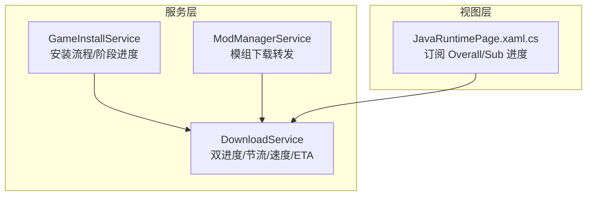
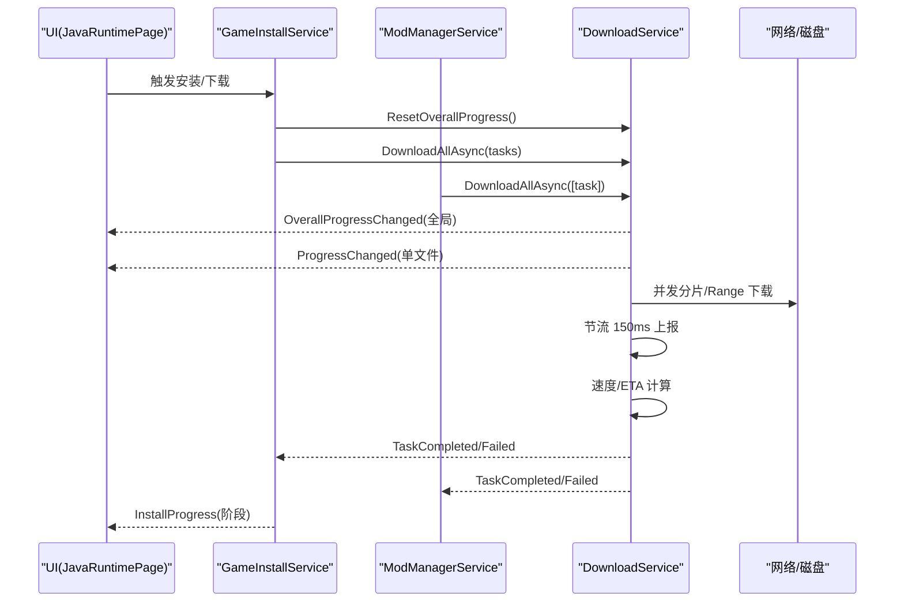
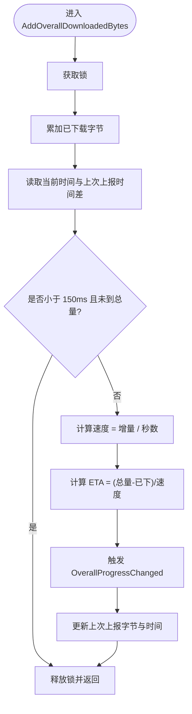
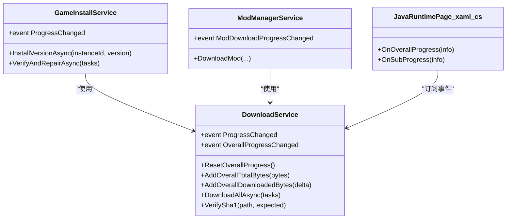

# 进度跟踪系统

<cite>
**本文引用的文件**   
- [DownloadService.cs](file://src/FufuLauncher/Services/DownloadService.cs)
- [GameInstallService.cs](file://src/FufuLauncher/Services/GameInstallService.cs)
- [ModManagerService.cs](file://src/FufuLauncher/Services/ModManagerService.cs)
- [JavaRuntimePage.xaml.cs](file://src/FufuLauncher/Views/JavaRuntimePage.xaml.cs)
</cite>

## 目录
1. [简介](#简介)
2. [项目结构](#项目结构)
3. [核心组件](#核心组件)
4. [架构总览](#架构总览)
5. [详细组件分析](#详细组件分析)
6. [依赖关系分析](#依赖关系分析)
7. [性能考量](#性能考量)
8. [故障排查指南](#故障排查指南)
9. [结论](#结论)
10. [附录](#附录)

## 简介
本文件为“可爱的芙芙启动器”的进度跟踪系统提供完整技术文档。重点说明双进度机制（单文件字节级进度与全局总进度）、150ms 节流策略、速度与剩余时间计算、事件订阅与 UI 绑定最佳实践，以及监控与调试方法。读者无需深入代码即可理解整体设计与使用方式。

## 项目结构
与进度跟踪直接相关的实现集中在下载服务与安装/模组管理服务中：
- DownloadService：核心下载引擎，负责分片/断点续传、双进度上报、速度/ETA 计算、重试与校验。
- GameInstallService：组装下载任务并驱动安装流程，重置全局进度，上报阶段进度。
- ModManagerService：封装模组下载流程，转发单文件进度到上层。
- JavaRuntimePage.xaml.cs：UI 层订阅全局与单文件进度事件，用于界面展示。

图表来源
- [DownloadService.cs](file://src/FufuLauncher/Services/DownloadService.cs)
- [GameInstallService.cs](file://src/FufuLauncher/Services/GameInstallService.cs)
- [ModManagerService.cs](file://src/FufuLauncher/Services/ModManagerService.cs)
- [JavaRuntimePage.xaml.cs](file://src/FufuLauncher/Views/JavaRuntimePage.xaml.cs)

章节来源
- [DownloadService.cs](file://src/FufuLauncher/Services/DownloadService.cs)
- [GameInstallService.cs](file://src/FufuLauncher/Services/GameInstallService.cs)
- [ModManagerService.cs](file://src/FufuLauncher/Services/ModManagerService.cs)
- [JavaRuntimePage.xaml.cs](file://src/FufuLauncher/Views/JavaRuntimePage.xaml.cs)

## 核心组件
- 下载任务模型与状态
  - 任务项包含 URL、本地路径、SHA1、大小、已下载字节、状态、类别等。
  - 支持按类别并发控制（游戏/资源/Java/模组/其他），互不阻塞。
- 进度信息模型
  - 包含总字节、已下载字节、瞬时速度、预估剩余时间、百分比。
- 双进度事件
  - ProgressChanged：单文件字节级进度（子进度条）。
  - OverallProgressChanged：全局总进度（所有批次累计，主进度条）。
- 关键能力
  - 大文件分片下载（>=8MB）与小文件 Range 续传。
  - 断点续传（.partial + 已下载字节记录）。
  - 失败指数退避重试（默认 3 次）。
  - 完成 SHA1 校验，失败自动重下一次。
  - 官方源/BMCLAPI 镜像切换与 DNS 容错。

章节来源
- [DownloadService.cs](file://src/FufuLauncher/Services/DownloadService.cs)

## 架构总览
下图展示了从安装/模组服务到下载引擎，再到 UI 的事件流与数据流。

图表来源
- [DownloadService.cs](file://src/FufuLauncher/Services/DownloadService.cs)
- [GameInstallService.cs](file://src/FufuLauncher/Services/GameInstallService.cs)
- [ModManagerService.cs](file://src/FufuLauncher/Services/ModManagerService.cs)
- [JavaRuntimePage.xaml.cs](file://src/FufuLauncher/Views/JavaRuntimePage.xaml.cs)

## 详细组件分析

### 双进度机制设计
- 单文件进度（ProgressChanged）
  - 在每次写入数据块后累加 task.Downloaded，并按约 200ms 间隔计算瞬时速度并上报。
  - 适用于单个文件的子进度条显示。
- 全局总进度（OverallProgressChanged）
  - 通过 AddOverallTotalBytes 设置本次批次的总字节数；AddOverallDownloadedBytes 累积已下载字节。
  - 内部维护 _overallTotalBytes/_overallDownloadedBytes/_lastOverallReportBytes/_lastOverallReportMs，并使用锁保证线程安全。
  - 每 150ms 计算一次速度并触发事件；当达到总量时强制触发一次，确保最终 100%。
  - 跳过已存在且校验通过的文件也会计入全局进度，避免断点续传/重装时进度卡住。

图表来源
- [DownloadService.cs](file://src/FufuLauncher/Services/DownloadService.cs)

章节来源
- [DownloadService.cs](file://src/FufuLauncher/Services/DownloadService.cs)

### 速度计算算法
- 瞬时速度（单文件）
  - 基于最近一次报告周期内的下载增量除以时间跨度，单位 Bytes/s。
  - 在 ReportSingleProgress 中构造 DownloadProgressInfo 并触发 ProgressChanged。
- 平均速度（全局）
  - 基于全局累计增量与时间差计算，单位 Bytes/s。
  - 在 AddOverallDownloadedBytes 中计算并随 OverallProgressChanged 上报。
- 预估剩余时间（ETA）
  - ETA = (Total - Downloaded) / Speed，若速度为 0 或已完成则返回最大值。
  - 单文件与全局均遵循该逻辑。

章节来源
- [DownloadService.cs](file://src/FufuLauncher/Services/DownloadService.cs)

### 进度更新的节流机制与性能优化
- 节流策略
  - 全局进度：固定 150ms 间隔上报，减少 UI 刷新压力；到达总量时强制触发一次，保证最终态。
  - 单文件进度：约 200ms 间隔上报，避免高频 IO 与 UI 更新。
- 并发与 I/O
  - 大文件分片并发写 .partial，小文件顺序追加写，缓冲 64KB，异步读写。
  - 各类别独立信号量限制并发，避免互相阻塞。
- 网络与超时
  - 每个请求首字节 30s 超时保护；HttpClient 总超时 5min。
  - 官方源失败自动降级 BMCLAPI，提升稳定性。

章节来源
- [DownloadService.cs](file://src/FufuLauncher/Services/DownloadService.cs)

### 进度事件的订阅与使用方法
- 订阅全局进度（主进度条）
  - 在页面/窗口初始化时订阅 OverallProgressChanged，并在析构/离开页时取消订阅。
  - 将 TotalBytes/DownloadedBytes/SpeedBytesPerSec/EstimatedRemaining 映射到 UI 控件。
- 订阅单文件进度（子进度条）
  - 在发起单次下载前订阅 ProgressChanged，完成后立即取消订阅，防止内存泄漏。
  - 将百分比与速度字符串格式化后显示在列表项或状态栏。
- 安装阶段进度
  - GameInstallService 暴露 ProgressChanged（InstallProgress），用于显示“解析清单/下载 client/下载库/下载资源/校验/完成”等阶段。

章节来源
- [DownloadService.cs](file://src/FufuLauncher/Services/DownloadService.cs)
- [GameInstallService.cs](file://src/FufuLauncher/Services/GameInstallService.cs)
- [ModManagerService.cs](file://src/FufuLauncher/Services/ModManagerService.cs)
- [JavaRuntimePage.xaml.cs](file://src/FufuLauncher/Views/JavaRuntimePage.xaml.cs)

### UI 绑定的最佳实践
- 线程安全
  - 进度事件可能在后台线程触发，UI 更新需调度到 UI 线程（如 WPF Dispatcher）。
- 防抖与合并
  - 对频繁事件进行合并（例如 150ms 内只取最新值），降低渲染开销。
- 状态一致性
  - 主进度条由 OverallProgressChanged 驱动，子进度条由 ProgressChanged 驱动，二者应保持一致性（例如总量一致、百分比不超过 100%）。
- 资源清理
  - 在页面关闭或 ViewModel 销毁时务必取消事件订阅，避免内存泄漏。

章节来源
- [DownloadService.cs](file://src/FufuLauncher/Services/DownloadService.cs)
- [JavaRuntimePage.xaml.cs](file://src/FufuLauncher/Views/JavaRuntimePage.xaml.cs)

### 进度监控与调试工具
- 日志输出
  - 下载失败、删除文件异常、校验失败等会写入应用日志，便于定位问题。
- 关键断点
  - 观察 AddOverallDownloadedBytes 的调用频率与增量，确认节流生效。
  - 检查 ReportSingleProgress 的触发间隔与速度曲线是否合理。
  - 查看 TaskCompleted/TaskFailed 事件，确认任务终态。
- 可视化建议
  - 在主界面增加“速度/ETA”文本框，实时显示全局速度及剩余时间。
  - 在任务列表中显示单文件进度条与速度，便于对比不同任务的吞吐。

章节来源
- [DownloadService.cs](file://src/FufuLauncher/Services/DownloadService.cs)

## 依赖关系分析
- DownloadService 依赖 ConfigService（下载源配置）与 NativeInteropService（SHA1 计算）。
- GameInstallService 依赖 DownloadService、HashVerifyService、InstanceService、JavaRuntimeService。
- ModManagerService 依赖 DownloadService、HashVerifyService、InstanceService。
- UI 层（JavaRuntimePage.xaml.cs）订阅 DownloadService 的双进度事件。

图表来源
- [DownloadService.cs](file://src/FufuLauncher/Services/DownloadService.cs)
- [GameInstallService.cs](file://src/FufuLauncher/Services/GameInstallService.cs)
- [ModManagerService.cs](file://src/FufuLauncher/Services/ModManagerService.cs)
- [JavaRuntimePage.xaml.cs](file://src/FufuLauncher/Views/JavaRuntimePage.xaml.cs)

章节来源
- [DownloadService.cs](file://src/FufuLauncher/Services/DownloadService.cs)
- [GameInstallService.cs](file://src/FufuLauncher/Services/GameInstallService.cs)
- [ModManagerService.cs](file://src/FufuLauncher/Services/ModManagerService.cs)
- [JavaRuntimePage.xaml.cs](file://src/FufuLauncher/Views/JavaRuntimePage.xaml.cs)

## 性能考量
- 节流与渲染
  - 150ms 全局节流与 200ms 单文件节流平衡了流畅度与 CPU/IO 压力。
- 并发控制
  - 按类别独立信号量，避免跨类别竞争；大文件分片并发提升吞吐。
- I/O 优化
  - 预分配 .partial 文件，减少碎片；64KB 缓冲与异步 IO 降低阻塞。
- 网络健壮性
  - 首字节超时与总超时结合；官方源失败自动降级国内镜像。
- 校验与重试
  - 完成即校验，失败自动重下一次；指数退避缓解瞬时拥塞。

[本节为通用指导，不直接分析具体文件]

## 故障排查指南
- 进度不更新
  - 检查是否调用了 ResetOverallProgress 与 AddOverallTotalBytes。
  - 确认 AddOverallDownloadedBytes 被持续调用（下载循环内）。
  - 观察节流条件是否导致长时间未触发（正常情况 150ms 内可能不触发）。
- 速度异常
  - 检查单文件与全局速度计算的时间差是否为 0（可能导致除零或极大值）。
  - 确认网络波动导致的速率抖动，必要时平滑处理。
- 校验失败
  - 查看日志中的 SHA1 校验失败提示，确认文件是否被删除并重下。
- 任务卡死
  - 检查 per-request 首字节超时是否触发；确认 HttpClient 连接池与 MaxConnectionsPerServer。
- UI 卡顿
  - 确保事件回调中 UI 更新已调度到 UI 线程，并进行必要的去抖/合并。

章节来源
- [DownloadService.cs](file://src/FufuLauncher/Services/DownloadService.cs)
- [GameInstallService.cs](file://src/FufuLauncher/Services/GameInstallService.cs)
- [ModManagerService.cs](file://src/FufuLauncher/Services/ModManagerService.cs)

## 结论
本进度跟踪系统通过双进度机制与严格的节流策略，在保证 UI 流畅性的同时提供了准确的速度与剩余时间估计。分片下载、断点续传、重试与校验共同构建了稳健的下载体验。配合清晰的订阅模式与 UI 绑定最佳实践，开发者可快速集成并扩展进度展示功能。

[本节为总结，不直接分析具体文件]

## 附录
- 常用 API 速查
  - ResetOverallProgress：开始新批次前重置全局统计。
  - AddOverallTotalBytes：设置本次批次总字节数。
  - AddOverallDownloadedBytes：累加已下载字节并触发全局进度。
  - ProgressChanged：单文件进度事件。
  - OverallProgressChanged：全局总进度事件。
  - VerifySha1：完成后的文件完整性校验。
- 事件订阅示例要点
  - 在页面加载时订阅，页面卸载时取消订阅。
  - UI 更新必须回到 UI 线程。
  - 对频繁事件做合并/去抖，避免过度渲染。

章节来源
- [DownloadService.cs](file://src/FufuLauncher/Services/DownloadService.cs)
- [JavaRuntimePage.xaml.cs](file://src/FufuLauncher/Views/JavaRuntimePage.xaml.cs)