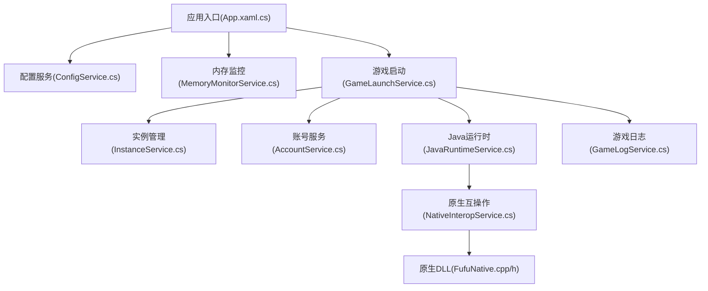
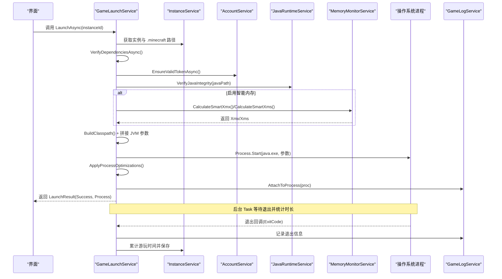
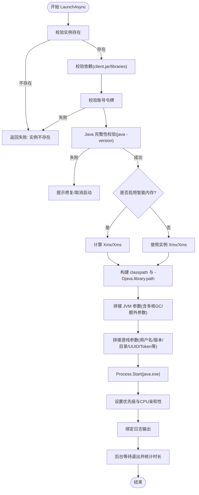
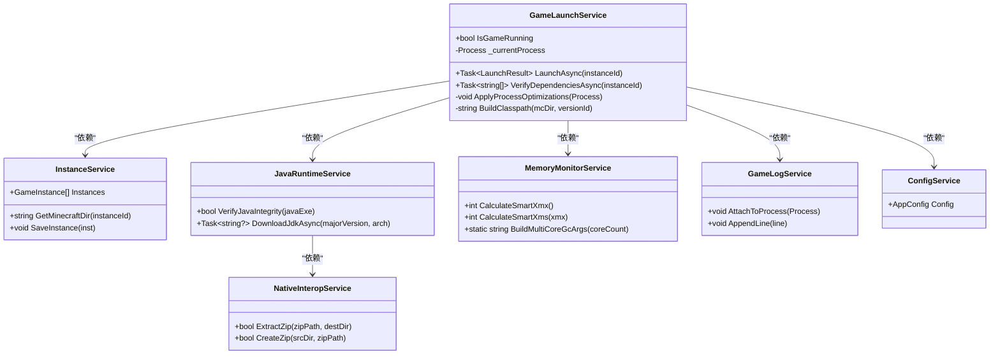

# 游戏进程生命周期管理

<cite>
**本文引用的文件**   
- [GameLaunchService.cs](file://src/FufuLauncher/Services/GameLaunchService.cs)
- [JavaRuntimeService.cs](file://src/FufuLauncher/Services/JavaRuntimeService.cs)
- [MemoryMonitorService.cs](file://src/FufuLauncher/Services/MemoryMonitorService.cs)
- [NativeInteropService.cs](file://src/FufuLauncher/Services/NativeInteropService.cs)
- [ConfigService.cs](file://src/FufuLauncher/Services/ConfigService.cs)
- [GameLogService.cs](file://src/FufuLauncher/Services/GameLogService.cs)
- [InstanceService.cs](file://src/FufuLauncher/Services/InstanceService.cs)
- [App.xaml.cs](file://src/FufuLauncher/App.xaml.cs)
- [FufuNative.cpp](file://native/FufuNative/FufuNative.cpp)
- [FufuNative.h](file://native/FufuNative/FufuNative.h)
</cite>

## 目录
1. [简介](#简介)
2. [项目结构](#项目结构)
3. [核心组件](#核心组件)
4. [架构总览](#架构总览)
5. [详细组件分析](#详细组件分析)
6. [依赖关系分析](#依赖关系分析)
7. [性能考量](#性能考量)
8. [故障排除指南](#故障排除指南)
9. [结论](#结论)
10. [附录](#附录)

## 简介
本文件面向“可爱的芙芙”启动器，系统化阐述游戏进程的完整生命周期管理：从实例校验、JVM 参数构建与类路径设置、进程创建与优先级/CPU 亲和性配置，到异步退出监控、资源清理与状态更新，以及异常处理与恢复策略。文档同时覆盖 JVM 内存分配（Xms/Xmx）、类路径与库路径、认证参数传递等关键细节，并提供最佳实践与排错指引。

## 项目结构
- 启动器主入口负责 DI 容器初始化、环境自检、日志与内存监控的启动。
- 游戏进程由 GameLaunchService 统一编排，依赖 InstanceService、AccountService、ConfigService、JavaRuntimeService、MemoryMonitorService、GameLogService 等完成前置校验、参数拼装、进程启动与监控。
- Java 运行时管理与完整性校验由 JavaRuntimeService 提供；内存智能分配与多核 GC 优化参数由 MemoryMonitorService 提供；原生加速能力通过 NativeInteropService 暴露给上层服务。
- 日志系统采用双通道分离：应用日志 app.log 与游戏日志 game.log，分别由 App 与 GameLogService 管理。

图表来源
- [App.xaml.cs:138-193](file://src/FufuLauncher/App.xaml.cs#L138-L193)
- [GameLaunchService.cs:35-65](file://src/FufuLauncher/Services/GameLaunchService.cs#L35-L65)
- [JavaRuntimeService.cs:50-84](file://src/FufuLauncher/Services/JavaRuntimeService.cs#L50-L84)
- [MemoryMonitorService.cs:26-59](file://src/FufuLauncher/Services/MemoryMonitorService.cs#L26-L59)
- [NativeInteropService.cs:20-25](file://src/FufuLauncher/Services/NativeInteropService.cs#L20-L25)
- [FufuNative.cpp:1-19](file://native/FufuNative/FufuNative.cpp#L1-L19)
- [FufuNative.h:1-13](file://native/FufuNative/FufuNative.h#L1-L13)

章节来源
- [App.xaml.cs:82-156](file://src/FufuLauncher/App.xaml.cs#L82-L156)
- [GameLaunchService.cs:1-17](file://src/FufuLauncher/Services/GameLaunchService.cs#L1-L17)

## 核心组件
- GameLaunchService：游戏进程生命周期编排者，负责依赖校验、JVM 参数构建、进程启动、优先级与 CPU 亲和性设置、异步退出监控与资源释放。
- JavaRuntimeService：Java 运行时下载、安装、完整性校验与版本探测。
- MemoryMonitorService：系统内存读取、智能 Xmx/Xms 计算、多核 GC 参数生成。
- NativeInteropService：C++ 原生 DLL 的高性能哈希与 ZIP 解压封装，失败自动回退托管实现。
- GameLogService：实时捕获游戏 stdout/stderr，批量写入 game.log，支持缓冲裁剪与刷新。
- InstanceService：多实例元数据与目录管理，为启动提供 .minecraft 路径与版本信息。
- ConfigService：用户配置持久化，包含 JVM 参数、分辨率、高优先级、CPU 亲和性、智能内存开关等。

章节来源
- [GameLaunchService.cs:35-65](file://src/FufuLauncher/Services/GameLaunchService.cs#L35-L65)
- [JavaRuntimeService.cs:50-84](file://src/FufuLauncher/Services/JavaRuntimeService.cs#L50-L84)
- [MemoryMonitorService.cs:26-59](file://src/FufuLauncher/Services/MemoryMonitorService.cs#L26-L59)
- [NativeInteropService.cs:20-25](file://src/FufuLauncher/Services/NativeInteropService.cs#L20-L25)
- [GameLogService.cs:22-52](file://src/FufuLauncher/Services/GameLogService.cs#L22-L52)
- [InstanceService.cs:27-49](file://src/FufuLauncher/Services/InstanceService.cs#L27-L49)
- [ConfigService.cs:13-79](file://src/FufuLauncher/Services/ConfigService.cs#L13-L79)

## 架构总览
下图展示游戏进程从启动到退出的关键交互流程，涵盖依赖校验、Java 完整性验证、JVM 参数构建、进程启动、优先级与亲和性设置、日志绑定与异步退出监控。

图表来源
- [GameLaunchService.cs:104-316](file://src/FufuLauncher/Services/GameLaunchService.cs#L104-L316)
- [GameLogService.cs:54-65](file://src/FufuLauncher/Services/GameLogService.cs#L54-L65)
- [MemoryMonitorService.cs:175-213](file://src/FufuLauncher/Services/MemoryMonitorService.cs#L175-L213)

## 详细组件分析

### 游戏进程生命周期（创建、参数、启动、退出）
- 依赖校验：检查 client.jar、libraries 目录是否存在，必要时解析 version.json 进行 SHA1 校验（骨架已预留扩展点）。
- 账号令牌校验：确保登录态有效，否则提示重新登录。
- Java 完整性校验：执行 java -version 检测可运行性，若失败则弹窗提示修复或取消启动。
- 智能内存分配：根据系统可用内存与配置阈值计算 Xmx/Xms，避免低配机器被自动分配过高内存。
- 类路径与库路径：动态拼接 libraries 下所有 jar 与 client.jar 作为 classpath；设置 -Djava.library.path 指向 natives 目录。
- JVM 参数构建：按顺序添加 -Xms/-Xmx、-Djava.library.path、-cp 及多核 GC 优化参数（可选），再追加额外参数与主类 net.minecraft.client.main.Main。
- 游戏参数：注入 --username/--version/--gameDir/--assetsDir/--assetIndex/--uuid/--accessToken/--userType 等，并根据全屏/窗口模式设置宽高。
- 进程启动与优化：使用 ProcessStartInfo 启动 java.exe，随后设置进程优先级（AboveNormal，禁止 Realtime）与 CPU 亲和性（保留 1 个核心给系统）。
- 日志绑定与退出监控：AttachToProcess 订阅 OutputDataReceived/ErrorDataReceived，后台 Task 等待退出，记录 ExitCode，累计游玩时间并保存实例。

图表来源
- [GameLaunchService.cs:104-316](file://src/FufuLauncher/Services/GameLaunchService.cs#L104-L316)

章节来源
- [GameLaunchService.cs:69-101](file://src/FufuLauncher/Services/GameLaunchService.cs#L69-L101)
- [GameLaunchService.cs:104-316](file://src/FufuLauncher/Services/GameLaunchService.cs#L104-L316)
- [GameLaunchService.cs:318-358](file://src/FufuLauncher/Services/GameLaunchService.cs#L318-L358)
- [GameLaunchService.cs:360-376](file://src/FufuLauncher/Services/GameLaunchService.cs#L360-L376)

### JVM 参数构建过程
- 内存分配：-Xms 与 -Xmx 由实例配置或智能算法决定，智能模式下按可用内存与阈值计算，向下对齐 256MB 减少碎片。
- 类路径：-cp 后拼接 client.jar 与 libraries 下所有 jar，Windows 分号分隔。
- 库路径：-Djava.library.path 指向 {mcDir}/versions/{versionId}/natives，供 Minecraft 加载原生库。
- 多核 GC 优化：当配置开启时，依据物理核心数生成 ParallelGCThreads/ConcGCThreads/CICompilerCount 参数。
- 认证参数：--username、--uuid、--accessToken、--userType=mojang 等由 AccountService 提供。
- 显示参数：--fullscreen 或 --width/--height 由实例配置决定。

章节来源
- [GameLaunchService.cs:199-267](file://src/FufuLauncher/Services/GameLaunchService.cs#L199-L267)
- [GameLaunchService.cs:360-376](file://src/FufuLauncher/Services/GameLaunchService.cs#L360-L376)
- [MemoryMonitorService.cs:203-213](file://src/FufuLauncher/Services/MemoryMonitorService.cs#L203-L213)

### 进程优先级与 CPU 亲和性
- 高优先级模式：将进程优先级设置为 AboveNormal，避免使用 Realtime 导致系统卡顿。
- CPU 亲和性：保留 1 个物理核心给系统，其余核心掩码用于游戏进程，降低跨 CCD/NUMA 调度延迟。
- 失败不阻塞：权限不足或平台限制导致的设置失败仅记录日志，不影响启动。

章节来源
- [GameLaunchService.cs:318-358](file://src/FufuLauncher/Services/GameLaunchService.cs#L318-L358)

### 进程监控机制（异步退出检测、资源清理、状态更新）
- 异步监控：后台 Task 调用 WaitForExit，捕获退出码并记录日志。
- 资源清理：finally 中 Dispose 进程引用，重置当前进程句柄，避免再次启动竞态。
- 状态更新：累计 TotalPlayTimeSeconds，更新 LastPlayedAt，持久化实例元数据。

章节来源
- [GameLaunchService.cs:287-316](file://src/FufuLauncher/Services/GameLaunchService.cs#L287-L316)

### 异常处理与错误恢复策略
- 依赖缺失：弹窗提示具体缺失项，阻止启动。
- 令牌过期：提示重新登录，终止启动流程。
- Java 完整性失败：弹窗说明可能原因（损坏/版本不兼容/安全软件拦截），允许用户选择继续尝试或取消。
- 进程启动失败：返回失败结果并记录异常消息。
- 优先级/亲和性设置失败：记录日志但不影响启动。
- 日志写入失败：忽略异常，保证主流程稳定。

章节来源
- [GameLaunchService.cs:112-177](file://src/FufuLauncher/Services/GameLaunchService.cs#L112-L177)
- [GameLaunchService.cs:269-316](file://src/FufuLauncher/Services/GameLaunchService.cs#L269-L316)
- [GameLogService.cs:140-166](file://src/FufuLauncher/Services/GameLogService.cs#L140-L166)

### 进程间通信与资源管理最佳实践
- 进程输出捕获：通过 BeginOutputReadLine/BegainErrorReadLine 订阅事件，避免死锁；使用缓冲队列与定时器批量写盘，降低 IO 开销。
- 内存监控：DispatcherTimer 在 UI 线程触发，避免 Invoke 队列堆积；间隔 3s 降低无谓刷新。
- 原生加速：优先调用 C++ DLL，失败自动回退托管实现，保证可用性。
- 实例隔离：每个实例独立 .minecraft/mods/saves/resourcepacks/shaderpacks，避免交叉污染。

章节来源
- [GameLogService.cs:54-65](file://src/FufuLauncher/Services/GameLogService.cs#L54-L65)
- [MemoryMonitorService.cs:62-88](file://src/FufuLauncher/Services/MemoryMonitorService.cs#L62-L88)
- [NativeInteropService.cs:84-101](file://src/FufuLauncher/Services/NativeInteropService.cs#L84-L101)
- [InstanceService.cs:6-13](file://src/FufuLauncher/Services/InstanceService.cs#L6-L13)

## 依赖关系分析
- GameLaunchService 依赖多个服务完成启动全流程：InstanceService（实例路径与元数据）、AccountService（认证参数）、JavaRuntimeService（Java 完整性）、MemoryMonitorService（内存与 GC 参数）、GameLogService（日志绑定）。
- JavaRuntimeService 依赖 DownloadService 与 NativeInteropService 完成 JDK 下载与解压。
- MemoryMonitorService 依赖 ConfigService 获取阈值与开关。
- NativeInteropService 依赖 FufuNative.dll，失败回退托管实现。

图表来源
- [GameLaunchService.cs:35-65](file://src/FufuLauncher/Services/GameLaunchService.cs#L35-L65)
- [InstanceService.cs:51-70](file://src/FufuLauncher/Services/InstanceService.cs#L51-L70)
- [JavaRuntimeService.cs:50-84](file://src/FufuLauncher/Services/JavaRuntimeService.cs#L50-L84)
- [MemoryMonitorService.cs:26-59](file://src/FufuLauncher/Services/MemoryMonitorService.cs#L26-L59)
- [GameLogService.cs:22-52](file://src/FufuLauncher/Services/GameLogService.cs#L22-L52)
- [ConfigService.cs:81-92](file://src/FufuLauncher/Services/ConfigService.cs#L81-L92)
- [NativeInteropService.cs:20-25](file://src/FufuLauncher/Services/NativeInteropService.cs#L20-L25)

章节来源
- [App.xaml.cs:170-193](file://src/FufuLauncher/App.xaml.cs#L170-L193)

## 性能考量
- 日志批处理：GameLogService 使用 ConcurrentQueue 与 200ms Timer 合并写入，避免逐行 IO 开销；内存缓冲上限 5000 行，超出裁剪最早行。
- 内存监控频率：DispatcherTimer 间隔 3s，Background 优先级，避免抢占输入事件。
- 原生加速：ZIP 解压与哈希优先调用 C++ DLL，失败回退托管实现，兼顾性能与稳定性。
- 多核 GC：根据物理核心数动态计算 GC 线程数，提升吞吐与响应。

章节来源
- [GameLogService.cs:140-166](file://src/FufuLauncher/Services/GameLogService.cs#L140-L166)
- [MemoryMonitorService.cs:62-88](file://src/FufuLauncher/Services/MemoryMonitorService.cs#L62-L88)
- [NativeInteropService.cs:84-101](file://src/FufuLauncher/Services/NativeInteropService.cs#L84-L101)
- [MemoryMonitorService.cs:203-213](file://src/FufuLauncher/Services/MemoryMonitorService.cs#L203-L213)

## 故障排除指南
- 启动前校验失败：检查 client.jar 与 libraries 目录是否完整；必要时解析 version.json 校验 SHA1。
- 账号令牌过期：重新登录以刷新令牌。
- Java 完整性失败：确认 java.exe 可执行且版本匹配；如被安全软件拦截，加入白名单或重新下载。
- 进程启动失败：检查 java.exe 路径是否正确；查看应用日志 app.log 定位异常。
- 优先级/亲和性设置失败：可能需要管理员权限；失败不影响启动，查看日志确认。
- 日志未更新：确认 GameLogService 已 AttachToProcess；必要时调用 FlushNow 强制刷新。

章节来源
- [GameLaunchService.cs:112-177](file://src/FufuLauncher/Services/GameLaunchService.cs#L112-L177)
- [GameLaunchService.cs:269-316](file://src/FufuLauncher/Services/GameLaunchService.cs#L269-L316)
- [GameLogService.cs:168-172](file://src/FufuLauncher/Services/GameLogService.cs#L168-L172)

## 结论
“可爱的芙芙”启动器通过模块化服务协作，实现了健壮的游戏进程生命周期管理：从依赖校验、Java 完整性验证、智能内存分配、JVM 参数构建，到进程启动、优先级与 CPU 亲和性优化、日志绑定与异步退出监控，形成闭环。其设计兼顾性能与稳定性，具备完善的异常处理与恢复策略，适合多实例、多版本的 Minecraft 启动场景。

## 附录
- 关键路径约定：
  - 游戏数据目录：{exe目录}\appmcGAME
  - 配置目录：{exe目录}\appmcGAME\Start\AppData\Roaming\FufuLauncher
  - 实例目录：{GameDataDir}\instances\{InstanceId}\.minecraft
  - Java 运行时目录：{GameDataDir}\runtimes\jdk-{major}-{arch}
- 常用 JVM 参数：
  - -Xms/-Xmx：初始/最大堆大小
  - -Djava.library.path：原生库路径
  - -cp：类路径
  - -XX:ParallelGCThreads/ConcGCThreads/CICompilerCount：多核 GC 优化

章节来源
- [App.xaml.cs:92-114](file://src/FufuLauncher/App.xaml.cs#L92-L114)
- [InstanceService.cs:6-13](file://src/FufuLauncher/Services/InstanceService.cs#L6-L13)
- [JavaRuntimeService.cs:86-105](file://src/FufuLauncher/Services/JavaRuntimeService.cs#L86-L105)
- [GameLaunchService.cs:199-267](file://src/FufuLauncher/Services/GameLaunchService.cs#L199-L267)