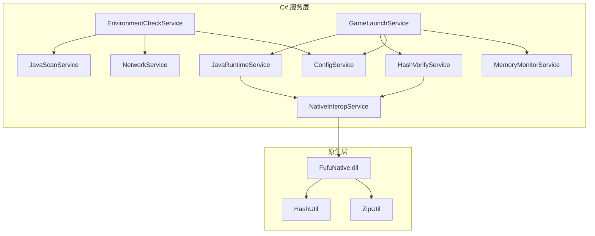
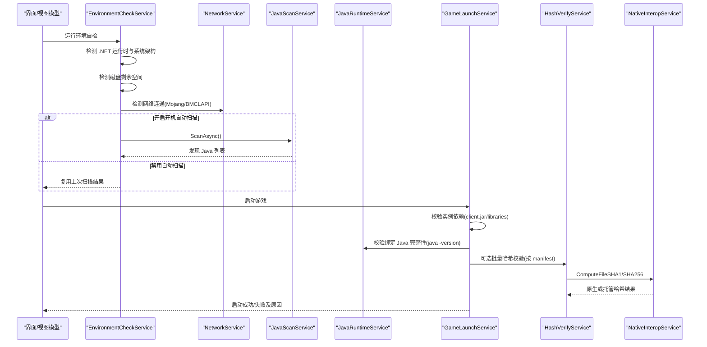
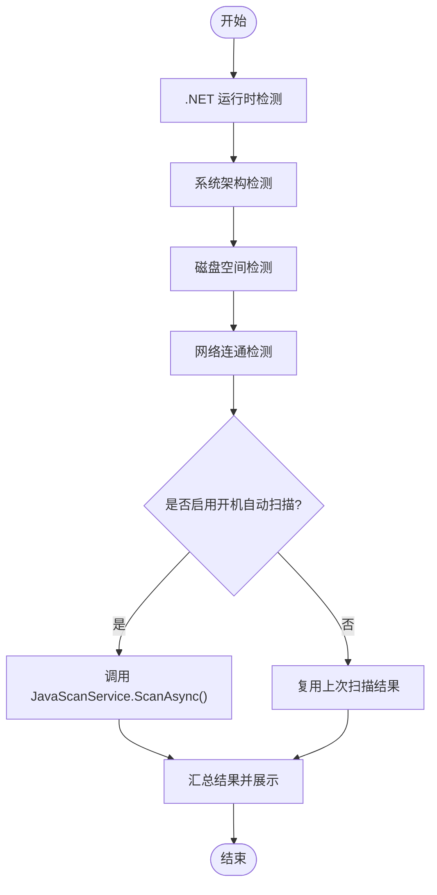
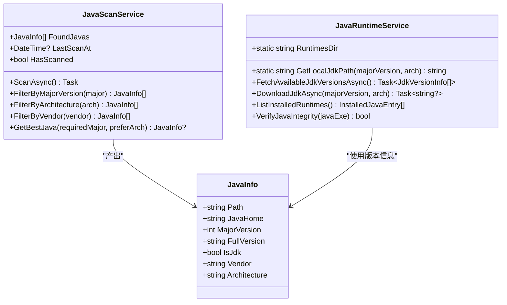
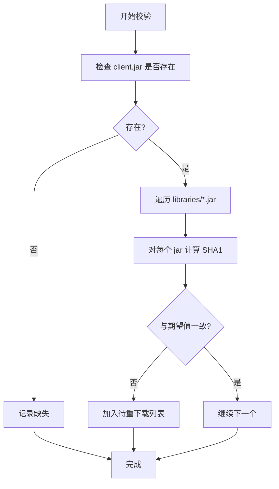
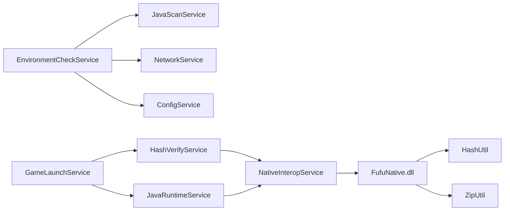

# 环境检查与依赖验证

<cite>
**本文引用的文件**   
- [EnvironmentCheckService.cs](file://src/FufuLauncher/Services/EnvironmentCheckService.cs)
- [JavaScanService.cs](file://src/FufuLauncher/Services/JavaScanService.cs)
- [JavaRuntimeService.cs](file://src/FufuLauncher/Services/JavaRuntimeService.cs)
- [HashVerifyService.cs](file://src/FufuLauncher/Services/HashVerifyService.cs)
- [NativeInteropService.cs](file://src/FufuLauncher/Services/NativeInteropService.cs)
- [FufuNative.cpp](file://native/FufuNative/FufuNative.cpp)
- [HashUtil.cpp](file://native/FufuNative/HashUtil.cpp)
- [ZipUtil.cpp](file://native/FufuNative/ZipUtil.cpp)
- [GameLaunchService.cs](file://src/FufuLauncher/Services/GameLaunchService.cs)
- [ConfigService.cs](file://src/FufuLauncher/Services/ConfigService.cs)
- [MemoryMonitorService.cs](file://src/FufuLauncher/Services/MemoryMonitorService.cs)
- [NetworkService.cs](file://src/FufuLauncher/Services/NetworkService.cs)
</cite>

## 目录
1. [简介](#简介)
2. [项目结构](#项目结构)
3. [核心组件](#核心组件)
4. [架构总览](#架构总览)
5. [详细组件分析](#详细组件分析)
6. [依赖关系分析](#依赖关系分析)
7. [性能考量](#性能考量)
8. [故障排除指南](#故障排除指南)
9. [结论](#结论)
10. [附录](#附录)

## 简介
本文件面向“可爱的芙芙”启动器的环境检查与依赖验证能力，系统性说明：
- 系统环境检查流程（操作系统架构检测、磁盘空间校验、网络连通性检测）
- Java 运行时验证机制（可执行存在性、版本兼容性、完整性测试）
- 游戏依赖文件校验（客户端主程序、库文件、资源文件的完整性）
- 缺失依赖的自动修复与用户引导
- 错误处理与降级策略
- 配置最佳实践与常见问题解决方案
- 关键代码路径与排障指引

## 项目结构
与环境检查和依赖验证相关的核心代码分布在 Services 层与原生模块中：
- C# 服务层：环境自检、Java 扫描与下载管理、哈希校验、网络检测、内存监控、启动前校验等
- 原生层：高性能 SHA1/SHA256 计算与 ZIP 解压/打包，提供托管 fallback

图表来源
- [EnvironmentCheckService.cs:1-215](file://src/FufuLauncher/Services/EnvironmentCheckService.cs#L1-L215)
- [JavaScanService.cs:1-293](file://src/FufuLauncher/Services/JavaScanService.cs#L1-L293)
- [JavaRuntimeService.cs:1-527](file://src/FufuLauncher/Services/JavaRuntimeService.cs#L1-L527)
- [HashVerifyService.cs:1-85](file://src/FufuLauncher/Services/HashVerifyService.cs#L1-L85)
- [NativeInteropService.cs:1-214](file://src/FufuLauncher/Services/NativeInteropService.cs#L1-L214)
- [FufuNative.cpp:1-78](file://native/FufuNative/FufuNative.cpp#L1-L78)
- [HashUtil.cpp:1-114](file://native/FufuNative/HashUtil.cpp#L1-L114)
- [ZipUtil.cpp:1-301](file://native/FufuNative/ZipUtil.cpp#L1-L301)
- [GameLaunchService.cs:1-401](file://src/FufuLauncher/Services/GameLaunchService.cs#L1-L401)
- [ConfigService.cs:1-148](file://src/FufuLauncher/Services/ConfigService.cs#L1-L148)
- [MemoryMonitorService.cs:1-227](file://src/FufuLauncher/Services/MemoryMonitorService.cs#L1-L227)
- [NetworkService.cs:1-95](file://src/FufuLauncher/Services/NetworkService.cs#L1-L95)

章节来源
- [EnvironmentCheckService.cs:1-215](file://src/FufuLauncher/Services/EnvironmentCheckService.cs#L1-L215)
- [JavaScanService.cs:1-293](file://src/FufuLauncher/Services/JavaScanService.cs#L1-L293)
- [JavaRuntimeService.cs:1-527](file://src/FufuLauncher/Services/JavaRuntimeService.cs#L1-L527)
- [HashVerifyService.cs:1-85](file://src/FufuLauncher/Services/HashVerifyService.cs#L1-L85)
- [NativeInteropService.cs:1-214](file://src/FufuLauncher/Services/NativeInteropService.cs#L1-L214)
- [FufuNative.cpp:1-78](file://native/FufuNative/FufuNative.cpp#L1-L78)
- [HashUtil.cpp:1-114](file://native/FufuNative/HashUtil.cpp#L1-L114)
- [ZipUtil.cpp:1-301](file://native/FufuNative/ZipUtil.cpp#L1-L301)
- [GameLaunchService.cs:1-401](file://src/FufuLauncher/Services/GameLaunchService.cs#L1-L401)
- [ConfigService.cs:1-148](file://src/FufuLauncher/Services/ConfigService.cs#L1-L148)
- [MemoryMonitorService.cs:1-227](file://src/FufuLauncher/Services/MemoryMonitorService.cs#L1-L227)
- [NetworkService.cs:1-95](file://src/FufuLauncher/Services/NetworkService.cs#L1-L95)

## 核心组件
- EnvironmentCheckService：统一的环境自检入口，汇总 .NET 运行时、系统架构、磁盘空间、网络连通、Java 扫描结果
- JavaScanService：按需扫描本机已安装的 Java（环境变量、注册表、PATH、常见安装目录），解析版本信息并支持筛选
- JavaRuntimeService：完整 JDK 下载与管理（多镜像源、解压、完整性校验、本地列表）
- HashVerifyService：基于原生或托管实现的 SHA1 校验，批量返回需重下载的文件
- NativeInteropService：P/Invoke 封装，优先调用 C++ DLL，失败回退到纯托管实现
- GameLaunchService：启动前依赖校验、Java 完整性二次校验、JVM 参数拼接、进程优化
- NetworkService：双源连通性检测（Mojang 官方与 BMCLAPI 国内镜像）
- MemoryMonitorService：系统内存监控与智能 Xmx/Xms 分配、多核 GC 优化参数生成
- ConfigService：用户配置持久化（含 Java 镜像源、开机自动扫描开关、GC 优化、CPU 亲和性等）

章节来源
- [EnvironmentCheckService.cs:1-215](file://src/FufuLauncher/Services/EnvironmentCheckService.cs#L1-L215)
- [JavaScanService.cs:1-293](file://src/FufuLauncher/Services/JavaScanService.cs#L1-L293)
- [JavaRuntimeService.cs:1-527](file://src/FufuLauncher/Services/JavaRuntimeService.cs#L1-L527)
- [HashVerifyService.cs:1-85](file://src/FufuLauncher/Services/HashVerifyService.cs#L1-L85)
- [NativeInteropService.cs:1-214](file://src/FufuLauncher/Services/NativeInteropService.cs#L1-L214)
- [GameLaunchService.cs:1-401](file://src/FufuLauncher/Services/GameLaunchService.cs#L1-L401)
- [NetworkService.cs:1-95](file://src/FufuLauncher/Services/NetworkService.cs#L1-L95)
- [MemoryMonitorService.cs:1-227](file://src/FufuLauncher/Services/MemoryMonitorService.cs#L1-L227)
- [ConfigService.cs:1-148](file://src/FufuLauncher/Services/ConfigService.cs#L1-L148)

## 架构总览
环境检查与依赖验证的整体流程如下：

图表来源
- [EnvironmentCheckService.cs:52-73](file://src/FufuLauncher/Services/EnvironmentCheckService.cs#L52-L73)
- [NetworkService.cs:34-76](file://src/FufuLauncher/Services/NetworkService.cs#L34-L76)
- [JavaScanService.cs:47-75](file://src/FufuLauncher/Services/JavaScanService.cs#L47-L75)
- [GameLaunchService.cs:70-120](file://src/FufuLauncher/Services/GameLaunchService.cs#L70-L120)
- [HashVerifyService.cs:34-83](file://src/FufuLauncher/Services/HashVerifyService.cs#L34-L83)
- [NativeInteropService.cs:38-73](file://src/FufuLauncher/Services/NativeInteropService.cs#L38-L73)

## 详细组件分析

### 系统环境检查流程
- .NET 运行时检测：由于启动器本身在 .NET8 Desktop 上运行，直接确认运行时可用并输出当前版本
- 操作系统架构检测：仅支持 64 位 Windows；若检测到 32 位系统，弹窗提示升级并标记不支持
- 磁盘空间检测：读取数据盘根目录可用空间，低于阈值（建议 5GB）则告警
- 网络连通检测：并发探测 Mojang 官方与 BMCLAPI 国内镜像，任一可达即视为可用
- Java 扫描：受 AutoScanJavaOnStartup 控制，默认不自动扫描；若启用则调用 JavaScanService 扫描并汇总结果

图表来源
- [EnvironmentCheckService.cs:91-117](file://src/FufuLauncher/Services/EnvironmentCheckService.cs#L91-L117)
- [EnvironmentCheckService.cs:119-149](file://src/FufuLauncher/Services/EnvironmentCheckService.cs#L119-L149)
- [EnvironmentCheckService.cs:151-174](file://src/FufuLauncher/Services/EnvironmentCheckService.cs#L151-L174)
- [EnvironmentCheckService.cs:176-213](file://src/FufuLauncher/Services/EnvironmentCheckService.cs#L176-L213)

章节来源
- [EnvironmentCheckService.cs:1-215](file://src/FufuLauncher/Services/EnvironmentCheckService.cs#L1-L215)
- [NetworkService.cs:1-95](file://src/FufuLauncher/Services/NetworkService.cs#L1-L95)

### Java 运行时验证机制
- 可执行存在性检查：通过 JavaRuntimeService.GetLocalJdkPath 或实例配置的 JavaPath 定位 java.exe，并判断是否存在
- 版本兼容性验证：调用 java -version 解析主版本、架构与厂商，支持 Java 1~24 全版本识别（含旧版 1.x 格式）
- 完整性测试：执行 java -version 并检查输出包含 version 关键字，确保可执行且未被破坏
- 自动修复与用户引导：若缺失或不可用，弹窗引导前往【☕ Java 运行时】页面下载对应组件（根据主版本推断组件名）

图表来源
- [JavaScanService.cs:25-34](file://src/FufuLauncher/Services/JavaScanService.cs#L25-L34)
- [JavaScanService.cs:47-75](file://src/FufuLauncher/Services/JavaScanService.cs#L47-L75)
- [JavaRuntimeService.cs:96-106](file://src/FufuLauncher/Services/JavaRuntimeService.cs#L96-L106)
- [JavaRuntimeService.cs:116-158](file://src/FufuLauncher/Services/JavaRuntimeService.cs#L116-L158)
- [JavaRuntimeService.cs:199-277](file://src/FufuLauncher/Services/JavaRuntimeService.cs#L199-L277)
- [JavaRuntimeService.cs:432-480](file://src/FufuLauncher/Services/JavaRuntimeService.cs#L432-L480)
- [JavaRuntimeService.cs:483-510](file://src/FufuLauncher/Services/JavaRuntimeService.cs#L483-L510)

章节来源
- [JavaScanService.cs:1-293](file://src/FufuLauncher/Services/JavaScanService.cs#L1-L293)
- [JavaRuntimeService.cs:1-527](file://src/FufuLauncher/Services/JavaRuntimeService.cs#L1-L527)
- [GameLaunchService.cs:129-177](file://src/FufuLauncher/Services/GameLaunchService.cs#L129-L177)

### 游戏依赖文件校验功能
- 客户端主程序校验：检查 versions/{versionId}/{versionId}.jar 是否存在
- 库文件校验：遍历 libraries 目录下的 jar 文件（生产环境应结合版本 JSON 的 libraries 列表进行逐项 SHA1 校验）
- 资源文件校验：可通过 HashVerifyService 对 assets 等资源进行批量 SHA1 校验，返回需重新下载的文件清单
- 哈希计算：优先使用原生 DLL（BCrypt API）计算 SHA1/SHA256，失败时回退到托管实现

图表来源
- [GameLaunchService.cs:70-101](file://src/FufuLauncher/Services/GameLaunchService.cs#L70-L101)
- [HashVerifyService.cs:34-83](file://src/FufuLauncher/Services/HashVerifyService.cs#L34-L83)
- [NativeInteropService.cs:38-73](file://src/FufuLauncher/Services/NativeInteropService.cs#L38-L73)

章节来源
- [GameLaunchService.cs:1-401](file://src/FufuLauncher/Services/GameLaunchService.cs#L1-L401)
- [HashVerifyService.cs:1-85](file://src/FufuLauncher/Services/HashVerifyService.cs#L1-L85)

### 依赖缺失时的自动修复与用户引导
- Java 缺失：弹窗提示前往【☕ Java 运行时】页面下载对应组件（根据主版本推断组件名）
- 网络异常：提示检查网络并重试
- 磁盘空间不足：提示清理空间或更换安装盘
- 哈希校验失败：返回需重下载的文件列表，由下载服务触发增量修复

章节来源
- [EnvironmentCheckService.cs:151-174](file://src/FufuLauncher/Services/EnvironmentCheckService.cs#L151-L174)
- [EnvironmentCheckService.cs:176-213](file://src/FufuLauncher/Services/EnvironmentCheckService.cs#L176-L213)
- [GameLaunchService.cs:129-177](file://src/FufuLauncher/Services/GameLaunchService.cs#L129-L177)
- [HashVerifyService.cs:72-83](file://src/FufuLauncher/Services/HashVerifyService.cs#L72-L83)

### 错误处理与降级策略
- 原生 DLL 缺失或调用失败：NativeInteropService 自动回退到托管实现（SHA1/SHA256、ZIP 解压/打包）
- 网络请求超时或失败：NetworkService 捕获异常并报告状态
- Java 完整性校验失败：GameLaunchService 弹窗提示，允许用户选择取消或继续尝试（可能立即崩溃）
- 磁盘检测异常：EnvironmentCheckService 捕获异常并记录失败原因

章节来源
- [NativeInteropService.cs:38-73](file://src/FufuLauncher/Services/NativeInteropService.cs#L38-L73)
- [NativeInteropService.cs:85-101](file://src/FufuLauncher/Services/NativeInteropService.cs#L85-L101)
- [NetworkService.cs:34-76](file://src/FufuLauncher/Services/NetworkService.cs#L34-L76)
- [GameLaunchService.cs:157-177](file://src/FufuLauncher/Services/GameLaunchService.cs#L157-L177)
- [EnvironmentCheckService.cs:119-149](file://src/FufuLauncher/Services/EnvironmentCheckService.cs#L119-L149)

### 环境配置的最佳实践
- Java 下载镜像：推荐优先使用国内镜像（Huaweicloud），官方源作为备选
- 开机自动扫描：默认关闭，避免启动卡顿；可在设置页手动触发
- JVM 多核优化：在多核 CPU 上开启 GC 优化参数，提升游戏性能
- 进程优先级与 CPU 亲和性：在高配机器上可开启以提升稳定性与帧率
- 智能内存分配：根据系统空闲内存动态计算 Xmx/Xms，避免低配机器内存不足

章节来源
- [ConfigService.cs:45-68](file://src/FufuLauncher/Services/ConfigService.cs#L45-L68)
- [MemoryMonitorService.cs:175-213](file://src/FufuLauncher/Services/MemoryMonitorService.cs#L175-L213)
- [JavaRuntimeService.cs:108-113](file://src/FufuLauncher/Services/JavaRuntimeService.cs#L108-L113)

## 依赖关系分析

图表来源
- [EnvironmentCheckService.cs:35-50](file://src/FufuLauncher/Services/EnvironmentCheckService.cs#L35-L50)
- [GameLaunchService.cs:48-65](file://src/FufuLauncher/Services/GameLaunchService.cs#L48-L65)
- [HashVerifyService.cs:24-31](file://src/FufuLauncher/Services/HashVerifyService.cs#L24-L31)
- [NativeInteropService.cs:20-25](file://src/FufuLauncher/Services/NativeInteropService.cs#L20-L25)
- [FufuNative.cpp:1-78](file://native/FufuNative/FufuNative.cpp#L1-L78)

章节来源
- [EnvironmentCheckService.cs:1-215](file://src/FufuLauncher/Services/EnvironmentCheckService.cs#L1-L215)
- [GameLaunchService.cs:1-401](file://src/FufuLauncher/Services/GameLaunchService.cs#L1-L401)
- [HashVerifyService.cs:1-85](file://src/FufuLauncher/Services/HashVerifyService.cs#L1-L85)
- [NativeInteropService.cs:1-214](file://src/FufuLauncher/Services/NativeInteropService.cs#L1-L214)
- [FufuNative.cpp:1-78](file://native/FufuNative/FufuNative.cpp#L1-L78)

## 性能考量
- 原生加速：SHA1/SHA256 计算与 ZIP 解压优先使用 C++ 原生实现（BCrypt API 与 Shell COM），显著降低 CPU 占用与耗时
- 分片下载：大文件（如 JDK zip）启用分片下载，提升断点续传与恢复能力
- 智能内存分配：根据系统空闲内存动态计算 Xmx/Xms，减少 GC 压力与碎片
- 多核 GC 优化：根据物理核心数生成 ParallelGCThreads/ConcGCThreads/CICompilerCount 参数，提升多线程性能
- 定时器优化：内存监控使用 DispatcherTimer（Background 优先级），避免 UI 线程阻塞

章节来源
- [NativeInteropService.cs:162-212](file://src/FufuLauncher/Services/NativeInteropService.cs#L162-L212)
- [JavaRuntimeService.cs:222-230](file://src/FufuLauncher/Services/JavaRuntimeService.cs#L222-L230)
- [MemoryMonitorService.cs:175-213](file://src/FufuLauncher/Services/MemoryMonitorService.cs#L175-L213)

## 故障排除指南
- 未检测到 Java：
  - 检查 JAVA_HOME 环境变量是否正确
  - 查看注册表 HKLM\SOFTWARE\JavaSoft 相关键值
  - 确认 PATH 中包含 java.exe 所在目录
  - 在【☕ Java 运行时】页面手动扫描或下载
- 网络异常：
  - 检查防火墙/代理设置
  - 切换下载镜像源（BMCLAPI/华为云）
  - 确认 DNS 解析正常
- 磁盘空间不足：
  - 清理临时文件或迁移安装目录到其他盘
  - 确保至少 5GB 可用空间
- Java 完整性校验失败：
  - 重新下载对应版本的 JDK
  - 检查安全软件是否拦截 java.exe
  - 确认文件未被病毒篡改
- 哈希校验失败：
  - 使用 HashVerifyService 批量校验并重新下载损坏文件
  - 检查存储介质是否有坏道

章节来源
- [JavaScanService.cs:47-75](file://src/FufuLauncher/Services/JavaScanService.cs#L47-L75)
- [NetworkService.cs:34-76](file://src/FufuLauncher/Services/NetworkService.cs#L34-L76)
- [EnvironmentCheckService.cs:119-149](file://src/FufuLauncher/Services/EnvironmentCheckService.cs#L119-L149)
- [GameLaunchService.cs:157-177](file://src/FufuLauncher/Services/GameLaunchService.cs#L157-L177)
- [HashVerifyService.cs:72-83](file://src/FufuLauncher/Services/HashVerifyService.cs#L72-L83)

## 结论
“可爱的芙芙”启动器的环境检查与依赖验证体系具备以下特点：
- 全面覆盖系统环境、Java 运行时、网络连通性与游戏依赖文件
- 采用原生加速与托管 fallback 的双轨策略，确保高可用与高性能
- 提供完善的错误处理与用户引导，降低用户操作门槛
- 支持智能内存分配与多核 GC 优化，提升游戏运行体验
- 配置项丰富且可定制，适应不同硬件与网络环境

## 附录
- 关键代码路径参考：
  - 环境自检入口：[EnvironmentCheckService.RunEnvironmentCheckAsync:52-73](file://src/FufuLauncher/Services/EnvironmentCheckService.cs#L52-L73)
  - Java 扫描与版本解析：[JavaScanService.ScanAsync:47-75](file://src/FufuLauncher/Services/JavaScanService.cs#L47-L75)
  - JDK 下载与解压：[JavaRuntimeService.DownloadJdkAsync:199-277](file://src/FufuLauncher/Services/JavaRuntimeService.cs#L199-L277)
  - 哈希校验与批量修复：[HashVerifyService.VerifyBatch:72-83](file://src/FufuLauncher/Services/HashVerifyService.cs#L72-L83)
  - 启动前依赖校验：[GameLaunchService.VerifyDependenciesAsync:70-101](file://src/FufuLauncher/Services/GameLaunchService.cs#L70-L101)
  - 网络连通性检测：[NetworkService.TestConnectivityAsync:34-76](file://src/FufuLauncher/Services/NetworkService.cs#L34-L76)
  - 智能内存分配：[MemoryMonitorService.CalculateSmartXmx:175-191](file://src/FufuLauncher/Services/MemoryMonitorService.cs#L175-L191)