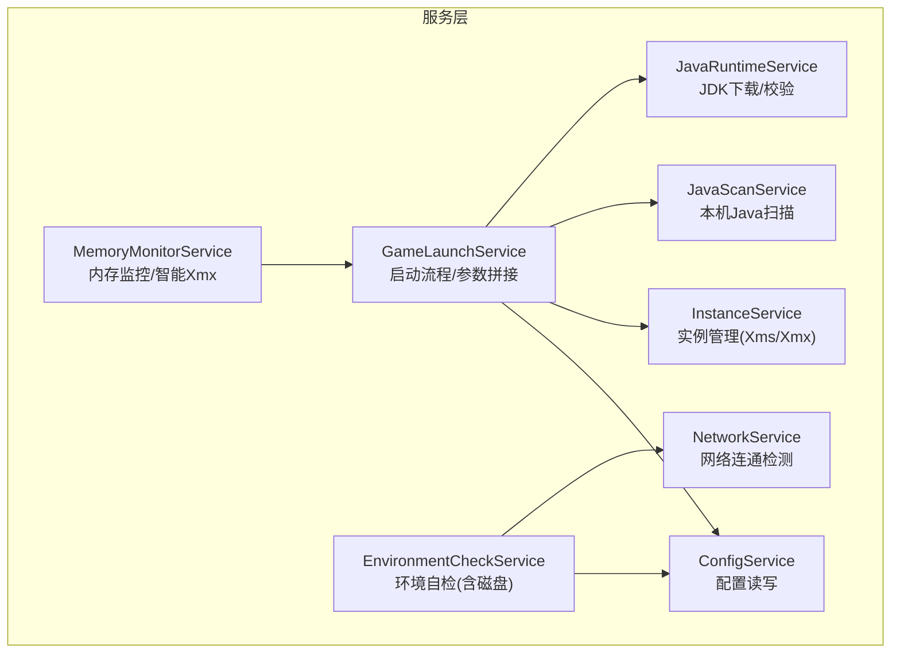
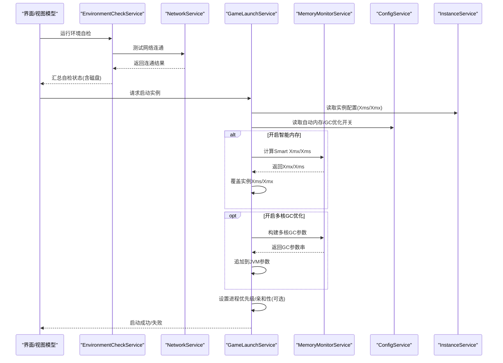
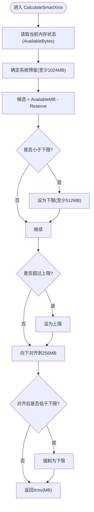
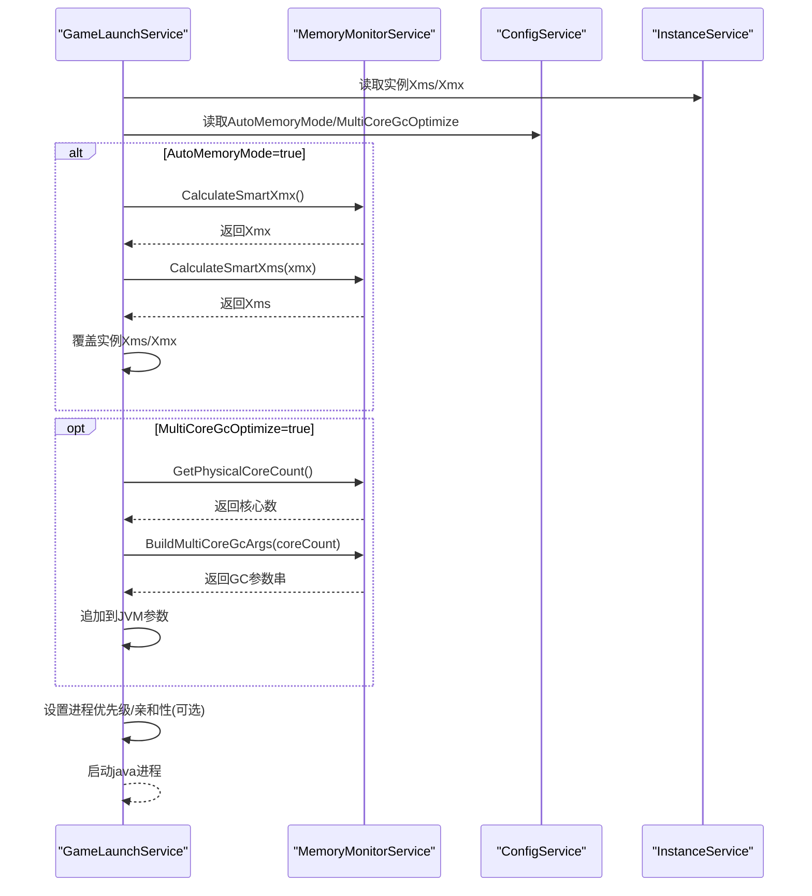
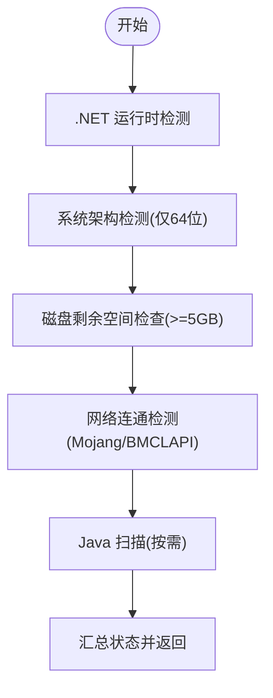
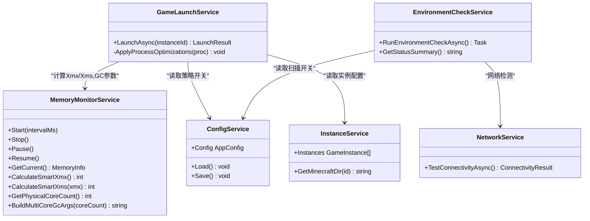

# 系统资源监控

<cite>
**本文引用的文件**   
- [MemoryMonitorService.cs](file://src/FufuLauncher/Services/MemoryMonitorService.cs)
- [ConfigService.cs](file://src/FufuLauncher/Services/ConfigService.cs)
- [GameLaunchService.cs](file://src/FufuLauncher/Services/GameLaunchService.cs)
- [EnvironmentCheckService.cs](file://src/FufuLauncher/Services/EnvironmentCheckService.cs)
- [NetworkService.cs](file://src/FufuLauncher/Services/NetworkService.cs)
- [JavaScanService.cs](file://src/FufuLauncher/Services/JavaScanService.cs)
- [JavaRuntimeService.cs](file://src/FufuLauncher/Services/JavaRuntimeService.cs)
- [InstanceService.cs](file://src/FufuLauncher/Services/InstanceService.cs)
</cite>

## 目录
1. [简介](#简介)
2. [项目结构](#项目结构)
3. [核心组件](#核心组件)
4. [架构总览](#架构总览)
5. [详细组件分析](#详细组件分析)
6. [依赖关系分析](#依赖关系分析)
7. [性能考量](#性能考量)
8. [故障排查指南](#故障排查指南)
9. [结论](#结论)
10. [附录：监控数据获取与工具使用](#附录监控数据获取与工具使用)

## 简介
本文件聚焦“可爱的芙芙启动器”的系统资源监控能力，围绕内存监控服务、CPU 核心检测、磁盘空间监控、系统性能指标收集与实时性保障机制展开。同时给出性能调优建议与优化策略，并说明如何获取监控数据以及使用常用性能分析工具进行诊断。

## 项目结构
资源监控相关代码集中在 Services 层，关键文件如下：
- MemoryMonitorService.cs：内存监控与智能 Xmx/Xms 计算、多核 GC 参数生成、物理核心数检测
- GameLaunchService.cs：启动时应用智能内存分配、GC 多核优化、进程优先级与 CPU 亲和性
- EnvironmentCheckService.cs：环境自检（含磁盘空间检查）
- ConfigService.cs：配置项（自动内存模式、预留内存、上下限等）
- NetworkService.cs：网络连通检测（辅助环境自检）
- JavaScanService.cs / JavaRuntimeService.cs：Java 运行时扫描与管理（为启动链路提供运行时信息）
- InstanceService.cs：实例元数据（Xms/Xmx、JVM 参数等）

**图表来源**
- [MemoryMonitorService.cs:1-227](file://src/FufuLauncher/Services/MemoryMonitorService.cs#L1-L227)
- [GameLaunchService.cs:1-401](file://src/FufuLauncher/Services/GameLaunchService.cs#L1-L401)
- [EnvironmentCheckService.cs:1-215](file://src/FufuLauncher/Services/EnvironmentCheckService.cs#L1-L215)
- [ConfigService.cs:1-148](file://src/FufuLauncher/Services/ConfigService.cs#L1-L148)
- [NetworkService.cs:1-95](file://src/FufuLauncher/Services/NetworkService.cs#L1-L95)
- [JavaScanService.cs:1-293](file://src/FufuLauncher/Services/JavaScanService.cs#L1-L293)
- [JavaRuntimeService.cs:1-527](file://src/FufuLauncher/Services/JavaRuntimeService.cs#L1-L527)
- [InstanceService.cs:1-253](file://src/FufuLauncher/Services/InstanceService.cs#L1-L253)

**章节来源**
- [MemoryMonitorService.cs:1-227](file://src/FufuLauncher/Services/MemoryMonitorService.cs#L1-L227)
- [GameLaunchService.cs:1-401](file://src/FufuLauncher/Services/GameLaunchService.cs#L1-L401)
- [EnvironmentCheckService.cs:1-215](file://src/FufuLauncher/Services/EnvironmentCheckService.cs#L1-L215)
- [ConfigService.cs:1-148](file://src/FufuLauncher/Services/ConfigService.cs#L1-L148)

## 核心组件
- 内存监控服务（MemoryMonitorService）
  - 读取系统物理内存总量、已用/可用、负载百分比
  - 智能计算 JVM 最大堆 Xmx 与初始堆 Xms，支持对齐与阈值限制
  - 生成多核 GC 优化参数（ParallelGCThreads/ConcGCThreads/CICompilerCount）
  - 定时刷新事件（UI 线程触发），支持暂停/恢复与兜底定时器
- 游戏启动服务（GameLaunchService）
  - 在启动前根据配置启用智能内存分配，覆盖实例默认 Xmx/Xms
  - 可选注入多核 GC 优化参数、设置进程优先级与 CPU 亲和性
- 环境自检服务（EnvironmentCheckService）
  - 磁盘剩余空间检查（按启动器数据盘根路径判断）
  - 网络连通检测（Mojang/BMCLAPI）
  - .NET 运行时与系统架构检测
- 配置服务（ConfigService）
  - 自动内存模式开关、预留内存、上下限、多核 GC 优化开关、高优先级/CPU 亲和性等

**章节来源**
- [MemoryMonitorService.cs:1-227](file://src/FufuLauncher/Services/MemoryMonitorService.cs#L1-L227)
- [GameLaunchService.cs:1-401](file://src/FufuLauncher/Services/GameLaunchService.cs#L1-L401)
- [EnvironmentCheckService.cs:1-215](file://src/FufuLauncher/Services/EnvironmentCheckService.cs#L1-L215)
- [ConfigService.cs:1-148](file://src/FufuLauncher/Services/ConfigService.cs#L1-L148)

## 架构总览
下图展示资源监控与启动流程的交互关系：启动服务在准备阶段调用内存监控服务计算 Xmx/Xms，并根据配置决定是否注入多核 GC 参数；环境自检服务在启动前完成磁盘与网络检查；配置服务贯穿各模块提供策略开关。

**图表来源**
- [GameLaunchService.cs:104-316](file://src/FufuLauncher/Services/GameLaunchService.cs#L104-L316)
- [MemoryMonitorService.cs:175-213](file://src/FufuLauncher/Services/MemoryMonitorService.cs#L175-L213)
- [EnvironmentCheckService.cs:52-73](file://src/FufuLauncher/Services/EnvironmentCheckService.cs#L52-L73)
- [NetworkService.cs:34-76](file://src/FufuLauncher/Services/NetworkService.cs#L34-L76)
- [ConfigService.cs:59-67](file://src/FufuLauncher/Services/ConfigService.cs#L59-L67)
- [InstanceService.cs:27-49](file://src/FufuLauncher/Services/InstanceService.cs#L27-L49)

## 详细组件分析

### 内存监控服务（MemoryMonitorService）
- 功能要点
  - 通过系统 API 读取物理内存总量、可用量、已用量与负载百分比
  - 定时刷新事件（DispatcherTimer，Background 优先级），避免 UI 卡顿；无 UI 时回退 Timer
  - 智能 Xmx 算法：当前空闲内存减去系统预留（至少 1GB），再受上下限约束，并按 256MB 对齐减少 GC 碎片
  - Xms 计算：取 Xmx 的 1/4，向下 256 对齐，最小 512MB
  - 多核 GC 参数：基于物理核心数估算 ParallelGCThreads/ConcGCThreads/CICompilerCount
  - 物理核心数：使用系统处理器计数，异常时回退默认值
- 复杂度与性能
  - 单次读取为 O(1)，定时器间隔默认 3000ms，降低 P/Invoke 频率
  - 事件抛出包裹 try/catch，异常写入日志，不中断主循环
- 错误处理
  - 读取异常记录日志；UI Dispatcher 不可用时回退线程池定时器

**图表来源**
- [MemoryMonitorService.cs:175-191](file://src/FufuLauncher/Services/MemoryMonitorService.cs#L175-L191)

**章节来源**
- [MemoryMonitorService.cs:26-227](file://src/FufuLauncher/Services/MemoryMonitorService.cs#L26-L227)

### 游戏启动服务（GameLaunchService）中的资源监控集成
- 智能内存分配
  - 当配置开启自动内存模式时，优先采用 MemoryMonitorService 计算的 Xmx/Xms 覆盖实例默认值
- 多核 GC 优化
  - 若开启 MultiCoreGcOptimize，则调用 BuildMultiCoreGcArgs 生成参数并追加到 JVM 启动参数
- 进程优化
  - 可选设置 AboveNormal 优先级与 CPU 亲和性掩码（保留 1 个核心给系统）
- 启动参数拼接
  - 组装 classpath、JVM 参数、认证参数、窗口参数等，确保稳定启动

**图表来源**
- [GameLaunchService.cs:179-225](file://src/FufuLauncher/Services/GameLaunchService.cs#L179-L225)
- [MemoryMonitorService.cs:158-213](file://src/FufuLauncher/Services/MemoryMonitorService.cs#L158-L213)

**章节来源**
- [GameLaunchService.cs:104-358](file://src/FufuLauncher/Services/GameLaunchService.cs#L104-L358)

### 环境自检服务（EnvironmentCheckService）与磁盘空间监控
- 磁盘空间检查
  - 以启动器数据目录所在盘根路径为准，计算可用 GB，阈值不足给出提示
  - 异常捕获并记录失败原因
- 网络连通检测
  - 分别探测 Mojang 官方源与 BMCLAPI 镜像源，返回延迟与可用性
- 其他自检
  - .NET 运行时存在性、操作系统架构（仅支持 64 位 Windows）

**图表来源**
- [EnvironmentCheckService.cs:52-73](file://src/FufuLauncher/Services/EnvironmentCheckService.cs#L52-L73)
- [EnvironmentCheckService.cs:119-149](file://src/FufuLauncher/Services/EnvironmentCheckService.cs#L119-L149)
- [NetworkService.cs:34-76](file://src/FufuLauncher/Services/NetworkService.cs#L34-L76)

**章节来源**
- [EnvironmentCheckService.cs:1-215](file://src/FufuLauncher/Services/EnvironmentCheckService.cs#L1-L215)
- [NetworkService.cs:1-95](file://src/FufuLauncher/Services/NetworkService.cs#L1-L95)

### 配置服务（ConfigService）与资源策略
- 自动内存模式
  - AutoMemoryMode：是否启用智能分配
  - MemoryReserveMb：系统预留（至少 1024MB）
  - AutoMemoryMinMb/AutoMemoryMaxMb：智能分配上下限
- 多核 GC 优化
  - MultiCoreGcOptimize：是否注入 GC 多核参数
- 进程优化
  - HighPriorityProcess：设置 AboveNormal 优先级
  - CpuAffinityEnabled：绑定 CPU 亲和性

**章节来源**
- [ConfigService.cs:51-67](file://src/FufuLauncher/Services/ConfigService.cs#L51-L67)

### Java 扫描与运行时（辅助资源信息）
- JavaScanService：扫描本机 Java 安装，解析版本、架构、厂商，提供筛选与最优选择
- JavaRuntimeService：下载与管理完整 JDK，校验 java.exe 完整性，列出本地运行时

**章节来源**
- [JavaScanService.cs:1-293](file://src/FufuLauncher/Services/JavaScanService.cs#L1-L293)
- [JavaRuntimeService.cs:1-527](file://src/FufuLauncher/Services/JavaRuntimeService.cs#L1-L527)

## 依赖关系分析
- 低耦合设计
  - MemoryMonitorService 仅依赖配置服务与系统 API，不直接参与启动流程
  - GameLaunchService 组合多个服务，按配置动态启用功能
- 外部依赖
  - Windows 内核 API（内存状态）
  - 文件系统（磁盘空间）
  - 网络 HTTP（连通性检测）
- 可能的循环依赖
  - 当前未见循环引用，服务间通过构造函数注入

**图表来源**
- [MemoryMonitorService.cs:26-213](file://src/FufuLauncher/Services/MemoryMonitorService.cs#L26-L213)
- [GameLaunchService.cs:35-65](file://src/FufuLauncher/Services/GameLaunchService.cs#L35-L65)
- [EnvironmentCheckService.cs:35-50](file://src/FufuLauncher/Services/EnvironmentCheckService.cs#L35-L50)
- [ConfigService.cs:81-92](file://src/FufuLauncher/Services/ConfigService.cs#L81-L92)
- [NetworkService.cs:18-29](file://src/FufuLauncher/Services/NetworkService.cs#L18-L29)
- [InstanceService.cs:51-70](file://src/FufuLauncher/Services/InstanceService.cs#L51-L70)

**章节来源**
- [MemoryMonitorService.cs:26-213](file://src/FufuLauncher/Services/MemoryMonitorService.cs#L26-L213)
- [GameLaunchService.cs:35-65](file://src/FufuLauncher/Services/GameLaunchService.cs#L35-L65)
- [EnvironmentCheckService.cs:35-50](file://src/FufuLauncher/Services/EnvironmentCheckService.cs#L35-L50)
- [ConfigService.cs:81-92](file://src/FufuLauncher/Services/ConfigService.cs#L81-L92)
- [NetworkService.cs:18-29](file://src/FufuLauncher/Services/NetworkService.cs#L18-L29)
- [InstanceService.cs:51-70](file://src/FufuLauncher/Services/InstanceService.cs#L51-L70)

## 性能考量
- 内存监控刷新频率
  - 默认 3000ms，UI 线程 Background 优先级，避免抢占输入事件
  - 可暂停/恢复以减少无监听者时的开销
- 智能 Xmx 对齐
  - 256MB 对齐减少 GC 碎片，提升吞吐
- 多核 GC 参数
  - 依据物理核心估算并行与并发线程数，平衡吞吐与延迟
- 进程优先级与亲和性
  - AboveNormal 优先级与 CPU 亲和性可降低调度抖动，但需管理员权限
- 磁盘空间阈值
  - 启动前检查剩余空间，避免下载/解压过程中因空间不足导致失败

[本节为通用指导，无需特定文件引用]

## 故障排查指南
- 内存监控读取异常
  - 现象：Updated 事件未触发或 UI 无更新
  - 排查：查看应用日志中“[内存监控] 读取异常”记录；确认 Dispatcher 可用性与定时器状态
- 智能 Xmx 过小或过大
  - 现象：游戏频繁 GC 或 OOM
  - 排查：检查 AutoMemoryMinMb/AutoMemoryMaxMb 与 MemoryReserveMb 配置；观察 GetCurrent() 返回的 AvailableBytes
- 多核 GC 参数无效
  - 现象：未生效
  - 排查：确认 MultiCoreGcOptimize 开关；核对 BuildMultiCoreGcArgs 输出；检查 JVM 是否接受该参数
- 磁盘空间不足
  - 现象：下载/解压失败
  - 排查：EnvironmentCheckService 返回 DiskSpaceOk=false；清理空间或更换目标盘
- 网络不可达
  - 现象：无法访问 Mojang/BMCLAPI
  - 排查：NetworkService.TestConnectivityAsync 返回不可用；检查代理/防火墙

**章节来源**
- [MemoryMonitorService.cs:130-141](file://src/FufuLauncher/Services/MemoryMonitorService.cs#L130-L141)
- [EnvironmentCheckService.cs:119-149](file://src/FufuLauncher/Services/EnvironmentCheckService.cs#L119-L149)
- [NetworkService.cs:34-76](file://src/FufuLauncher/Services/NetworkService.cs#L34-L76)

## 结论
本项目的资源监控体系以 MemoryMonitorService 为核心，结合 GameLaunchService 的启动流程与环境自检服务，实现了稳定的内存监控、智能 Xmx/Xms 分配、多核 GC 优化与磁盘空间检查。通过合理的定时器策略与异常保护，保证了实时监控与准确性。配合配置开关与进程级优化，可在不同硬件环境下取得较好的稳定性与性能表现。

[本节为总结性内容，无需特定文件引用]

## 附录：监控数据获取与工具使用
- 内存监控数据获取
  - 订阅 MemoryMonitorService.Updated 事件，获取 MemoryInfo（TotalBytes/AvailableBytes/UsedBytes/LoadPercent）
  - 手动调用 GetCurrent() 获取瞬时快照
- CPU 核心数检测
  - 使用 GetPhysicalCoreCount() 获取物理核心数，用于 GC 参数与亲和性设置
- 磁盘空间检查
  - 通过 EnvironmentCheckService.CheckDiskSpace 逻辑，读取根盘 AvailableFreeSpace
- 系统性能指标收集
  - 内存：Total/Available/Used、LoadPercent
  - CPU：核心数、进程优先级与亲和性（影响调度）
  - 进程资源：启动后由 GameLogService 捕获输出，退出时统计时长
- 性能分析工具建议
  - Windows Performance Monitor（计数器：Process\% Processor Time、Process\Working Set、Memory\Available Bytes）
  - Visual Studio Profiler（CPU/内存采样）
  - dotnet-gcstat / JFR（JVM 内部 GC 行为）
  - 任务管理器（快速查看进程占用）

[本节为通用指导，无需特定文件引用]