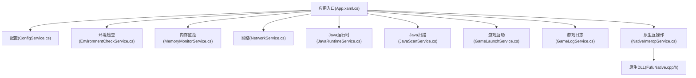
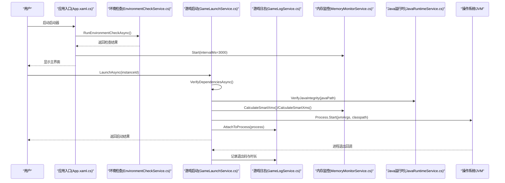
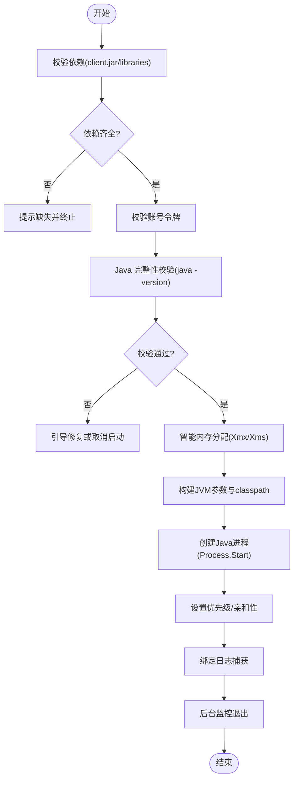
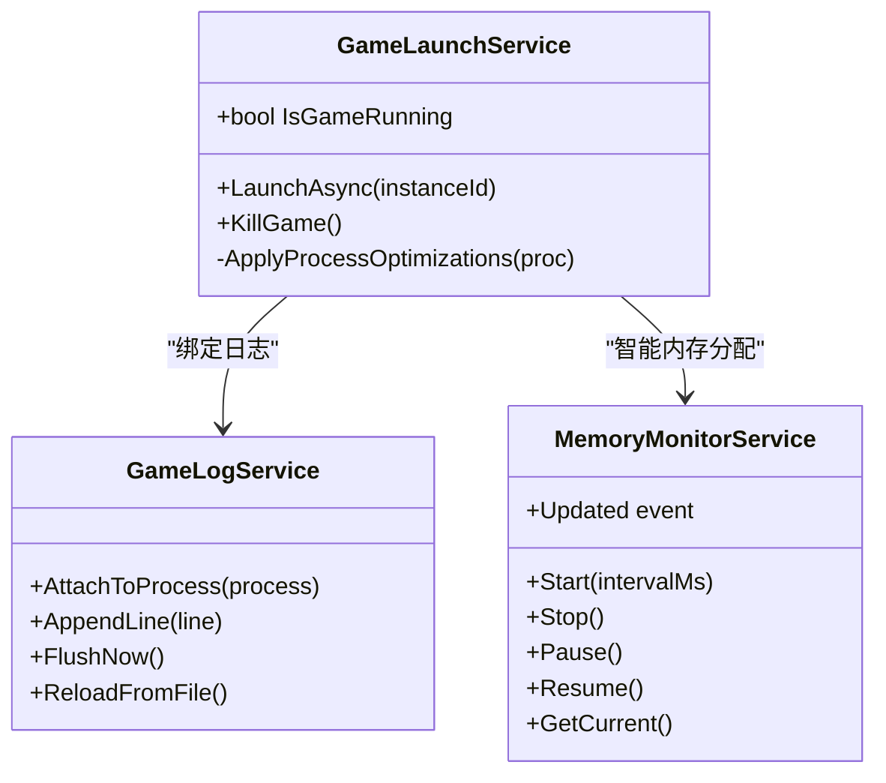
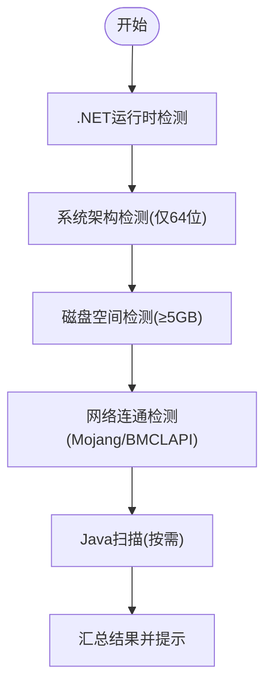
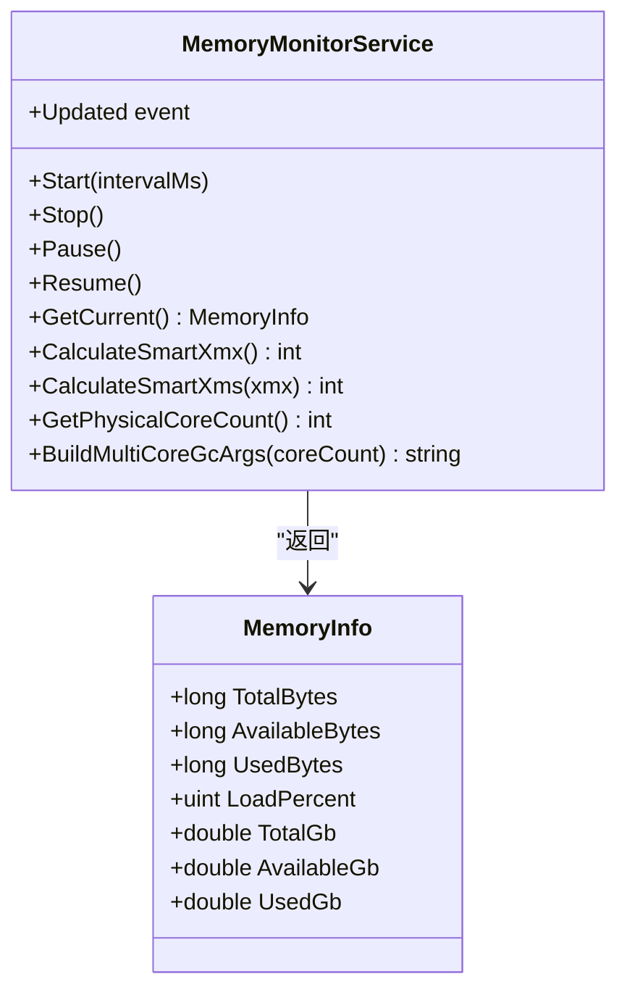
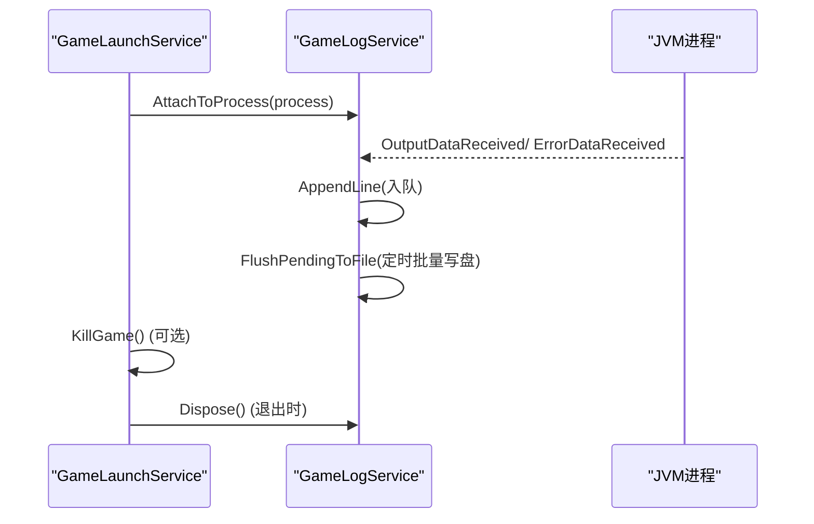
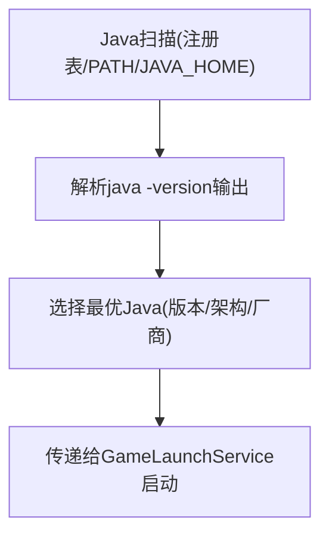
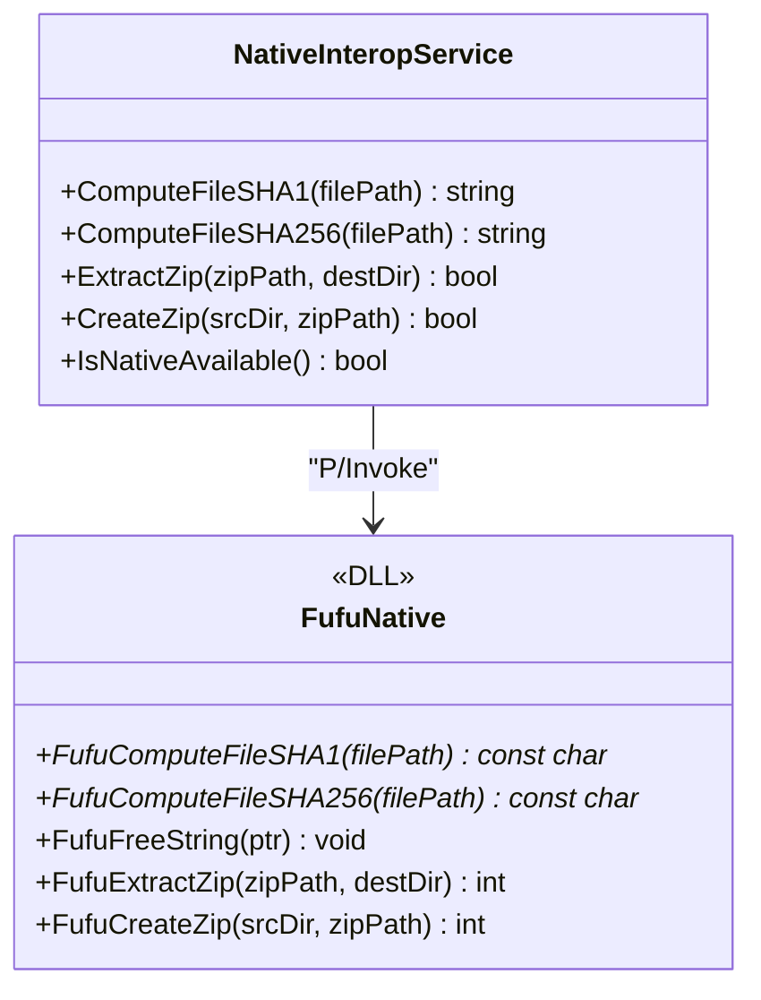
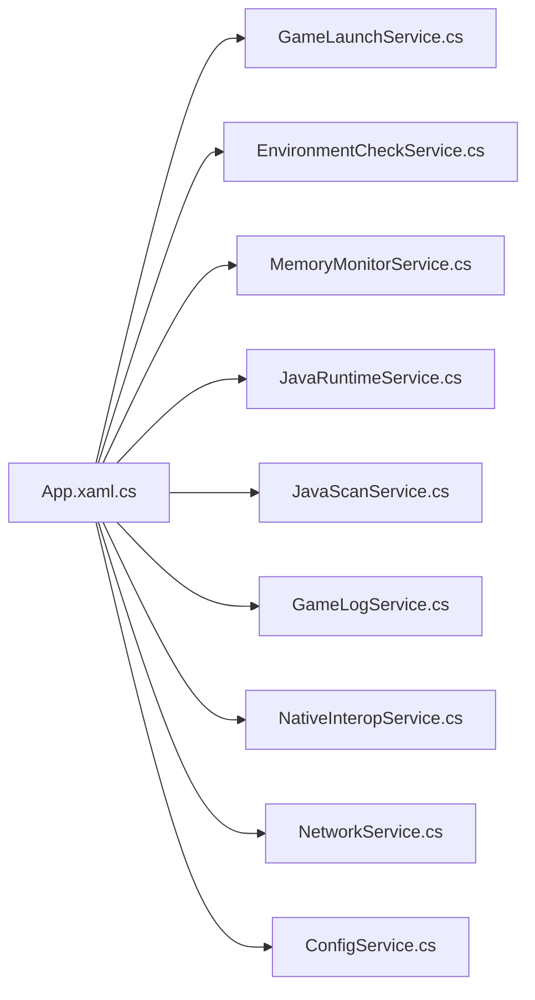

# 进程和系统管理

<cite>
**本文引用的文件**   
- [App.xaml.cs](file://src/FufuLauncher/App.xaml.cs)
- [ConfigService.cs](file://src/FufuLauncher/Services/ConfigService.cs)
- [EnvironmentCheckService.cs](file://src/FufuLauncher/Services/EnvironmentCheckService.cs)
- [GameLaunchService.cs](file://src/FufuLauncher/Services/GameLaunchService.cs)
- [GameLogService.cs](file://src/FufuLauncher/Services/GameLogService.cs)
- [JavaRuntimeService.cs](file://src/FufuLauncher/Services/JavaRuntimeService.cs)
- [JavaScanService.cs](file://src/FufuLauncher/Services/JavaScanService.cs)
- [MemoryMonitorService.cs](file://src/FufuLauncher/Services/MemoryMonitorService.cs)
- [NativeInteropService.cs](file://src/FufuLauncher/Services/NativeInteropService.cs)
- [NetworkService.cs](file://src/FufuLauncher/Services/NetworkService.cs)
- [FufuNative.cpp](file://native/FufuNative/FufuNative.cpp)
- [FufuNative.h](file://native/FufuNative/FufuNative.h)
</cite>

## 目录
1. [简介](#简介)
2. [项目结构](#项目结构)
3. [核心组件](#核心组件)
4. [架构总览](#架构总览)
5. [详细组件分析](#详细组件分析)
6. [依赖关系分析](#依赖关系分析)
7. [性能考量](#性能考量)
8. [故障排除指南](#故障排除指南)
9. [结论](#结论)
10. [附录](#附录)

## 简介
本文件面向“可爱的芙芙”启动器的进程与系统管理能力，系统性说明游戏进程启动流程（JVM 参数、进程创建与生命周期）、进程监控机制（状态检测、资源占用、异常退出处理）、环境检查服务（系统依赖、Java 运行时验证、权限提示）、系统资源监控（CPU、内存、磁盘空间）、进程间通信与资源清理、以及与操作系统集成（注册表、环境变量、系统服务）等。文档同时提供性能调优建议与故障排查指引，帮助读者快速定位并解决问题。

## 项目结构
启动器采用 WPF + .NET 8 应用，通过 DI 容器装配各服务模块。关键路径：
- 应用入口与全局异常捕获、DI 装配、数据目录初始化、日志缓冲写入：App.xaml.cs
- 配置中心：ConfigService.cs
- 环境自检：EnvironmentCheckService.cs
- 游戏启动与 JVM 参数拼装、进程优先级/亲和性、退出监控：GameLaunchService.cs
- 游戏日志实时捕获与批量落盘：GameLogService.cs
- Java 运行时下载与管理、完整性校验：JavaRuntimeService.cs
- 本机 Java 扫描（注册表、PATH、JAVA_HOME、Program Files 等）：JavaScanService.cs
- 内存监控与智能分配、多核 GC 参数生成：MemoryMonitorService.cs
- 原生 DLL 封装与托管回退（哈希、ZIP）：NativeInteropService.cs
- 网络连通检测：NetworkService.cs
- 原生 DLL 导出接口实现：FufuNative.cpp / FufuNative.h

**图表来源** 
- [App.xaml.cs:138-217](file://src/FufuLauncher/App.xaml.cs#L138-L217)
- [ConfigService.cs:81-148](file://src/FufuLauncher/Services/ConfigService.cs#L81-L148)
- [EnvironmentCheckService.cs:35-73](file://src/FufuLauncher/Services/EnvironmentCheckService.cs#L35-L73)
- [MemoryMonitorService.cs:26-88](file://src/FufuLauncher/Services/MemoryMonitorService.cs#L26-L88)
- [NetworkService.cs:18-33](file://src/FufuLauncher/Services/NetworkService.cs#L18-L33)
- [JavaRuntimeService.cs:50-84](file://src/FufuLauncher/Services/JavaRuntimeService.cs#L50-L84)
- [JavaScanService.cs:36-75](file://src/FufuLauncher/Services/JavaScanService.cs#L36-L75)
- [GameLaunchService.cs:35-65](file://src/FufuLauncher/Services/GameLaunchService.cs#L35-L65)
- [GameLogService.cs:22-52](file://src/FufuLauncher/Services/GameLogService.cs#L22-L52)
- [NativeInteropService.cs:20-25](file://src/FufuLauncher/Services/NativeInteropService.cs#L20-L25)
- [FufuNative.cpp:1-20](file://native/FufuNative/FufuNative.cpp#L1-L20)
- [FufuNative.h:1-18](file://native/FufuNative/FufuNative.h#L1-L18)

**章节来源**
- [App.xaml.cs:82-156](file://src/FufuLauncher/App.xaml.cs#L82-L156)
- [ConfigService.cs:13-79](file://src/FufuLauncher/Services/ConfigService.cs#L13-L79)

## 核心组件
- 游戏启动服务：负责依赖校验、账号令牌校验、Java 完整性校验、JVM 参数拼接、进程创建、优先级/亲和性设置、日志绑定、退出监控与统计。
- 环境检查服务：启动时进行 .NET 运行时、系统架构、磁盘空间、网络连通、Java 扫描的综合检查，汇总结果供 UI 展示。
- 内存监控服务：定时读取系统内存信息，提供智能 Xmx/Xms 计算与多核 GC 参数生成，支持 UI 刷新事件。
- Java 运行时服务：按镜像源下载完整 JDK、解压、目录整理、版本探测、完整性校验、列出已安装运行时。
- Java 扫描服务：按需扫描 JAVA_HOME、Program Files、注册表、PATH 等位置，解析 java -version 输出，筛选最优 Java。
- 游戏日志服务：实时捕获 stdout/stderr，内存缓冲+定时批量落盘，避免频繁 IO 阻塞。
- 原生互操作服务：优先调用 C++ DLL 完成哈希与 ZIP 操作，失败自动回退到托管实现。
- 网络服务：检测 Mojang/BMCLAPI 连通性与延迟。

**章节来源**
- [GameLaunchService.cs:69-316](file://src/FufuLauncher/Services/GameLaunchService.cs#L69-L316)
- [EnvironmentCheckService.cs:52-73](file://src/FufuLauncher/Services/EnvironmentCheckService.cs#L52-L73)
- [MemoryMonitorService.cs:56-88](file://src/FufuLauncher/Services/MemoryMonitorService.cs#L56-L88)
- [JavaRuntimeService.cs:199-277](file://src/FufuLauncher/Services/JavaRuntimeService.cs#L199-L277)
- [JavaScanService.cs:47-75](file://src/FufuLauncher/Services/JavaScanService.cs#L47-L75)
- [GameLogService.cs:54-66](file://src/FufuLauncher/Services/GameLogService.cs#L54-L66)
- [NativeInteropService.cs:38-73](file://src/FufuLauncher/Services/NativeInteropService.cs#L38-L73)
- [NetworkService.cs:34-76](file://src/FufuLauncher/Services/NetworkService.cs#L34-L76)

## 架构总览
启动器在应用启动阶段完成 DI 装配与环境自检，随后显示主界面；用户触发启动后，启动服务依次执行依赖校验、Java 完整性校验、JVM 参数构建、进程创建与优化、日志绑定与退出监控。内存监控服务以定时器方式周期性更新系统内存快照，供 UI 展示与智能分配使用。

**图表来源** 
- [App.xaml.cs:149-156](file://src/FufuLauncher/App.xaml.cs#L149-L156)
- [EnvironmentCheckService.cs:52-73](file://src/FufuLauncher/Services/EnvironmentCheckService.cs#L52-L73)
- [GameLaunchService.cs:104-316](file://src/FufuLauncher/Services/GameLaunchService.cs#L104-L316)
- [GameLogService.cs:54-66](file://src/FufuLauncher/Services/GameLogService.cs#L54-L66)
- [MemoryMonitorService.cs:62-88](file://src/FufuLauncher/Services/MemoryMonitorService.cs#L62-L88)
- [JavaRuntimeService.cs:482-510](file://src/FufuLauncher/Services/JavaRuntimeService.cs#L482-L510)

## 详细组件分析

### 游戏进程启动与生命周期管理
- 依赖校验：检查 client.jar、libraries 目录是否存在，必要时提示缺失项。
- 账号令牌校验：确保登录态有效，否则阻止启动。
- Java 完整性校验：文件存在且可执行（java -version），若失败则弹窗引导修复或取消启动。
- 智能内存分配：根据当前可用内存与预留阈值计算 Xmx/Xms，覆盖实例配置。
- JVM 参数构建：基础参数（-Xms/-Xmx/-Djava.library.path/-cp）、可选多核 GC 优化参数、额外参数、主类与游戏参数（用户名、版本、目录、UUID、访问令牌等）。
- 进程创建与优化：设置工作目录、重定向输出、创建无窗口进程；可选设置 AboveNormal 优先级与 CPU 亲和性掩码。
- 日志绑定与退出监控：附加 GameLogService 捕获输出，后台等待退出，累计游玩时长并保存实例信息。

**图表来源** 
- [GameLaunchService.cs:69-316](file://src/FufuLauncher/Services/GameLaunchService.cs#L69-L316)

**章节来源**
- [GameLaunchService.cs:69-316](file://src/FufuLauncher/Services/GameLaunchService.cs#L69-L316)

### 进程监控机制
- 状态检测：IsGameRunning 基于 _currentProcess.HasExited 判断。
- 资源占用监控：由 MemoryMonitorService 定时读取系统内存负载、总量、可用量，并提供 UI 事件。
- 异常退出处理：后台 WaitForExit 捕获退出码，记录日志并累计游玩时长；异常被捕获并记录。

**图表来源** 
- [GameLaunchService.cs:67-316](file://src/FufuLauncher/Services/GameLaunchService.cs#L67-L316)
- [GameLogService.cs:54-66](file://src/FufuLauncher/Services/GameLogService.cs#L54-L66)
- [MemoryMonitorService.cs:56-88](file://src/FufuLauncher/Services/MemoryMonitorService.cs#L56-L88)

**章节来源**
- [GameLaunchService.cs:67-316](file://src/FufuLauncher/Services/GameLaunchService.cs#L67-L316)
- [GameLogService.cs:54-66](file://src/FufuLauncher/Services/GameLogService.cs#L54-L66)
- [MemoryMonitorService.cs:56-88](file://src/FufuLauncher/Services/MemoryMonitorService.cs#L56-L88)

### 环境检查服务
- .NET 运行时检测：确认 Desktop 运行时已加载。
- 系统架构检测：仅支持 64 位 Windows，32 位直接提示升级。
- 磁盘空间检测：检查启动器数据目录所在盘剩余空间，不足 5GB 给出警告。
- 网络连通检测：测试 Mojang/BMCLAPI 可达性与延迟。
- Java 扫描：受 AutoScanJavaOnStartup 控制，默认不自动扫描，复用上次结果或手动触发。

**图表来源** 
- [EnvironmentCheckService.cs:52-73](file://src/FufuLauncher/Services/EnvironmentCheckService.cs#L52-L73)
- [EnvironmentCheckService.cs:91-117](file://src/FufuLauncher/Services/EnvironmentCheckService.cs#L91-L117)
- [EnvironmentCheckService.cs:119-149](file://src/FufuLauncher/Services/EnvironmentCheckService.cs#L119-L149)
- [EnvironmentCheckService.cs:151-174](file://src/FufuLauncher/Services/EnvironmentCheckService.cs#L151-L174)
- [EnvironmentCheckService.cs:176-213](file://src/FufuLauncher/Services/EnvironmentCheckService.cs#L176-L213)

**章节来源**
- [EnvironmentCheckService.cs:52-73](file://src/FufuLauncher/Services/EnvironmentCheckService.cs#L52-L73)
- [EnvironmentCheckService.cs:91-117](file://src/FufuLauncher/Services/EnvironmentCheckService.cs#L91-L117)
- [EnvironmentCheckService.cs:119-149](file://src/FufuLauncher/Services/EnvironmentCheckService.cs#L119-L149)
- [EnvironmentCheckService.cs:151-174](file://src/FufuLauncher/Services/EnvironmentCheckService.cs#L151-L174)
- [EnvironmentCheckService.cs:176-213](file://src/FufuLauncher/Services/EnvironmentCheckService.cs#L176-L213)

### 系统资源监控功能
- 内存监控：通过 GlobalMemoryStatusEx 读取物理内存总量、可用量、已用量与负载百分比；DispatcherTimer 以 Background 优先级每 3s 触发一次，避免 UI 卡顿。
- CPU 核心数：Environment.ProcessorCount 获取物理核心数，用于多核 GC 参数生成。
- 智能内存分配：CalculateSmartXmx 基于可用内存减去预留值（至少 1GB），限制上下限并按 256MB 对齐；CalculateSmartXms 取 Xmx 的 1/4，最小 512MB。
- 多核 GC 参数：BuildMultiCoreGcArgs 生成 ParallelGCThreads/ConcGCThreads/CICompilerCount 参数。

**图表来源** 
- [MemoryMonitorService.cs:26-88](file://src/FufuLauncher/Services/MemoryMonitorService.cs#L26-L88)
- [MemoryMonitorService.cs:144-213](file://src/FufuLauncher/Services/MemoryMonitorService.cs#L144-L213)
- [MemoryMonitorService.cs:217-227](file://src/FufuLauncher/Services/MemoryMonitorService.cs#L217-L227)

**章节来源**
- [MemoryMonitorService.cs:56-88](file://src/FufuLauncher/Services/MemoryMonitorService.cs#L56-L88)
- [MemoryMonitorService.cs:144-213](file://src/FufuLauncher/Services/MemoryMonitorService.cs#L144-L213)
- [MemoryMonitorService.cs:217-227](file://src/FufuLauncher/Services/MemoryMonitorService.cs#L217-L227)

### 进程间通信与资源清理
- 进程间通信：通过 Process.StandardOutput/StandardError 异步读取，GameLogService 将输出行加入内存缓冲队列并批量写盘，同时触发 LogsAppended 事件供 UI 消费。
- 资源清理：
  - GameLogService.Dispose 取消事件订阅、最后一次刷盘、释放定时器。
  - GameLaunchService.KillGame 强制终止进程树。
  - MemoryMonitorService.Stop/Pause/Resume 控制定时器生命周期。
  - App.OnExit 停止内存监控、释放背景资源、最终刷新应用日志缓冲。

**图表来源** 
- [GameLaunchService.cs:269-316](file://src/FufuLauncher/Services/GameLaunchService.cs#L269-L316)
- [GameLogService.cs:54-66](file://src/FufuLauncher/Services/GameLogService.cs#L54-L66)
- [GameLogService.cs:139-166](file://src/FufuLauncher/Services/GameLogService.cs#L139-L166)
- [GameLogService.cs:210-222](file://src/FufuLauncher/Services/GameLogService.cs#L210-L222)
- [App.xaml.cs:158-168](file://src/FufuLauncher/App.xaml.cs#L158-L168)

**章节来源**
- [GameLaunchService.cs:269-316](file://src/FufuLauncher/Services/GameLaunchService.cs#L269-L316)
- [GameLogService.cs:54-66](file://src/FufuLauncher/Services/GameLogService.cs#L54-L66)
- [GameLogService.cs:139-166](file://src/FufuLauncher/Services/GameLogService.cs#L139-L166)
- [GameLogService.cs:210-222](file://src/FufuLauncher/Services/GameLogService.cs#L210-L222)
- [App.xaml.cs:158-168](file://src/FufuLauncher/App.xaml.cs#L158-L168)

### 与操作系统集成
- 注册表操作：JavaScanService 扫描 HKLM\SOFTWARE\JavaSoft 及 Eclipse Adoptium、Microsoft JDK 键值，支持 64/32 位视图。
- 环境变量管理：读取 JAVA_HOME、PATH，定位 java.exe；GameLaunchService 传递 --username/--version/--gameDir 等参数给 JVM。
- 系统服务集成：未直接注册系统服务；通过进程优先级与 CPU 亲和性提升游戏性能；磁盘空间检测影响运行条件。

**图表来源** 
- [JavaScanService.cs:123-156](file://src/FufuLauncher/Services/JavaScanService.cs#L123-L156)
- [JavaScanService.cs:158-168](file://src/FufuLauncher/Services/JavaScanService.cs#L158-L168)
- [JavaScanService.cs:191-217](file://src/FufuLauncher/Services/JavaScanService.cs#L191-L217)
- [GameLaunchService.cs:236-267](file://src/FufuLauncher/Services/GameLaunchService.cs#L236-L267)

**章节来源**
- [JavaScanService.cs:123-156](file://src/FufuLauncher/Services/JavaScanService.cs#L123-L156)
- [JavaScanService.cs:158-168](file://src/FufuLauncher/Services/JavaScanService.cs#L158-L168)
- [JavaScanService.cs:191-217](file://src/FufuLauncher/Services/JavaScanService.cs#L191-L217)
- [GameLaunchService.cs:236-267](file://src/FufuLauncher/Services/GameLaunchService.cs#L236-L267)

### 原生互操作与性能加速
- 原生 DLL 导出：FufuNative.cpp 提供 SHA1/SHA256 计算、ZIP 解压/打包接口。
- C# 封装：NativeInteropService 优先调用原生方法，失败自动回退到托管实现（System.IO.Compression、Cryptography）。
- 内存与字符串管理：C++ 分配的 UTF-8 字符串由 FufuFreeString 释放，C# 侧 PtrToUtf8StringAndFree 统一处理。

**图表来源** 
- [NativeInteropService.cs:38-73](file://src/FufuLauncher/Services/NativeInteropService.cs#L38-L73)
- [NativeInteropService.cs:84-119](file://src/FufuLauncher/Services/NativeInteropService.cs#L84-L119)
- [FufuNative.cpp:30-75](file://native/FufuNative/FufuNative.cpp#L30-L75)
- [FufuNative.h:22-48](file://native/FufuNative/FufuNative.h#L22-L48)

**章节来源**
- [NativeInteropService.cs:38-73](file://src/FufuLauncher/Services/NativeInteropService.cs#L38-L73)
- [NativeInteropService.cs:84-119](file://src/FufuLauncher/Services/NativeInteropService.cs#L84-L119)
- [FufuNative.cpp:30-75](file://native/FufuNative/FufuNative.cpp#L30-L75)
- [FufuNative.h:22-48](file://native/FufuNative/FufuNative.h#L22-L48)

## 依赖关系分析
- 启动器入口依赖所有服务，通过 DI 装配。
- GameLaunchService 依赖 InstanceService、VersionManifestService、HashVerifyService、AccountService、GameLogService、ConfigService、JavaRuntimeService、MemoryMonitorService。
- EnvironmentCheckService 依赖 JavaScanService、NetworkService、ConfigService。
- MemoryMonitorService 依赖 ConfigService。
- JavaRuntimeService 依赖 DownloadService、ConfigService、NativeInteropService。
- JavaScanService 依赖 Microsoft.Win32 注册表 API 与 System.Diagnostics。
- GameLogService 依赖 System.Diagnostics 与文件系统。
- NativeInteropService 依赖 C++ DLL 与 .NET 托管库。

**图表来源** 
- [App.xaml.cs:138-217](file://src/FufuLauncher/App.xaml.cs#L138-L217)

**章节来源**
- [App.xaml.cs:138-217](file://src/FufuLauncher/App.xaml.cs#L138-L217)

## 性能考量
- 日志写入：GameLogService 使用并发队列与 200ms 批量刷新，避免逐行 IO 开销；内存缓冲限制最大行数防止膨胀。
- 内存监控：DispatcherTimer Background 优先级降低对 UI 的抢占，间隔 3s 减少 P/Invoke 频率。
- 原生加速：NativeInteropService 优先调用 C++ DLL，失败回退托管实现，保证可用性。
- JVM 多核优化：根据物理核心数生成 GC 线程参数，减少 GC 停顿。
- 智能内存分配：按可用内存动态计算 Xmx/Xms，避免低配机器崩溃与高配机器浪费。

[本节为通用指导，不直接分析具体文件]

## 故障排除指南
- 启动前依赖缺失：检查 client.jar 与 libraries 目录是否完整；必要时重新下载版本。
- Java 完整性失败：确认 java.exe 存在且可执行（java -version），或被安全软件拦截；前往【Java 运行时】页面下载对应版本。
- 网络不可达：检查防火墙/代理设置，确认 Mojang/BMCLAPI 可达；查看 NetworkService 检测结果。
- 内存不足：调整 AutoMemoryMode 与 MemoryReserveMb，或增加系统内存；观察 MemoryMonitorService 的负载百分比。
- 进程无法终止：使用 KillGame 强制终止；检查是否有子进程未回收。
- 日志无法刷新：调用 GameLogService.FlushNow() 强制落盘；检查 app.log/game.log 权限。

**章节来源**
- [GameLaunchService.cs:69-120](file://src/FufuLauncher/Services/GameLaunchService.cs#L69-L120)
- [EnvironmentCheckService.cs:151-174](file://src/FufuLauncher/Services/EnvironmentCheckService.cs#L151-L174)
- [MemoryMonitorService.cs:175-201](file://src/FufuLauncher/Services/MemoryMonitorService.cs#L175-L201)
- [GameLogService.cs:169-172](file://src/FufuLauncher/Services/GameLogService.cs#L169-L172)

## 结论
“可爱的芙芙”启动器通过模块化服务设计实现了健壮的进程与系统管理能力：从环境自检、Java 运行时管理、智能内存分配与多核 GC 优化，到进程创建、优先级/亲和性设置、日志捕获与退出监控，形成完整的启动与运行闭环。原生互操作提供高性能路径并具备可靠回退策略。结合配置中心与 DI 容器，系统具备良好的可扩展性与可维护性。

[本节为总结，不直接分析具体文件]

## 附录
- 配置项参考（节选）：
  - JavaDownloadMirror：Official/Huaweicloud
  - AutoScanJavaOnStartup：是否开机自动扫描 Java
  - MultiCoreGcOptimize：启用多核 GC 优化预设
  - HighPriorityProcess：设置进程高优先级
  - CpuAffinityEnabled：启用 CPU 亲和性
  - AutoMemoryMode：智能内存分配开关
  - MemoryReserveMb/AutoMemoryMinMb/AutoMemoryMaxMb：内存预留与上下限

**章节来源**
- [ConfigService.cs:45-68](file://src/FufuLauncher/Services/ConfigService.cs#L45-L68)