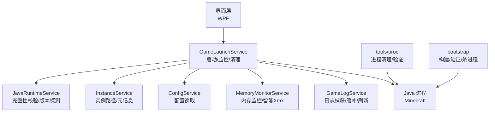
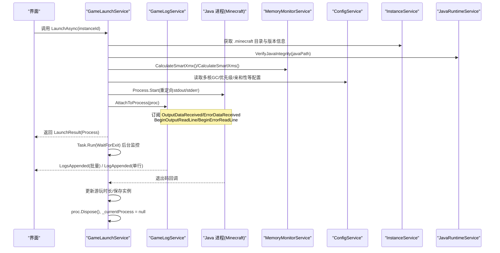
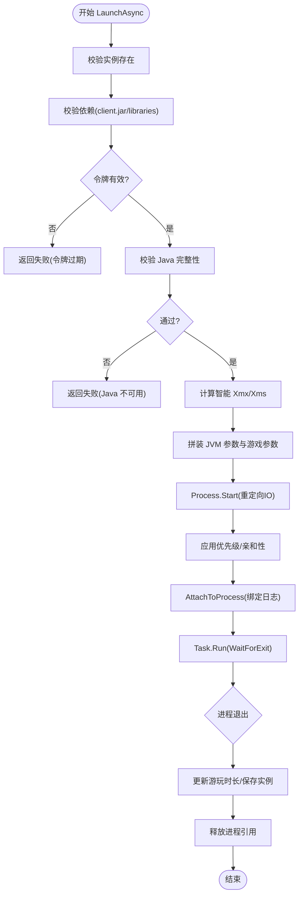
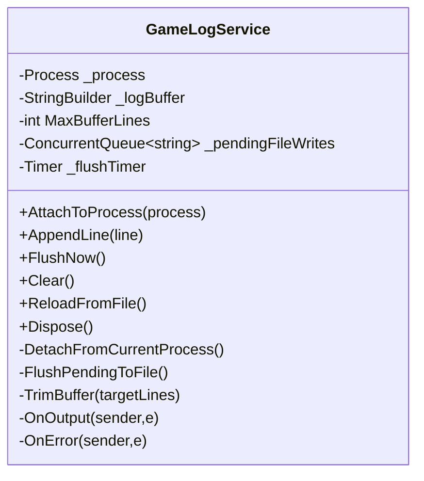
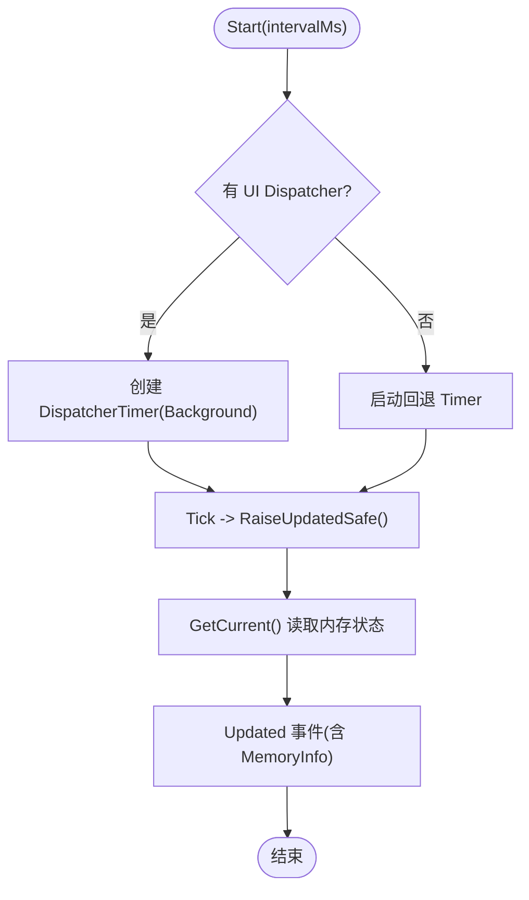
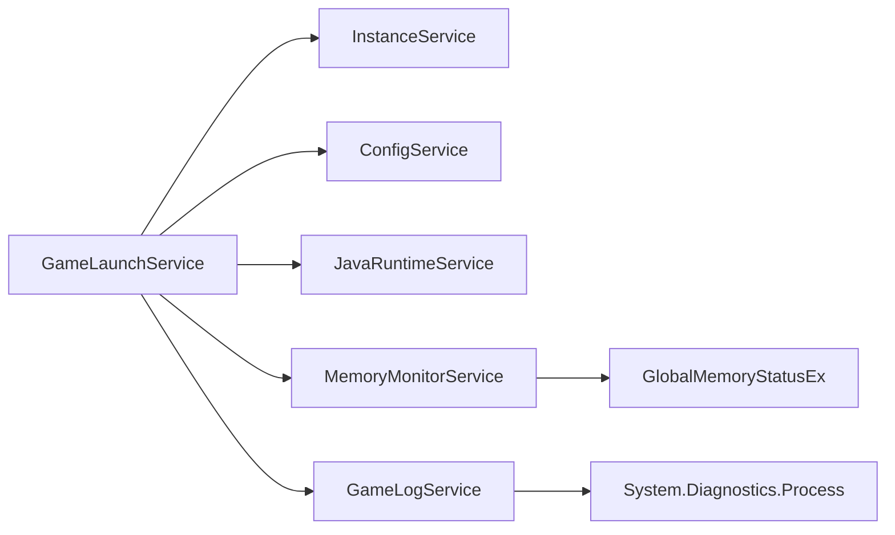

# 进程间通信与资源清理

<cite>
**本文引用的文件**   
- [GameLaunchService.cs](file://src/FufuLauncher/Services/GameLaunchService.cs)
- [GameLogService.cs](file://src/FufuLauncher/Services/GameLogService.cs)
- [MemoryMonitorService.cs](file://src/FufuLauncher/Services/MemoryMonitorService.cs)
- [ConfigService.cs](file://src/FufuLauncher/Services/ConfigService.cs)
- [InstanceService.cs](file://src/FufuLauncher/Services/InstanceService.cs)
- [JavaRuntimeService.cs](file://src/FufuLauncher/Services/JavaRuntimeService.cs)
- [Program.cs（工具）](file://tools/proc/Program.cs)
- [Program.cs（引导程序）](file://bootstrap/Program.cs)
</cite>

## 目录
1. [简介](#简介)
2. [项目结构](#项目结构)
3. [核心组件](#核心组件)
4. [架构总览](#架构总览)
5. [详细组件分析](#详细组件分析)
6. [依赖关系分析](#依赖关系分析)
7. [性能考量](#性能考量)
8. [故障排查指南](#故障排查指南)
9. [结论](#结论)
10. [附录：通信协议与清理策略示例](#附录通信协议与清理策略示例)

## 简介
本文件聚焦“可爱的芙芙启动器”在游戏进程与启动器之间的进程间通信（IPC）与资源清理机制。内容涵盖：
- 标准输出重定向、日志捕获与状态同步
- 进程间消息传递协议（事件通知、进度反馈、错误报告）
- 资源清理（进程终止、文件句柄释放、内存回收）
- 异步监控模式（后台任务管理、异常处理）
- 生命周期结束时的清理流程与泄漏防护
- 性能优化建议与调试技巧
- 通信协议定义与清理策略实现要点

## 项目结构
与 IPC 和资源清理直接相关的代码主要位于 Services 层，以及用于构建与验证的 bootstrap 和 tools 工具。关键文件如下：
- GameLaunchService：负责启动 Java 游戏进程、设置参数、绑定日志、监控退出、资源释放
- GameLogService：负责捕获 stdout/stderr、缓冲写入、批量刷新、事件推送
- MemoryMonitorService：系统内存监控与智能分配 Xmx/Xms、多核 GC 参数生成
- ConfigService：配置项（JVM 参数、优先级、亲和性、自动内存等）
- InstanceService：实例元数据与路径解析
- JavaRuntimeService：Java 运行时完整性校验、版本探测
- tools/proc 与 bootstrap：进程清理、产物验证与打包辅助

图表来源
- [GameLaunchService.cs:104-316](file://src/FufuLauncher/Services/GameLaunchService.cs#L104-L316)
- [GameLogService.cs:54-81](file://src/FufuLauncher/Services/GameLogService.cs#L54-L81)
- [MemoryMonitorService.cs:175-213](file://src/FufuLauncher/Services/MemoryMonitorService.cs#L175-L213)
- [ConfigService.cs:51-67](file://src/FufuLauncher/Services/ConfigService.cs#L51-L67)
- [InstanceService.cs:125-138](file://src/FufuLauncher/Services/InstanceService.cs#L125-L138)
- [JavaRuntimeService.cs:482-510](file://src/FufuLauncher/Services/JavaRuntimeService.cs#L482-L510)
- [Program.cs（工具）:22-41](file://tools/proc/Program.cs#L22-L41)
- [Program.cs（引导程序）:43-62](file://bootstrap/Program.cs#L43-L62)

章节来源
- [GameLaunchService.cs:104-316](file://src/FufuLauncher/Services/GameLaunchService.cs#L104-L316)
- [GameLogService.cs:54-81](file://src/FufuLauncher/Services/GameLogService.cs#L54-L81)
- [MemoryMonitorService.cs:175-213](file://src/FufuLauncher/Services/MemoryMonitorService.cs#L175-L213)
- [ConfigService.cs:51-67](file://src/FufuLauncher/Services/ConfigService.cs#L51-L67)
- [InstanceService.cs:125-138](file://src/FufuLauncher/Services/InstanceService.cs#L125-L138)
- [JavaRuntimeService.cs:482-510](file://src/FufuLauncher/Services/JavaRuntimeService.cs#L482-L510)
- [Program.cs（工具）:22-41](file://tools/proc/Program.cs#L22-L41)
- [Program.cs（引导程序）:43-62](file://bootstrap/Program.cs#L43-L62)

## 核心组件
- 游戏启动服务（GameLaunchService）
  - 组装 classpath 与 JVM 参数，启动 Java 进程
  - 设置高优先级/CPU 亲和性（可选）
  - 绑定日志捕获，后台监控退出并更新统计
  - 提供 KillGame 强制终止整个进程树
- 游戏日志服务（GameLogService）
  - 订阅 Process.OutputDataReceived/ErrorDataReceived
  - 内存缓冲 + 定时批量写盘，避免频繁 IO
  - 提供 LogsAppended 批量事件与 LogAppended 兼容单行事件
  - Dispose 时确保最后一次刷新与定时器释放
- 内存监控服务（MemoryMonitorService）
  - 定时读取系统内存，计算智能 Xmx/Xms
  - 生成多核 GC 优化参数（ParallelGCThreads/ConcGCThreads/CICompilerCount）
- 配置服务（ConfigService）
  - 提供 MultiCoreGcOptimize、HighPriorityProcess、CpuAffinityEnabled、AutoMemoryMode 等开关
- 实例服务（InstanceService）
  - 提供 .minecraft 目录路径、版本 ID、Java 路径等
- Java 运行时服务（JavaRuntimeService）
  - 校验 java.exe 可执行性与版本信息
  - 支持下载与管理完整 JDK

章节来源
- [GameLaunchService.cs:104-316](file://src/FufuLauncher/Services/GameLaunchService.cs#L104-L316)
- [GameLogService.cs:54-81](file://src/FufuLauncher/Services/GameLogService.cs#L54-L81)
- [MemoryMonitorService.cs:175-213](file://src/FufuLauncher/Services/MemoryMonitorService.cs#L175-L213)
- [ConfigService.cs:51-67](file://src/FufuLauncher/Services/ConfigService.cs#L51-L67)
- [InstanceService.cs:125-138](file://src/FufuLauncher/Services/InstanceService.cs#L125-L138)
- [JavaRuntimeService.cs:482-510](file://src/FufuLauncher/Services/JavaRuntimeService.cs#L482-L510)

## 架构总览
下图展示启动器与游戏进程的通信与清理主流程：

图表来源
- [GameLaunchService.cs:104-316](file://src/FufuLauncher/Services/GameLaunchService.cs#L104-L316)
- [GameLogService.cs:54-81](file://src/FufuLauncher/Services/GameLogService.cs#L54-L81)
- [MemoryMonitorService.cs:175-213](file://src/FufuLauncher/Services/MemoryMonitorService.cs#L175-L213)
- [ConfigService.cs:51-67](file://src/FufuLauncher/Services/ConfigService.cs#L51-L67)
- [InstanceService.cs:125-138](file://src/FufuLauncher/Services/InstanceService.cs#L125-L138)
- [JavaRuntimeService.cs:482-510](file://src/FufuLauncher/Services/JavaRuntimeService.cs#L482-L510)

## 详细组件分析

### 游戏启动服务（GameLaunchService）
- 启动前校验
  - 依赖文件检查（client.jar、libraries 目录）
  - 账号令牌有效性校验
  - Java 完整性校验（java -version）
- 参数拼装
  - Xms/Xmx（支持智能分配覆盖）
  - 多核 GC 优化参数（ParallelGCThreads/ConcGCThreads/CICompilerCount）
  - 额外 JVM 参数、主类与游戏参数（用户名、版本、UUID、accessToken 等）
- 进程启动与优化
  - RedirectStandardOutput/RedirectStandardError
  - 设置优先级（AboveNormal）、CPU 亲和性掩码
- 日志绑定与监控
  - AttachToProcess 绑定日志服务
  - 后台 Task.Run 等待退出，记录退出码与累计时长
  - finally 中释放进程引用，避免重复使用
- 强制终止
  - KillGame 使用 entireProcessTree=true 终止子进程树

图表来源
- [GameLaunchService.cs:104-316](file://src/FufuLauncher/Services/GameLaunchService.cs#L104-L316)

章节来源
- [GameLaunchService.cs:104-316](file://src/FufuLauncher/Services/GameLaunchService.cs#L104-L316)

### 游戏日志服务（GameLogService）
- 事件订阅
  - AttachToProcess 订阅 OutputDataReceived/ErrorDataReceived
  - BeginOutputReadLine/BeginErrorReadLine 启动异步读取
- 缓冲与刷新
  - 内存 StringBuilder 缓冲，限制最大行数（超出裁剪最早行）
  - ConcurrentQueue 待写队列，Timer 每 200ms 批量写入 game.log
  - FlushNow 强制立即刷新（打开日志查看器时调用）
- 事件推送
  - LogsAppended（批量）优先触发；LogAppended（单行）向后兼容
- 资源清理
  - DetachFromCurrentProcess 取消事件订阅，防止重复回调累积
  - Dispose 时最后一次 FlushPendingToFile 并释放 Timer

图表来源
- [GameLogService.cs:54-81](file://src/FufuLauncher/Services/GameLogService.cs#L54-L81)
- [GameLogService.cs:99-120](file://src/FufuLauncher/Services/GameLogService.cs#L99-L120)
- [GameLogService.cs:139-172](file://src/FufuLauncher/Services/GameLogService.cs#L139-L172)
- [GameLogService.cs:210-222](file://src/FufuLauncher/Services/GameLogService.cs#L210-L222)

章节来源
- [GameLogService.cs:54-81](file://src/FufuLauncher/Services/GameLogService.cs#L54-L81)
- [GameLogService.cs:99-120](file://src/FufuLauncher/Services/GameLogService.cs#L99-L120)
- [GameLogService.cs:139-172](file://src/FufuLauncher/Services/GameLogService.cs#L139-L172)
- [GameLogService.cs:210-222](file://src/FufuLauncher/Services/GameLogService.cs#L210-L222)

### 内存监控服务（MemoryMonitorService）
- 定时刷新
  - DispatcherTimer（UI 线程 Background 优先级），间隔 3000ms
  - 兜底 Timer（若 UI Dispatcher 不可用）
- 智能分配
  - CalculateSmartXmx：当前可用内存 - 预留（至少 1GB），上下限约束，256MB 对齐
  - CalculateSmartXms：Xmx 的 1/4，向下 256 对齐，最小 512
- 多核 GC 参数
  - BuildMultiCoreGcArgs：根据物理核心数计算 ParallelGCThreads/ConcGCThreads/CICompilerCount

图表来源
- [MemoryMonitorService.cs:62-88](file://src/FufuLauncher/Services/MemoryMonitorService.cs#L62-L88)
- [MemoryMonitorService.cs:144-155](file://src/FufuLauncher/Services/MemoryMonitorService.cs#L144-L155)
- [MemoryMonitorService.cs:175-213](file://src/FufuLauncher/Services/MemoryMonitorService.cs#L175-L213)

章节来源
- [MemoryMonitorService.cs:62-88](file://src/FufuLauncher/Services/MemoryMonitorService.cs#L62-L88)
- [MemoryMonitorService.cs:144-155](file://src/FufuLauncher/Services/MemoryMonitorService.cs#L144-L155)
- [MemoryMonitorService.cs:175-213](file://src/FufuLauncher/Services/MemoryMonitorService.cs#L175-L213)

### Java 运行时服务（JavaRuntimeService）
- 完整性校验
  - VerifyJavaIntegrity：检查 java.exe 存在且 java -version 可执行
- 版本探测
  - TryQueryJavaMeta：调用 java -version 解析主版本、架构、厂商
- 下载与管理
  - DownloadJdkAsync：按镜像源下载 zip 并解压，FlattenJdkDirectory 上提内部目录
  - ListInstalledRuntimes：列出本地已安装 JDK 条目

章节来源
- [JavaRuntimeService.cs:482-510](file://src/FufuLauncher/Services/JavaRuntimeService.cs#L482-L510)
- [JavaRuntimeService.cs:432-480](file://src/FufuLauncher/Services/JavaRuntimeService.cs#L432-L480)
- [JavaRuntimeService.cs:199-277](file://src/FufuLauncher/Services/JavaRuntimeService.cs#L199-L277)

### 工具与引导程序（进程清理与验证）
- tools/proc
  - 查找并终止占用 exe 的进程（FufuLauncher、fufu-bootstrap、fufu-proc）
  - 短暂等待句柄释放，迁移旧目录，验证并测试启动
- bootstrap
  - --kill 模式：终止指定名称的所有进程
  - 构建流程：检测 Go、安装 goversioninfo、生成 resource.syso、编译、验证版权信息

章节来源
- [Program.cs（工具）:22-41](file://tools/proc/Program.cs#L22-L41)
- [Program.cs（工具）:78-115](file://tools/proc/Program.cs#L78-L115)
- [Program.cs（引导程序）:43-62](file://bootstrap/Program.cs#L43-L62)
- [Program.cs（引导程序）:353-394](file://bootstrap/Program.cs#L353-L394)

## 依赖关系分析
- GameLaunchService 依赖：
  - InstanceService（实例路径/元信息）
  - VersionManifestService（版本清单，未在本节展开）
  - HashVerifyService（哈希校验，未在本节展开）
  - AccountService（账号令牌）
  - GameLogService（日志绑定）
  - ConfigService（JVM 参数与优化开关）
  - JavaRuntimeService（完整性校验）
  - MemoryMonitorService（智能内存分配）
- GameLogService 依赖：
  - System.Diagnostics.Process（事件订阅）
  - System.IO（文件写入）
  - System.Threading.Timer（批量刷新）
- MemoryMonitorService 依赖：
  - Windows API GlobalMemoryStatusEx（P/Invoke）
  - WPF Dispatcher（UI 线程定时器）

图表来源
- [GameLaunchService.cs:104-316](file://src/FufuLauncher/Services/GameLaunchService.cs#L104-L316)
- [GameLogService.cs:54-81](file://src/FufuLauncher/Services/GameLogService.cs#L54-L81)
- [MemoryMonitorService.cs:28-44](file://src/FufuLauncher/Services/MemoryMonitorService.cs#L28-L44)

章节来源
- [GameLaunchService.cs:104-316](file://src/FufuLauncher/Services/GameLaunchService.cs#L104-L316)
- [GameLogService.cs:54-81](file://src/FufuLauncher/Services/GameLogService.cs#L54-L81)
- [MemoryMonitorService.cs:28-44](file://src/FufuLauncher/Services/MemoryMonitorService.cs#L28-L44)

## 性能考量
- 日志写入
  - 使用 ConcurrentQueue + Timer 批量写盘，减少文件句柄频繁开关
  - 内存缓冲限制最大行数，避免长时间运行内存膨胀
- 内存监控
  - DispatcherTimer 在 UI 线程 Background 优先级触发，避免抢占输入事件
  - 降低刷新频率至 3000ms，减少 P/Invoke 开销
- JVM 参数
  - 多核 GC 参数按物理核心数动态计算，平衡并行与并发线程
  - Xmx 按 256MB 对齐，减少 GC 碎片
- 进程优化
  - 高优先级（AboveNormal）与 CPU 亲和性提升调度效率
  - 使用 entireProcessTree=true 快速终止，避免残留子进程

[本节为通用指导，不直接分析具体文件]

## 故障排查指南
- 日志无法显示或卡顿
  - 检查 GameLogService.AttachToProcess 是否正确订阅事件
  - 确认 FlushNow 是否在打开日志查看器时被调用
  - 观察 LogsAppended 是否被 UI 订阅者正确处理
- 进程退出后资源未释放
  - 确认 GameLaunchService 的后台 WaitForExit 任务是否正常执行
  - 检查 finally 块中 proc.Dispose() 与 _currentProcess 置空逻辑
- Java 完整性问题
  - 使用 JavaRuntimeService.VerifyJavaIntegrity 判断 java -version 是否可执行
  - 查看 App.WriteAppLog 中的异常信息
- 内存分配不合理
  - 检查 ConfigService.AutoMemoryMode 与 MemoryReserveMb/AutoMemoryMinMb/AutoMemoryMaxMb
  - 使用 MemoryMonitorService.CalculateSmartXmx/Xms 验证计算结果
- 进程清理失败
  - 使用 tools/proc 或 bootstrap --kill 终止占用进程
  - 确认 entireProcessTree=true 是否生效

章节来源
- [GameLogService.cs:54-81](file://src/FufuLauncher/Services/GameLogService.cs#L54-L81)
- [GameLogService.cs:139-172](file://src/FufuLauncher/Services/GameLogService.cs#L139-L172)
- [GameLaunchService.cs:287-316](file://src/FufuLauncher/Services/GameLaunchService.cs#L287-L316)
- [JavaRuntimeService.cs:482-510](file://src/FufuLauncher/Services/JavaRuntimeService.cs#L482-L510)
- [Program.cs（工具）:22-41](file://tools/proc/Program.cs#L22-L41)
- [Program.cs（引导程序）:43-62](file://bootstrap/Program.cs#L43-L62)

## 结论
该启动器通过标准输出重定向与事件订阅实现了稳定的进程间通信，结合内存缓冲与批量刷新提升了日志 I/O 性能。启动流程中对 Java 完整性、依赖文件、账号令牌进行前置校验，配合智能内存分配与多核 GC 优化，保障游戏进程稳定高效运行。资源清理方面，采用后台监控与 finally 释放、进程树级终止等手段，有效防止资源泄漏。整体设计清晰、健壮，适合扩展更多进程监控与清理能力。

[本节为总结，不直接分析具体文件]

## 附录：通信协议与清理策略示例

### 进程间通信协议定义
- 事件通知
  - 来源：GameLogService.LogsAppended（批量）与 LogAppended（单行）
  - 用途：UI 实时显示游戏输出，区分 stdout 与 stderr（stderr 加前缀）
- 进度反馈
  - 来源：JavaRuntimeService.ProgressChanged（下载/解压进度）
  - 用途：用户界面展示下载与解压进度
- 错误报告
  - 来源：App.WriteAppLog（统一应用日志）
  - 用途：记录各模块异常与诊断信息

章节来源
- [GameLogService.cs:40-44](file://src/FufuLauncher/Services/GameLogService.cs#L40-L44)
- [GameLogService.cs:91-97](file://src/FufuLauncher/Services/GameLogService.cs#L91-L97)
- [JavaRuntimeService.cs:74](file://src/FufuLauncher/Services/JavaRuntimeService.cs#L74)

### 清理策略实现要点
- 进程终止
  - GameLaunchService.KillGame：entireProcessTree=true 终止子进程树
  - tools/proc 与 bootstrap --kill：批量查找并终止目标进程
- 文件句柄释放
  - GameLogService.FlushPendingToFile：批量写盘后释放临时缓冲区
  - GameLogService.Dispose：最后一次刷新并释放 Timer
- 内存资源回收
  - GameLaunchService 后台任务 finally 块中 proc.Dispose() 与 _currentProcess 置空
  - MemoryMonitorService.Stop/Pause/Resume：控制定时器生命周期

章节来源
- [GameLaunchService.cs:378-384](file://src/FufuLauncher/Services/GameLaunchService.cs#L378-L384)
- [GameLogService.cs:139-172](file://src/FufuLauncher/Services/GameLogService.cs#L139-L172)
- [GameLogService.cs:210-222](file://src/FufuLauncher/Services/GameLogService.cs#L210-L222)
- [Program.cs（工具）:22-41](file://tools/proc/Program.cs#L22-L41)
- [Program.cs（引导程序）:43-62](file://bootstrap/Program.cs#L43-L62)