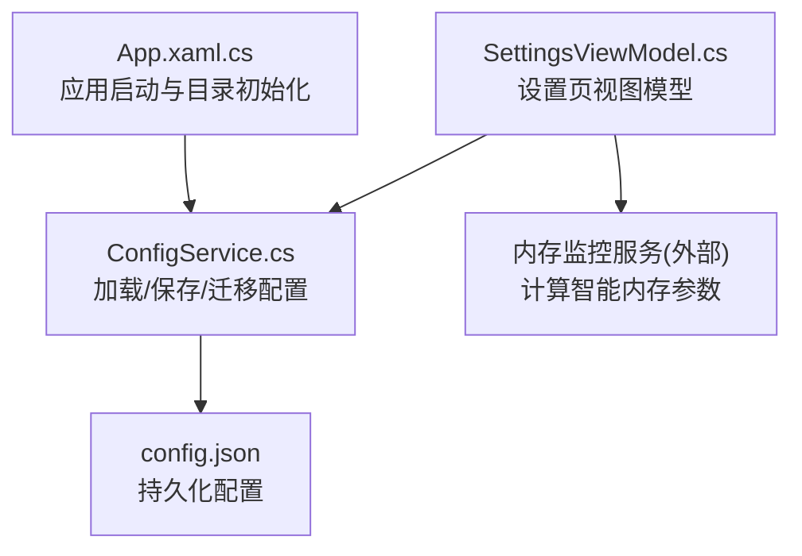
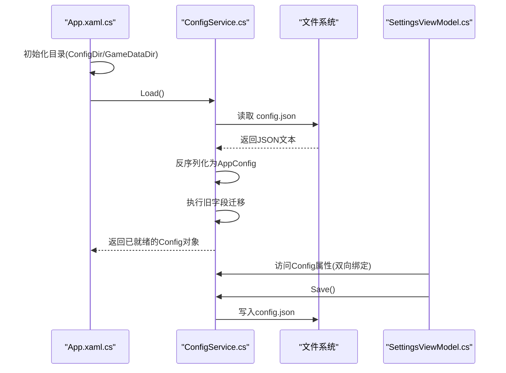
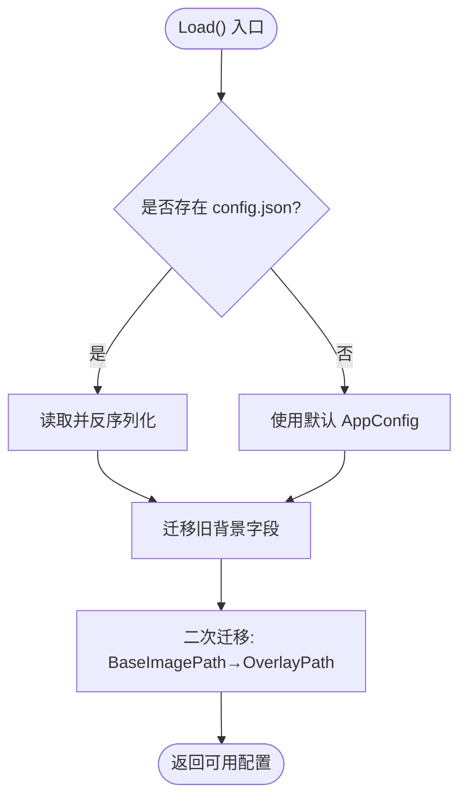
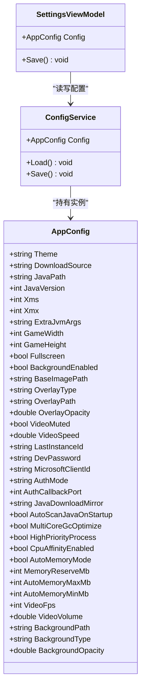
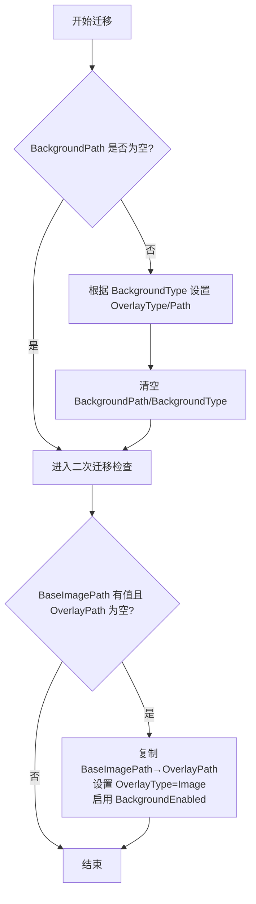

# 配置管理系统

<cite>
**本文引用的文件**   
- [ConfigService.cs](file://src/FufuLauncher/Services/ConfigService.cs)
- [App.xaml.cs](file://src/FufuLauncher/App.xaml.cs)
- [SettingsViewModel.cs](file://src/FufuLauncher/ViewModels/SettingsViewModel.cs)
- [config.json](file://Start/appmcGAME/config.json)
</cite>

## 目录
1. [简介](#简介)
2. [项目结构](#项目结构)
3. [核心组件](#核心组件)
4. [架构总览](#架构总览)
5. [详细组件分析](#详细组件分析)
6. [依赖关系分析](#依赖关系分析)
7. [性能考量](#性能考量)
8. [故障排查指南](#故障排查指南)
9. [结论](#结论)
10. [附录](#附录)

## 简介
本文件为“可爱的芙芙启动器”的配置管理系统提供完整、可操作的文档。内容涵盖：
- JSON 配置文件结构与字段定义（应用设置、用户偏好、运行时配置）
- 配置迁移机制与版本升级兼容处理
- 默认值管理与回退策略
- 环境变量管理（系统级与用户级优先级）
- 配置验证规则与错误处理策略
- 配置热重载与实时生效的实现方式
- 具体示例与最佳实践建议

## 项目结构
配置相关代码集中在以下位置：
- 配置模型与服务：src/FufuLauncher/Services/ConfigService.cs
- 应用入口与目录初始化：src/FufuLauncher/App.xaml.cs
- 设置页视图模型（UI 绑定与保存触发）：src/FufuLauncher/ViewModels/SettingsViewModel.cs
- 持久化配置样例：Start/appmcGAME/config.json

**图表来源** 
- [App.xaml.cs:82-156](file://src/FufuLauncher/App.xaml.cs#L82-L156)
- [ConfigService.cs:94-146](file://src/FufuLauncher/Services/ConfigService.cs#L94-L146)
- [SettingsViewModel.cs:221-245](file://src/FufuLauncher/ViewModels/SettingsViewModel.cs#L221-L245)

**章节来源**
- [App.xaml.cs:82-156](file://src/FufuLauncher/App.xaml.cs#L82-L156)
- [ConfigService.cs:13-79](file://src/FufuLauncher/Services/ConfigService.cs#L13-L79)

## 核心组件
- AppConfig：配置数据模型，包含主题、下载源、Java 路径与版本、JVM 参数、分辨率、背景与叠加层、认证模式、Java 镜像、多核 GC 优化、CPU 亲和性、智能内存分配、视频背景等字段。
- ConfigService：负责配置的加载、保存、旧版字段迁移与容错处理；使用 System.Text.Json 进行序列化/反序列化。
- SettingsViewModel：将 UI 操作映射到 AppConfig 属性，并在需要时调用 ConfigService.Save() 持久化。

关键职责划分：
- 数据模型：AppConfig
- I/O 与迁移：ConfigService
- UI 绑定与触发：SettingsViewModel

**章节来源**
- [ConfigService.cs:13-79](file://src/FufuLauncher/Services/ConfigService.cs#L13-L79)
- [ConfigService.cs:81-146](file://src/FufuLauncher/Services/ConfigService.cs#L81-L146)
- [SettingsViewModel.cs:20-30](file://src/FufuLauncher/ViewModels/SettingsViewModel.cs#L20-L30)

## 架构总览
配置生命周期从应用启动开始，经过目录准备、配置加载、迁移、UI 绑定与保存，形成闭环。

**图表来源** 
- [App.xaml.cs:92-145](file://src/FufuLauncher/App.xaml.cs#L92-L145)
- [ConfigService.cs:94-146](file://src/FufuLauncher/Services/ConfigService.cs#L94-L146)
- [SettingsViewModel.cs:221-245](file://src/FufuLauncher/ViewModels/SettingsViewModel.cs#L221-L245)

## 详细组件分析

### 配置数据模型（AppConfig）
- 字段分组与用途
  - 界面与下载：Theme、DownloadSource
  - Java 与 JVM：JavaPath、JavaVersion、Xms、Xmx、ExtraJvmArgs
  - 游戏显示：GameWidth、GameHeight、Fullscreen
  - 背景与叠加层：BackgroundEnabled、BaseImagePath、OverlayType、OverlayPath、OverlayOpacity、VideoMuted、VideoSpeed
  - 实例与开发：LastInstanceId、DevPassword
  - 微软账号登录：MicrosoftClientId、AuthMode、AuthCallbackPort
  - Java 运行库：JavaDownloadMirror、AutoScanJavaOnStartup
  - JVM 多核优化：MultiCoreGcOptimize、HighPriorityProcess、CpuAffinityEnabled
  - 智能内存：AutoMemoryMode、MemoryReserveMb、AutoMemoryMaxMb、AutoMemoryMinMb
  - 视频背景增强：VideoFps、VideoVolume
  - 兼容字段：BackgroundPath、BackgroundType、BackgroundOpacity（用于迁移）

- 默认值策略
  - 所有属性在模型中均提供合理默认值，确保无配置文件时仍可正常运行。

- 复杂度与影响
  - 字段数量较多但均为简单类型，序列化/反序列化开销低。
  - 兼容性字段仅用于迁移，不影响运行时性能。

**章节来源**
- [ConfigService.cs:13-79](file://src/FufuLauncher/Services/ConfigService.cs#L13-L79)

### 配置服务（ConfigService）
- 加载流程
  - 若存在配置文件则读取并反序列化；否则使用默认 AppConfig。
  - 执行两次迁移：
    1) 旧背景字段 BackgroundPath/BackgroundType → BaseImagePath/OverlayType/OverlayPath
    2) 当 BaseImagePath 有值且 OverlayPath 为空时，复制并启用 Image 叠加层
  - 异常捕获：反序列化失败时回退到默认配置，避免崩溃。

- 保存流程
  - 使用 System.Text.Json 序列化并写入文件；异常被吞掉以避免影响主流程。

- 配置路径
  - 配置文件位于 {ConfigDir}/config.json，其中 ConfigDir 由应用入口初始化。

**图表来源** 
- [ConfigService.cs:94-133](file://src/FufuLauncher/Services/ConfigService.cs#L94-L133)

**章节来源**
- [ConfigService.cs:81-146](file://src/FufuLauncher/Services/ConfigService.cs#L81-L146)

### 应用入口与目录初始化（App.xaml.cs）
- 目录策略
  - GameDataDir：{exe目录}\appmcGAME
  - ConfigDir：{GameDataDir}\Start\AppData\Roaming\FufuLauncher
  - 自动创建必要子目录（instances、runtimes、accounts、saves、versions、mods、assets、libraries、cache 等）

- 旧配置迁移
  - 首次启动时将 appmcGAME\config.json 复制到新 ConfigDir\config.json（若不存在）
  - 日志文件也做相应迁移

- 配置加载时机
  - DI 容器构建后，获取 ConfigService 并调用 Load()

**章节来源**
- [App.xaml.cs:92-145](file://src/FufuLauncher/App.xaml.cs#L92-L145)

### 设置页视图模型（SettingsViewModel.cs）
- 与配置的交互
  - 直接暴露 ConfigService.Config 的属性供 UI 双向绑定
  - 修改开关类属性（如 AutoMemoryMode、MultiCoreGcOptimize 等）即时更新底层配置
  - 调用 Save() 持久化变更

- 智能内存推荐
  - 通过 MemoryMonitorService 计算 SmartXmx/SmartXms，并在 UI 上展示与一键应用到当前实例

**章节来源**
- [SettingsViewModel.cs:99-170](file://src/FufuLauncher/ViewModels/SettingsViewModel.cs#L99-L170)
- [SettingsViewModel.cs:221-245](file://src/FufuLauncher/ViewModels/SettingsViewModel.cs#L221-L245)

## 依赖关系分析
- 组件耦合
  - SettingsViewModel 依赖 ConfigService 以读写配置
  - App.xaml.cs 负责初始化目录与加载配置，随后注入到 DI 容器
  - ConfigService 依赖文件系统与 System.Text.Json

- 外部依赖
  - 内存监控服务（非配置模块）参与智能内存计算，但不改变配置模型本身

**图表来源** 
- [ConfigService.cs:13-79](file://src/FufuLauncher/Services/ConfigService.cs#L13-L79)
- [ConfigService.cs:81-146](file://src/FufuLauncher/Services/ConfigService.cs#L81-L146)
- [SettingsViewModel.cs:20-30](file://src/FufuLauncher/ViewModels/SettingsViewModel.cs#L20-L30)

**章节来源**
- [ConfigService.cs:81-146](file://src/FufuLauncher/Services/ConfigService.cs#L81-L146)
- [SettingsViewModel.cs:20-30](file://src/FufuLauncher/ViewModels/SettingsViewModel.cs#L20-L30)

## 性能考量
- 序列化选项
  - WriteIndented=true 提升可读性，WhenWritingNull 减少冗余字段
- 加载与保存
  - 小体积 JSON 文件，I/O 开销极低；异常被吞掉避免阻塞主线程
- 迁移逻辑
  - 仅在 Load() 时执行一次，条件判断简单，对性能影响可忽略
- UI 绑定
  - SettingsViewModel 缓存智能内存计算结果，避免频繁 P/Invoke 导致的卡顿

[本节为通用指导，不直接分析具体文件]

## 故障排查指南
- 配置文件损坏或无法解析
  - 现象：加载失败，回退到默认配置
  - 处理：检查 config.json 语法；必要时删除或恢复备份
- 保存失败
  - 现象：保存异常被忽略，可能因权限不足或磁盘不可写
  - 处理：确认 ConfigDir 可写；检查杀毒软件拦截
- 旧配置未迁移
  - 现象：背景或叠加层字段未生效
  - 处理：确认 Load() 中的迁移逻辑是否被执行；检查字段名是否正确

**章节来源**
- [ConfigService.cs:128-146](file://src/FufuLauncher/Services/ConfigService.cs#L128-L146)
- [App.xaml.cs:116-136](file://src/FufuLauncher/App.xaml.cs#L116-L136)

## 结论
该配置管理系统以简洁的数据模型与稳健的 I/O 处理为核心，结合完善的迁移与默认值策略，确保在不同环境与版本间稳定运行。UI 层通过视图模型与配置服务解耦，便于扩展与维护。建议在后续迭代中引入更严格的配置校验与热重载能力，以提升用户体验与可靠性。

[本节为总结性内容，不直接分析具体文件]

## 附录

### JSON 配置结构与字段说明
以下为配置文件中各字段的含义与取值范围（基于模型默认值与注释）：
- 主题与下载源
  - Theme：Light/Dark
  - DownloadSource：Mojang/BMCLAPI
- Java 与 JVM
  - JavaPath：Java 可执行文件路径（可为空）
  - JavaVersion：Java 主版本号（默认 17）
  - Xms/Xmx：初始/最大堆内存（MB）
  - ExtraJvmArgs：额外 JVM 参数（字符串）
- 游戏显示
  - GameWidth/GameHeight：窗口分辨率
  - Fullscreen：是否全屏
- 背景与叠加层
  - BackgroundEnabled：是否启用背景
  - BaseImagePath：固定图片路径（底层）
  - OverlayType：None/Image/Video（上层）
  - OverlayPath：叠加层媒体路径
  - OverlayOpacity：叠加层透明度
  - VideoMuted：视频静音
  - VideoSpeed：视频播放速度
- 实例与开发
  - LastInstanceId：上次启动实例 ID
  - DevPassword：开发者密码
- 微软账号登录
  - MicrosoftClientId：客户端 ID
  - AuthMode：DeviceCode/LocalCallback
  - AuthCallbackPort：本地回调端口
- Java 运行库
  - JavaDownloadMirror：Official/BMCLAPI/Huaweicloud
  - AutoScanJavaOnStartup：开机自动扫描 Java
- JVM 多核优化
  - MultiCoreGcOptimize：启用 GC 多核优化
  - HighPriorityProcess：高优先级进程（禁止 Realtime）
  - CpuAffinityEnabled：CPU 亲和性增强
- 智能内存
  - AutoMemoryMode：启用智能分配
  - MemoryReserveMb：系统预留内存（MB）
  - AutoMemoryMaxMb/AutoMemoryMinMb：智能分配上下限（MB）
- 视频背景增强
  - VideoFps：帧率限制（0 不限）
  - VideoVolume：音量（0~1）
- 兼容字段（仅迁移用）
  - BackgroundPath/BackgroundType/BackgroundOpacity

参考示例文件：
- [config.json](file://Start/appmcGAME/config.json)

**章节来源**
- [ConfigService.cs:13-79](file://src/FufuLauncher/Services/ConfigService.cs#L13-L79)
- [config.json:1-36](file://Start/appmcGAME/config.json#L1-L36)

### 配置迁移机制
- 旧背景字段迁移
  - BackgroundPath/BackgroundType → BaseImagePath/OverlayType/OverlayPath
  - 若原类型为 Video，则设置 OverlayType=Video 并拷贝路径；否则设置为 BaseImagePath
  - 同时根据 BackgroundOpacity 设置 OverlayOpacity
- 二次迁移
  - 若 BaseImagePath 有值而 OverlayPath 为空，且 OverlayType 不是 Video，则将 BaseImagePath 复制到 OverlayPath，并将 OverlayType 设为 Image，启用 BackgroundEnabled

**图表来源** 
- [ConfigService.cs:104-127](file://src/FufuLauncher/Services/ConfigService.cs#L104-L127)

**章节来源**
- [ConfigService.cs:104-127](file://src/FufuLauncher/Services/ConfigService.cs#L104-L127)

### 默认值管理与回退策略
- 模型默认值
  - 所有字段在 AppConfig 中提供默认值，确保无配置文件时行为一致
- 加载失败回退
  - 反序列化异常时，使用新的默认 AppConfig，避免崩溃
- 保存失败处理
  - 写入异常被忽略，保证主流程不受影响

**章节来源**
- [ConfigService.cs:128-146](file://src/FufuLauncher/Services/ConfigService.cs#L128-L146)

### 环境变量管理
- 当前实现
  - 配置系统本身不直接读取环境变量；Java 扫描服务会读取 JAVA_HOME 与 PATH 以发现 Java 安装
- 优先级建议
  - 用户级配置（config.json）优先于系统级环境变量
  - 若需覆盖 Java 路径，可在配置中显式设置 JavaPath

**章节来源**
- [ConfigService.cs:13-79](file://src/FufuLauncher/Services/ConfigService.cs#L13-L79)

### 配置验证规则与错误处理策略
- 验证规则
  - 当前未实现严格校验；依赖 JSON 反序列化与默认值兜底
- 错误处理
  - 加载失败：回退到默认配置
  - 保存失败：静默忽略，避免中断主流程
- 建议改进
  - 增加字段范围校验（如 Xms/Xmx 正数、分辨率合法等）
  - 提供配置修复工具或提示

**章节来源**
- [ConfigService.cs:128-146](file://src/FufuLauncher/Services/ConfigService.cs#L128-L146)

### 配置热重载与实时生效
- 现状
  - 配置在应用启动时加载一次；UI 通过视图模型绑定到内存中的 AppConfig
  - 保存后立即落盘，但不会自动热重载
- 实现建议
  - 在 ConfigService 中增加 Watcher 监听 config.json 变更
  - 变更时重新加载并通知 UI（INotifyPropertyChanged）
  - 对敏感字段（如 JavaPath、JVM 参数）重启后生效，避免运行时不一致

[本节为概念性建议，不直接分析具体文件]

### 最佳实践建议
- 保持 config.json 整洁，避免遗留无效字段
- 谨慎修改 JVM 参数，确保与目标 Java 版本兼容
- 使用智能内存模式时，合理设置 MemoryReserveMb 与上下限
- 定期备份 config.json 与日志文件，便于问题回溯

[本节为通用指导，不直接分析具体文件]