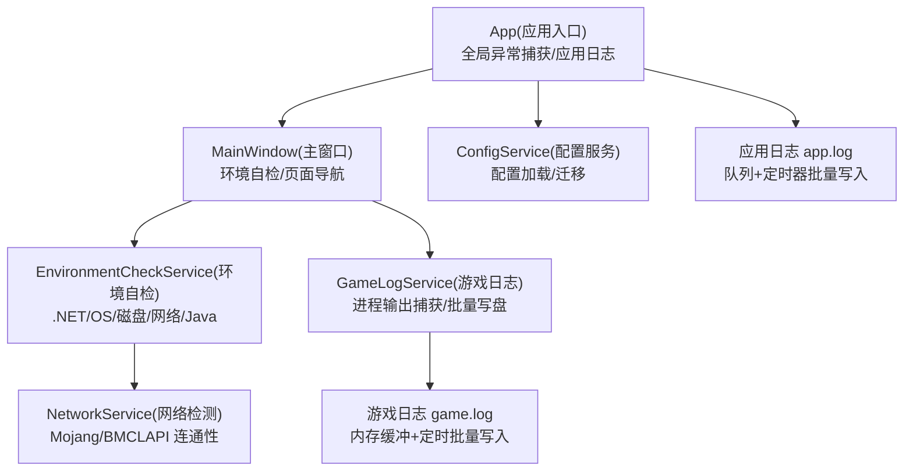
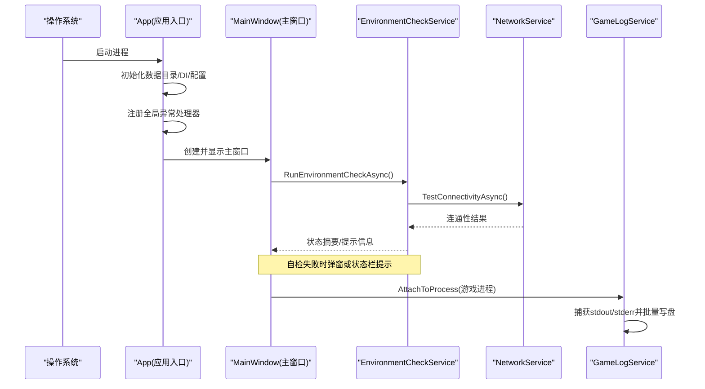
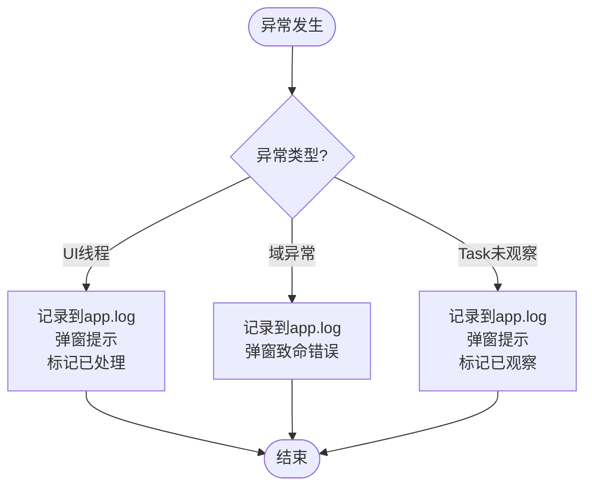
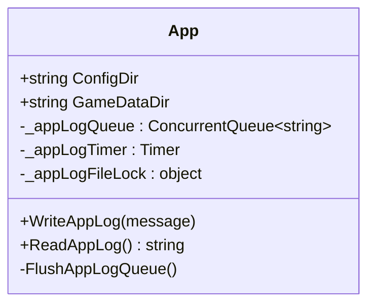
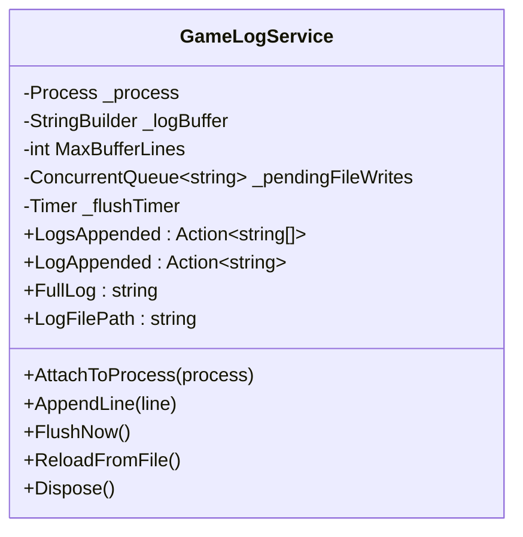
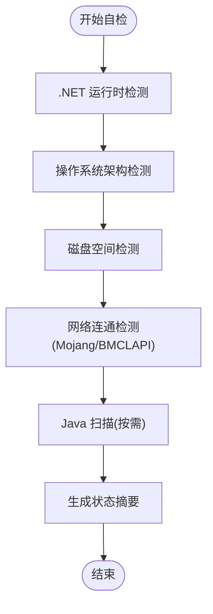
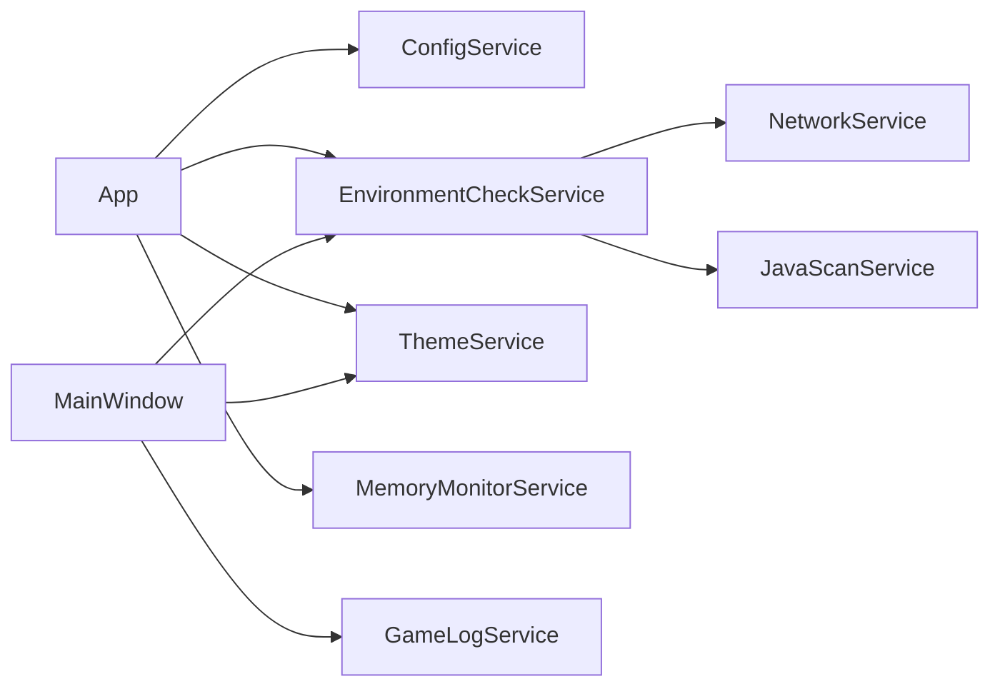

# 错误处理和日志系统

<cite>
**本文引用的文件**
- [App.xaml.cs](file://src/FufuLauncher/App.xaml.cs)
- [MainWindow.xaml.cs](file://src/FufuLauncher/MainWindow.xaml.cs)
- [GameLogService.cs](file://src/FufuLauncher/Services/GameLogService.cs)
- [ConfigService.cs](file://src/FufuLauncher/Services/ConfigService.cs)
- [EnvironmentCheckService.cs](file://src/FufuLauncher/Services/EnvironmentCheckService.cs)
- [NetworkService.cs](file://src/FufuLauncher/Services/NetworkService.cs)
- [README.md](file://README.md)
</cite>

## 目录
1. [简介](#简介)
2. [项目结构](#项目结构)
3. [核心组件](#核心组件)
4. [架构总览](#架构总览)
5. [详细组件分析](#详细组件分析)
6. [依赖关系分析](#依赖关系分析)
7. [性能考量](#性能考量)
8. [故障排查指南](#故障排查指南)
9. [结论](#结论)
10. [附录](#附录)

## 简介
本文件面向“可爱的芙芙”启动器的错误处理与日志系统，系统性说明全局异常捕获机制、分级日志体系（应用日志与游戏日志）、异步写入与批量刷新策略、日志查看与轮转思路、错误分类与处理策略、远程上报扩展点以及调试与排障方法。文档同时提供架构图与流程图，帮助读者快速理解并高效使用。

## 项目结构
- 应用入口与全局异常捕获：位于 App.xaml.cs，负责 DI 容器初始化、目录准备、主题加载、全局未处理异常捕获、应用级日志缓冲与落盘。
- 主窗口与环境自检：MainWindow.xaml.cs 在加载时触发环境自检，并将结果展示于状态栏；对 UI 线程异常进行友好提示。
- 游戏日志服务：GameLogService.cs 实时捕获游戏进程 stdout/stderr，内存缓冲 + 定时批量刷盘，支持事件通知与文件重载。
- 配置服务：ConfigService.cs 管理用户设置与迁移，为日志路径、下载源等提供配置支撑。
- 网络检测：NetworkService.cs 用于连通性测试，辅助环境自检与错误归因。

**图表来源**
- [App.xaml.cs:82-156](file://src/FufuLauncher/App.xaml.cs#L82-L156)
- [MainWindow.xaml.cs:38-73](file://src/FufuLauncher/MainWindow.xaml.cs#L38-L73)
- [GameLogService.cs:22-65](file://src/FufuLauncher/Services/GameLogService.cs#L22-L65)
- [ConfigService.cs:94-133](file://src/FufuLauncher/Services/ConfigService.cs#L94-L133)
- [EnvironmentCheckService.cs:52-73](file://src/FufuLauncher/Services/EnvironmentCheckService.cs#L52-L73)
- [NetworkService.cs:34-76](file://src/FufuLauncher/Services/NetworkService.cs#L34-L76)

**章节来源**
- [App.xaml.cs:25-156](file://src/FufuLauncher/App.xaml.cs#L25-L156)
- [MainWindow.xaml.cs:1-73](file://src/FufuLauncher/MainWindow.xaml.cs#L1-L73)
- [GameLogService.cs:1-65](file://src/FufuLauncher/Services/GameLogService.cs#L1-L65)
- [ConfigService.cs:1-133](file://src/FufuLauncher/Services/ConfigService.cs#L1-L133)
- [EnvironmentCheckService.cs:1-73](file://src/FufuLauncher/Services/EnvironmentCheckService.cs#L1-L73)
- [NetworkService.cs:1-76](file://src/FufuLauncher/Services/NetworkService.cs#L1-L76)

## 核心组件
- 全局异常捕获
  - UI 线程未处理异常：DispatcherUnhandledException，记录到应用日志并弹窗提示，标记已处理避免崩溃。
  - 域内未处理异常：AppDomain.CurrentDomain.UnhandledException，记录并弹窗致命错误提示。
  - Task 未观察异常：TaskScheduler.UnobservedTaskException，记录并弹窗提示，标记已观察防止进程终止。
- 应用日志
  - 入队式缓冲：ConcurrentQueue 缓存日志行，Timer 每 200ms 批量写入 app.log，降低 IO 阻塞。
  - 读取器强制刷新：ReadAppLog 先 Flush 再读取，确保最新内容可见。
- 游戏日志
  - 进程输出捕获：AttachToProcess 订阅 OutputDataReceived/ErrorDataReceived，统一格式化后入队。
  - 内存缓冲限长：StringBuilder 限制最大行数，超出裁剪最早行，避免内存膨胀。
  - 批量写盘与事件：Timer 合并写入 game.log，LogsAppended 批量通知订阅者，兼容 LogAppended 单行事件。
- 环境自检
  - 检查 .NET 运行时、操作系统架构、磁盘空间、网络连通、Java 扫描；失败项通过状态摘要或弹窗提示。
- 配置服务
  - 加载/保存配置，包含下载源、Java 路径、JVM 参数、背景设置等；失败时回退默认值，保证健壮性。

**章节来源**
- [App.xaml.cs:86-90](file://src/FufuLauncher/App.xaml.cs#L86-L90)
- [App.xaml.cs:219-244](file://src/FufuLauncher/App.xaml.cs#L219-L244)
- [App.xaml.cs:40-80](file://src/FufuLauncher/App.xaml.cs#L40-L80)
- [GameLogService.cs:22-65](file://src/FufuLauncher/Services/GameLogService.cs#L22-L65)
- [GameLogService.cs:99-166](file://src/FufuLauncher/Services/GameLogService.cs#L99-L166)
- [EnvironmentCheckService.cs:52-73](file://src/FufuLauncher/Services/EnvironmentCheckService.cs#L52-L73)
- [ConfigService.cs:94-146](file://src/FufuLauncher/Services/ConfigService.cs#L94-L146)

## 架构总览
下图展示了启动器启动时的关键流程：应用入口完成目录与 DI 初始化，注册全局异常处理器，加载配置并显示主窗口；主窗口加载后执行环境自检，并在需要时弹出提示；游戏运行期间由 GameLogService 捕获进程输出并批量落盘。

**图表来源**
- [App.xaml.cs:82-156](file://src/FufuLauncher/App.xaml.cs#L82-L156)
- [MainWindow.xaml.cs:38-73](file://src/FufuLauncher/MainWindow.xaml.cs#L38-L73)
- [EnvironmentCheckService.cs:52-73](file://src/FufuLauncher/Services/EnvironmentCheckService.cs#L52-L73)
- [NetworkService.cs:34-76](file://src/FufuLauncher/Services/NetworkService.cs#L34-L76)
- [GameLogService.cs:54-65](file://src/FufuLauncher/Services/GameLogService.cs#L54-L65)

## 详细组件分析

### 全局异常捕获机制
- 捕获点
  - UI 线程：DispatcherUnhandledException，记录并弹窗，标记已处理。
  - 非 UI 线程：AppDomain.CurrentDomain.UnhandledException，记录并弹窗致命错误。
  - 后台任务：TaskScheduler.UnobservedTaskException，记录并弹窗，标记已观察。
- 恢复策略
  - UI 异常：阻止崩溃，允许用户继续操作或退出。
  - 域异常：提示致命错误，通常建议退出。
  - Task 异常：标记已观察，避免进程被终止，保持应用稳定。
- 日志记录
  - 所有异常均写入应用日志（app.log），便于后续分析。

**图表来源**
- [App.xaml.cs:219-244](file://src/FufuLauncher/App.xaml.cs#L219-L244)

**章节来源**
- [App.xaml.cs:86-90](file://src/FufuLauncher/App.xaml.cs#L86-L90)
- [App.xaml.cs:219-244](file://src/FufuLauncher/App.xaml.cs#L219-L244)

### 应用日志系统（app.log）
- 写入模式
  - 入队缓冲：WriteAppLog 将格式化后的日志行入队。
  - 批量落盘：Timer 每 200ms 触发 FlushAppLogQueue，批量 AppendAllLines 到 app.log。
  - 读取保障：ReadAppLog 先强制刷新队列，再读取文件全文。
- 错误处理
  - 写入失败忽略，避免影响主流程。
- 适用场景
  - 启动器自身运行日志、异常堆栈、关键操作审计。

**图表来源**
- [App.xaml.cs:40-80](file://src/FufuLauncher/App.xaml.cs#L40-L80)

**章节来源**
- [App.xaml.cs:40-80](file://src/FufuLauncher/App.xaml.cs#L40-L80)

### 游戏日志系统（game.log）
- 进程捕获
  - AttachToProcess 订阅 OutputDataReceived/ErrorDataReceived，统一格式化后 AppendLine。
- 内存缓冲
  - StringBuilder 限制最大行数，超出裁剪最早行，避免长时间运行内存膨胀。
- 批量写盘
  - Timer 每 200ms 合并待写队列，一次性 AppendAllText 到 game.log。
- 事件通知
  - LogsAppended 批量通知订阅者；兼容旧 LogAppended 单行事件。
- 文件重载
  - ReloadFromFile 从文件重建内存缓冲，支持跨页面切换恢复显示。

**图表来源**
- [GameLogService.cs:22-65](file://src/FufuLauncher/Services/GameLogService.cs#L22-L65)
- [GameLogService.cs:99-166](file://src/FufuLauncher/Services/GameLogService.cs#L99-L166)
- [GameLogService.cs:184-208](file://src/FufuLauncher/Services/GameLogService.cs#L184-L208)

**章节来源**
- [GameLogService.cs:22-65](file://src/FufuLauncher/Services/GameLogService.cs#L22-L65)
- [GameLogService.cs:99-166](file://src/FufuLauncher/Services/GameLogService.cs#L99-L166)
- [GameLogService.cs:184-208](file://src/FufuLauncher/Services/GameLogService.cs#L184-L208)

### 环境自检与错误提示
- 检查项
  - .NET 运行时：确认已加载。
  - 操作系统架构：仅支持 64 位 Windows，否则弹窗提示。
  - 磁盘空间：剩余不足则提示至少 5GB。
  - 网络连通：Mojang 与 BMCLAPI 双源检测，失败弹窗。
  - Java 扫描：根据配置决定是否自动扫描，无 Java 时引导安装。
- 结果展示
  - GetStatusSummary 汇总状态，供状态栏展示。

**图表来源**
- [EnvironmentCheckService.cs:52-73](file://src/FufuLauncher/Services/EnvironmentCheckService.cs#L52-L73)
- [EnvironmentCheckService.cs:91-117](file://src/FufuLauncher/Services/EnvironmentCheckService.cs#L91-L117)
- [EnvironmentCheckService.cs:119-149](file://src/FufuLauncher/Services/EnvironmentCheckService.cs#L119-L149)
- [EnvironmentCheckService.cs:151-174](file://src/FufuLauncher/Services/EnvironmentCheckService.cs#L151-L174)
- [EnvironmentCheckService.cs:176-213](file://src/FufuLauncher/Services/EnvironmentCheckService.cs#L176-L213)

**章节来源**
- [EnvironmentCheckService.cs:52-73](file://src/FufuLauncher/Services/EnvironmentCheckService.cs#L52-L73)
- [EnvironmentCheckService.cs:91-117](file://src/FufuLauncher/Services/EnvironmentCheckService.cs#L91-L117)
- [EnvironmentCheckService.cs:119-149](file://src/FufuLauncher/Services/EnvironmentCheckService.cs#L119-L149)
- [EnvironmentCheckService.cs:151-174](file://src/FufuLauncher/Services/EnvironmentCheckService.cs#L151-L174)
- [EnvironmentCheckService.cs:176-213](file://src/FufuLauncher/Services/EnvironmentCheckService.cs#L176-L213)

### 配置服务与错误恢复
- 配置加载
  - 若配置文件存在则反序列化，失败回退默认配置。
  - 支持旧配置字段迁移（背景双层结构）。
- 配置保存
  - 序列化写入，失败不抛出异常，避免崩溃。
- 作用
  - 为下载源、Java 路径、JVM 参数、背景设置等提供持久化支撑。

**章节来源**
- [ConfigService.cs:94-146](file://src/FufuLauncher/Services/ConfigService.cs#L94-L146)

### 网络检测与错误归因
- 目标端点
  - Mojang 官方源与 BMCLAPI 国内镜像源。
- 返回信息
  - 连通性与延迟，组合消息用于状态展示与提示。
- 超时与异常
  - HttpClient 超时 8 秒，异常捕获不影响整体流程。

**章节来源**
- [NetworkService.cs:34-76](file://src/FufuLauncher/Services/NetworkService.cs#L34-L76)

## 依赖关系分析
- App 依赖 ConfigService、EnvironmentCheckService、ThemeService、MemoryMonitorService 等，完成启动期初始化与资源释放。
- MainWindow 依赖 ThemeService、EnvironmentCheckService，负责 UI 交互与自检结果展示。
- GameLogService 独立于 UI，通过事件通知订阅者，适合日志查看页使用。
- EnvironmentCheckService 依赖 NetworkService、JavaScanService、ConfigService，聚合检查结果。

**图表来源**
- [App.xaml.cs:170-217](file://src/FufuLauncher/App.xaml.cs#L170-L217)
- [MainWindow.xaml.cs:25-36](file://src/FufuLauncher/MainWindow.xaml.cs#L25-L36)
- [EnvironmentCheckService.cs:35-50](file://src/FufuLauncher/Services/EnvironmentCheckService.cs#L35-L50)

**章节来源**
- [App.xaml.cs:170-217](file://src/FufuLauncher/App.xaml.cs#L170-L217)
- [MainWindow.xaml.cs:25-36](file://src/FufuLauncher/MainWindow.xaml.cs#L25-L36)
- [EnvironmentCheckService.cs:35-50](file://src/FufuLauncher/Services/EnvironmentCheckService.cs#L35-L50)

## 性能考量
- 应用日志
  - 使用 ConcurrentQueue 与 Timer 批量写入，减少频繁 IO 造成的 UI 卡顿。
- 游戏日志
  - 内存缓冲限长（最大 5000 行），超出裁剪最早行，控制内存占用。
  - 批量写盘（200ms 合并），显著降低文件句柄开关次数。
- 网络检测
  - HttpClient 超时 8 秒，避免长时间阻塞。
- 资源释放
  - 窗口关闭时释放背景资源，避免 MediaElement 持有文件句柄导致泄漏。

[本节为通用性能指导，不直接分析具体文件]

## 故障排查指南
- 常见错误场景与处理
  - 未找到 Java：环境自检提示并引导至 Java 运行时页面下载或手动安装。
  - 网络不可用：状态栏提示“网络不通”，检查代理/防火墙并重试。
  - 磁盘空间不足：提示至少 5GB 可用空间，清理磁盘或更换安装位置。
  - 32 位系统：弹窗提示不支持，需升级至 64 位 Windows。
- 日志分析方法
  - 应用日志 app.log：查看启动器自身异常与关键操作轨迹。
  - 游戏日志 game.log：查看游戏进程 stdout/stderr，定位崩溃原因。
  - 读取前强制刷新：确保读到最新内容。
- 调试技巧
  - 启用开发密码（DevPassword）以访问开发者功能（如适用）。
  - 在日志查看页调用 FlushNow 强制刷新，确保最新日志可见。
  - 关注状态栏自检摘要，快速定位问题模块。
- 预防措施
  - 定期清理磁盘空间，预留足够安装与运行空间。
  - 使用稳定的网络环境，必要时切换下载源。
  - 保持 Java 版本与 JVM 参数合理，避免内存溢出。

**章节来源**
- [EnvironmentCheckService.cs:176-213](file://src/FufuLauncher/Services/EnvironmentCheckService.cs#L176-L213)
- [NetworkService.cs:34-76](file://src/FufuLauncher/Services/NetworkService.cs#L34-L76)
- [GameLogService.cs:168-172](file://src/FufuLauncher/Services/GameLogService.cs#L168-L172)
- [App.xaml.cs:69-80](file://src/FufuLauncher/App.xaml.cs#L69-L80)

## 结论
本启动器通过多层异常捕获与分级日志体系，实现了高可用的错误处理与可观测性。应用日志与游戏日志分离，结合批量写入与内存缓冲，兼顾性能与稳定性。环境自检与网络检测帮助用户快速定位问题。未来可扩展日志轮转与远程上报能力，进一步提升运维效率。

[本节为总结性内容，不直接分析具体文件]

## 附录
- 日志格式规范
  - 应用日志 app.log：时间戳 + 消息，按行追加。
  - 游戏日志 game.log：时间戳 + 原始输出（stderr 前缀标识），按行追加。
- 搜索过滤建议
  - 使用文本编辑器或命令行工具（如 findstr/grep）按关键字搜索异常堆栈或错误码。
  - 结合时间戳筛选特定时间段的问题。
- 远程上报扩展点
  - 可在 WriteAppLog 或 GameLogService 的批量写入处增加网络上报逻辑（需考虑隐私与性能）。
- 日志轮转建议
  - 基于文件大小或时间周期进行轮转，保留最近 N 份日志，避免磁盘占满。

[本节为通用指导，不直接分析具体文件]