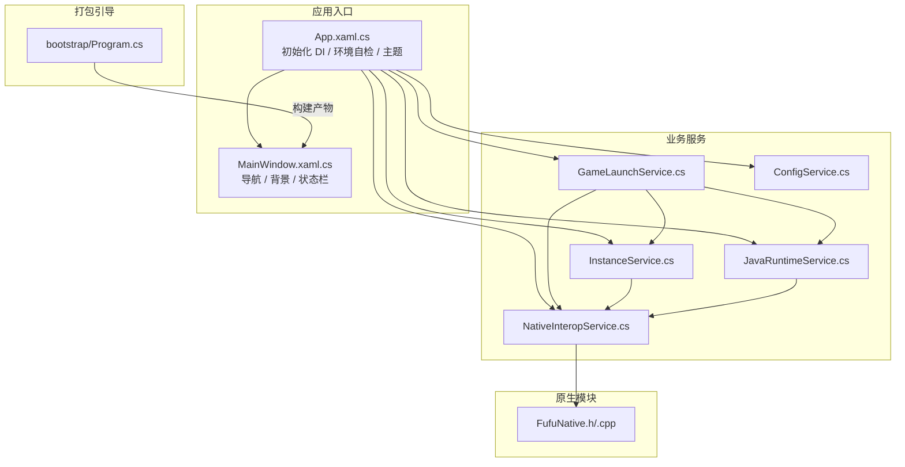
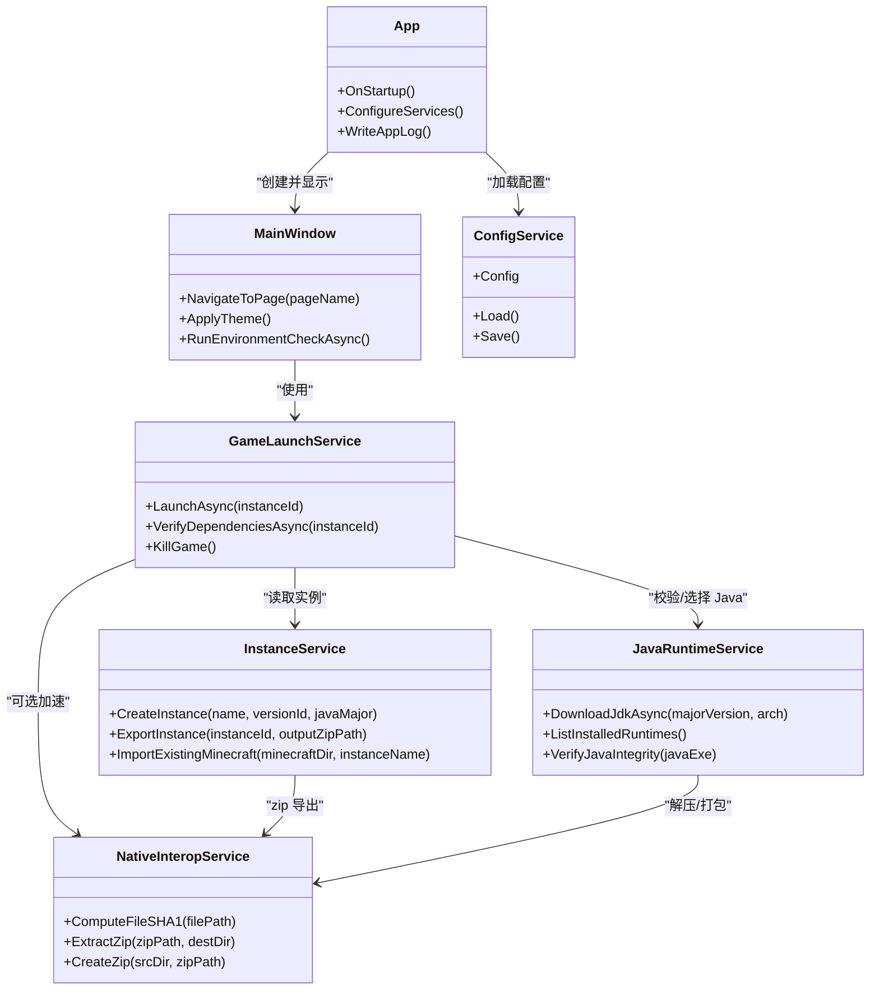
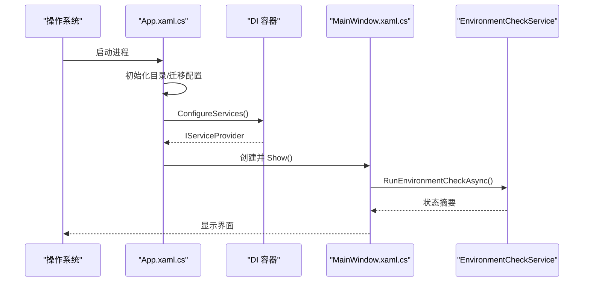
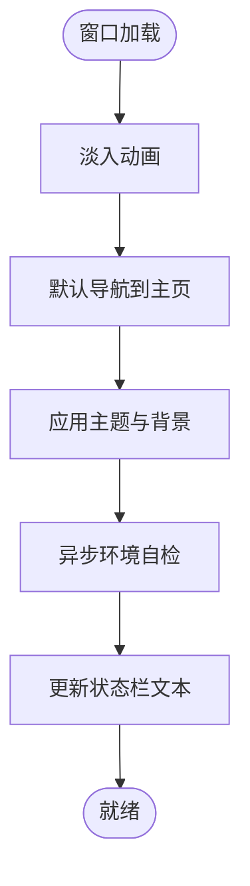
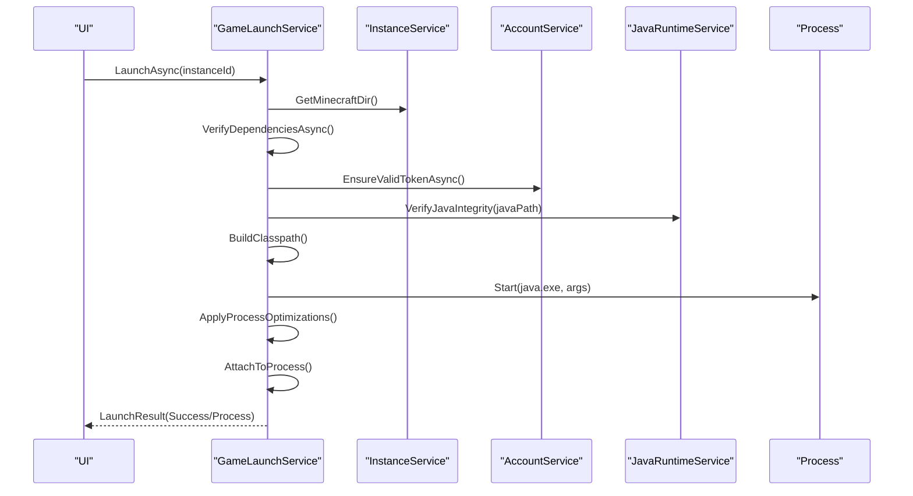
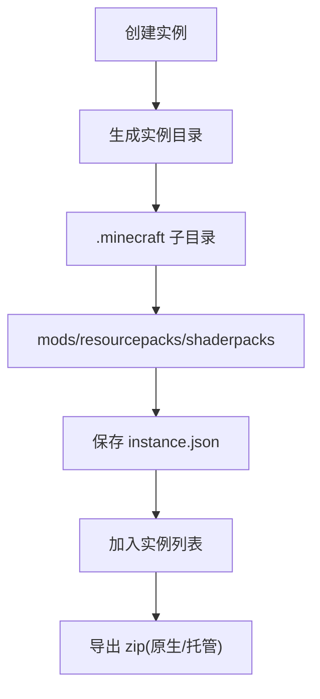
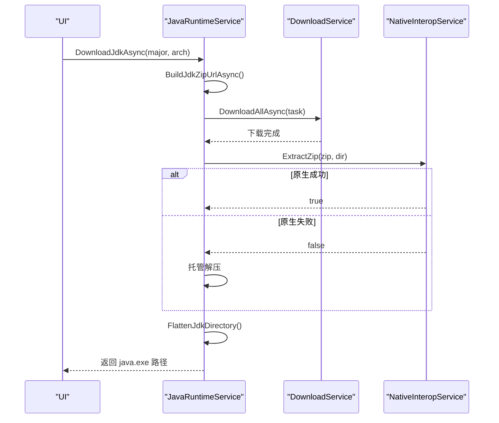
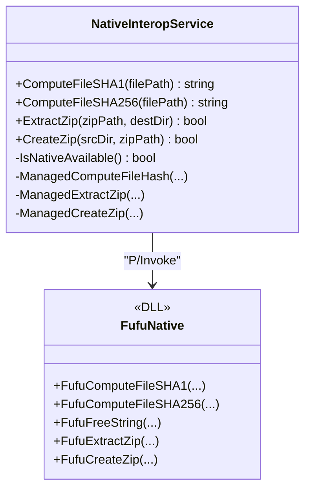
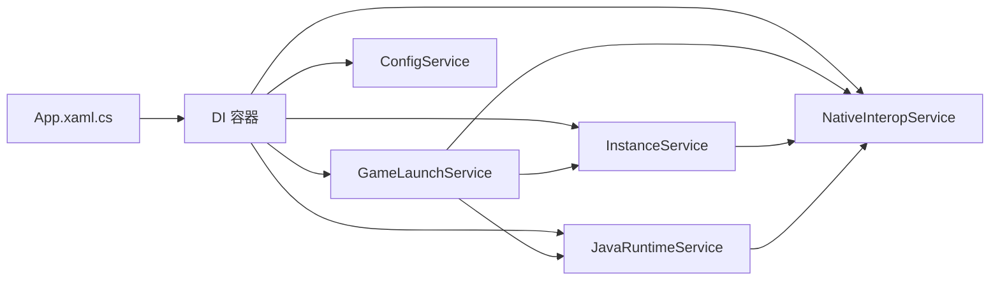

# 项目概述

<cite>
**本文引用的文件**   
- [README.md](file://README.md)
- [FufuLauncher.csproj](file://src/FufuLauncher/FufuLauncher.csproj)
- [Program.cs](file://bootstrap/Program.cs)
- [App.xaml.cs](file://src/FufuLauncher/App.xaml.cs)
- [MainWindow.xaml.cs](file://src/FufuLauncher/MainWindow.xaml.cs)
- [GameLaunchService.cs](file://src/FufuLauncher/Services/GameLaunchService.cs)
- [InstanceService.cs](file://src/FufuLauncher/Services/InstanceService.cs)
- [JavaRuntimeService.cs](file://src/FufuLauncher/Services/JavaRuntimeService.cs)
- [NativeInteropService.cs](file://src/FufuLauncher/Services/NativeInteropService.cs)
- [FufuNative.h](file://native/FufuNative/FufuNative.h)
- [FufuNative.cpp](file://native/FufuNative/FufuNative.cpp)
- [ConfigService.cs](file://src/FufuLauncher/Services/ConfigService.cs)
- [MainViewModel.cs](file://src/FufuLauncher/ViewModels/MainViewModel.cs)
</cite>

## 目录
1. [简介](#简介)
2. [项目结构](#项目结构)
3. [核心组件](#核心组件)
4. [架构总览](#架构总览)
5. [详细组件分析](#详细组件分析)
6. [依赖关系分析](#依赖关系分析)
7. [性能考量](#性能考量)
8. [故障排查指南](#故障排查指南)
9. [结论](#结论)
10. [附录：快速开始](#附录快速开始)

## 简介
可爱的芙芙是一个对标 PCL2 全部能力的 Minecraft Java 版启动器，采用 C# WPF (.NET 8) + C++ 原生 DLL 构建。项目提供多实例管理、模组支持、Java 运行时管理、资源包管理与存档管理等完整能力，并以 MVVM 模式与依赖注入服务化架构组织代码，兼顾易用性与可扩展性。

## 项目结构
- 解决方案与主程序
  - 解决方案根包含 VS2022 解决方案与打包引导程序
  - 主程序位于 src/FufuLauncher，基于 .NET 8 WPF
  - 原生模块位于 native/FufuNative，提供高性能哈希与 ZIP 能力
  - bootstrap/Program.cs 负责 Go 工具链安装与可执行文件打包
- 数据与配置
  - 运行期数据目录 appmcGAME（实例、Java 运行时、加载器）
  - 用户配置目录 Start/AppData/Roaming/FufuLauncher（配置、缓存、日志、账号）
- 页面与视图模型
  - Views 下为各功能页（主页、下载、Java 运行时、实例、账号、模组、存档、设置）
  - ViewModels 实现 MVVM 绑定逻辑，通过 DI 注入服务

图表来源
- [App.xaml.cs:82-176](file://src/FufuLauncher/App.xaml.cs#L82-L176)
- [MainWindow.xaml.cs:38-97](file://src/FufuLauncher/MainWindow.xaml.cs#L38-L97)
- [GameLaunchService.cs:104-316](file://src/FufuLauncher/Services/GameLaunchService.cs#L104-L316)
- [InstanceService.cs:72-116](file://src/FufuLauncher/Services/InstanceService.cs#L72-L116)
- [JavaRuntimeService.cs:199-277](file://src/FufuLauncher/Services/JavaRuntimeService.cs#L199-L277)
- [NativeInteropService.cs:84-119](file://src/FufuLauncher/Services/NativeInteropService.cs#L84-L119)
- [FufuNative.h:19-48](file://native/FufuNative/FufuNative.h#L19-L48)
- [FufuNative.cpp:28-75](file://native/FufuNative/FufuNative.cpp#L28-L75)
- [Program.cs:16-186](file://bootstrap/Program.cs#L16-L186)

章节来源
- [README.md:1-87](file://README.md#L1-L87)
- [FufuLauncher.csproj:1-49](file://src/FufuLauncher/FufuLauncher.csproj#L1-L49)

## 核心组件
- 应用生命周期与 DI 容器
  - App.xaml.cs 负责创建 ServiceCollection，注册所有服务、视图模型与页面，并启动主窗口与环境自检
- 主窗口与导航
  - MainWindow.xaml.cs 承载标题栏交互、页面切换动画、背景层控制与状态栏信息
- 游戏启动服务
  - GameLaunchService.cs 负责 classpath 拼接、JVM 参数组装、依赖校验、进程优先级与 CPU 亲和性、日志绑定与退出监控
- 实例管理
  - InstanceService.cs 维护多实例隔离目录结构，支持创建、复制、删除、导出 zip、导入已有 .minecraft
- Java 运行时管理
  - JavaRuntimeService.cs 支持多镜像源下载与安装 JDK，自动解析可用版本，解压后整理目录，探测元数据与完整性
- 原生互操作
  - NativeInteropService.cs 封装 P/Invoke 调用 FufuNative.dll，失败时回退到托管实现，保证无 DLL 也能运行
- 配置服务
  - ConfigService.cs 持久化用户设置，含主题、下载源、Java、JVM、分辨率、背景、登录、内存智能分配等

章节来源
- [App.xaml.cs:178-225](file://src/FufuLauncher/App.xaml.cs#L178-L225)
- [MainWindow.xaml.cs:99-186](file://src/FufuLauncher/MainWindow.xaml.cs#L99-L186)
- [GameLaunchService.cs:104-316](file://src/FufuLauncher/Services/GameLaunchService.cs#L104-L316)
- [InstanceService.cs:72-116](file://src/FufuLauncher/Services/InstanceService.cs#L72-L116)
- [JavaRuntimeService.cs:199-277](file://src/FufuLauncher/Services/JavaRuntimeService.cs#L199-L277)
- [NativeInteropService.cs:84-119](file://src/FufuLauncher/Services/NativeInteropService.cs#L84-L119)
- [ConfigService.cs:13-79](file://src/FufuLauncher/Services/ConfigService.cs#L13-L79)

## 架构总览
- 设计模式
  - MVVM：Views 仅负责展示与交互，ViewModels 持有状态与命令，通过 DataBinding 驱动 UI
  - 依赖注入：Microsoft.Extensions.DependencyInjection 统一注册单例服务与瞬态页面，解耦组件
  - 服务导向：每个业务域由独立 Service 封装，职责清晰，便于测试与扩展
- 分层与边界
  - UI 层：WPF 页面与主题
  - 视图模型层：MVVM 绑定与状态管理
  - 服务层：业务逻辑与外部系统交互
  - 原生层：C++ DLL 加速关键路径（哈希、ZIP），并提供托管 fallback
- 数据流
  - 用户操作 → ViewModel → Service → 原生/网络/文件系统 → 事件/回调 → UI 更新

图表来源
- [App.xaml.cs:178-225](file://src/FufuLauncher/App.xaml.cs#L178-L225)
- [MainWindow.xaml.cs:38-97](file://src/FufuLauncher/MainWindow.xaml.cs#L38-L97)
- [GameLaunchService.cs:104-316](file://src/FufuLauncher/Services/GameLaunchService.cs#L104-L316)
- [InstanceService.cs:193-238](file://src/FufuLauncher/Services/InstanceService.cs#L193-L238)
- [JavaRuntimeService.cs:199-277](file://src/FufuLauncher/Services/JavaRuntimeService.cs#L199-L277)
- [NativeInteropService.cs:84-119](file://src/FufuLauncher/Services/NativeInteropService.cs#L84-L119)
- [ConfigService.cs:94-146](file://src/FufuLauncher/Services/ConfigService.cs#L94-L146)

## 详细组件分析

### 应用启动与 DI 容器
- 启动流程
  - 初始化双数据目录（appmcGAME 与配置目录）
  - 迁移旧配置与日志
  - 构建 ServiceCollection，注册所有服务与页面
  - 启动内存监控、加载主题、显示主窗口
- 异常捕获
  - 全局未处理异常、Domain 异常、Task 未观察异常均记录日志并弹窗提示

图表来源
- [App.xaml.cs:82-176](file://src/FufuLauncher/App.xaml.cs#L82-L176)
- [MainWindow.xaml.cs:38-73](file://src/FufuLauncher/MainWindow.xaml.cs#L38-L73)

章节来源
- [App.xaml.cs:82-176](file://src/FufuLauncher/App.xaml.cs#L82-L176)

### 主窗口与页面导航
- 标题栏交互：拖动、最大化/最小化/关闭
- 页面切换：从 DI 获取 Page，释放旧页面资源，淡入+上滑动画
- 背景层：双层（底层图片 + 上层图片/视频），最小化暂停播放，关闭释放句柄

图表来源
- [MainWindow.xaml.cs:38-97](file://src/FufuLauncher/MainWindow.xaml.cs#L38-L97)

章节来源
- [MainWindow.xaml.cs:99-186](file://src/FufuLauncher/MainWindow.xaml.cs#L99-L186)

### 游戏启动服务
- 启动前校验：依赖文件、账号令牌、Java 完整性
- JVM 参数：Xms/Xmx、多核 GC 优化、额外参数、认证参数
- 进程优化：高优先级、CPU 亲和性
- 日志绑定与退出监控：累计游玩时间、清理资源

图表来源
- [GameLaunchService.cs:104-316](file://src/FufuLauncher/Services/GameLaunchService.cs#L104-L316)

章节来源
- [GameLaunchService.cs:104-316](file://src/FufuLauncher/Services/GameLaunchService.cs#L104-L316)

### 实例管理服务
- 目录结构：每个实例独立 .minecraft、mods、resourcepacks、shaderpacks、options、instance.json
- 操作：重命名、复制、删除、导出 zip、导入已有 .minecraft
- 与原生模块协作：导出 zip 优先使用 C++ 实现，失败回退

图表来源
- [InstanceService.cs:94-116](file://src/FufuLauncher/Services/InstanceService.cs#L94-L116)
- [InstanceService.cs:193-238](file://src/FufuLauncher/Services/InstanceService.cs#L193-L238)

章节来源
- [InstanceService.cs:72-116](file://src/FufuLauncher/Services/InstanceService.cs#L72-L116)

### Java 运行时管理
- 镜像源：官方 Adoptium API、华为云 OpenJDK
- 下载与解压：分片下载、原生解压优先、失败回退托管
- 元数据探测：java -version 解析主版本、架构、厂商
- 完整性校验：文件存在且可执行

图表来源
- [JavaRuntimeService.cs:199-277](file://src/FufuLauncher/Services/JavaRuntimeService.cs#L199-L277)
- [JavaRuntimeService.cs:279-335](file://src/FufuLauncher/Services/JavaRuntimeService.cs#L279-L335)
- [NativeInteropService.cs:84-119](file://src/FufuLauncher/Services/NativeInteropService.cs#L84-L119)

章节来源
- [JavaRuntimeService.cs:199-277](file://src/FufuLauncher/Services/JavaRuntimeService.cs#L199-L277)

### 原生互操作服务
- 策略：优先调用 C++ DLL，失败自动回退到托管实现
- 功能：SHA1/SHA256 计算、ZIP 解压与打包
- 内存管理：C++ 分配的字符串由 C# 释放

图表来源
- [NativeInteropService.cs:20-119](file://src/FufuLauncher/Services/NativeInteropService.cs#L20-L119)
- [FufuNative.h:19-48](file://native/FufuNative/FufuNative.h#L19-L48)
- [FufuNative.cpp:28-75](file://native/FufuNative/FufuNative.cpp#L28-L75)

章节来源
- [NativeInteropService.cs:84-119](file://src/FufuLauncher/Services/NativeInteropService.cs#L84-L119)

### 配置服务
- 配置项：主题、下载源、Java 路径/版本、JVM 参数、分辨率、背景、登录、内存智能分配、视频背景等
- 迁移：兼容旧配置字段，自动转换为双层背景结构

章节来源
- [ConfigService.cs:13-79](file://src/FufuLauncher/Services/ConfigService.cs#L13-L79)

### 打包引导程序
- 功能：检测/安装 Go 工具链、安装 goversioninfo、生成 resource.syso、编译 Go 启动器、验证嵌入的版权与版本信息
- 网络诊断：打印代理与环境变量，便于排查

章节来源
- [Program.cs:16-186](file://bootstrap/Program.cs#L16-L186)

## 依赖关系分析
- 组件耦合
  - GameLaunchService 强依赖 InstanceService、JavaRuntimeService、AccountService、ConfigService、MemoryMonitorService
  - InstanceService 依赖 NativeInteropService（zip 导出）
  - JavaRuntimeService 依赖 DownloadService、NativeInteropService
  - App 集中注册所有服务，降低横向耦合
- 外部依赖
  - Microsoft.Extensions.DependencyInjection 用于 DI
  - C++ 原生 DLL 作为可选加速路径
  - .NET 8 Desktop Runtime 为运行时要求

图表来源
- [App.xaml.cs:178-225](file://src/FufuLauncher/App.xaml.cs#L178-L225)
- [GameLaunchService.cs:48-65](file://src/FufuLauncher/Services/GameLaunchService.cs#L48-L65)
- [InstanceService.cs:66-70](file://src/FufuLauncher/Services/InstanceService.cs#L66-L70)
- [JavaRuntimeService.cs:76-84](file://src/FufuLauncher/Services/JavaRuntimeService.cs#L76-L84)
- [NativeInteropService.cs:20-25](file://src/FufuLauncher/Services/NativeInteropService.cs#L20-L25)
- [ConfigService.cs:81-92](file://src/FufuLauncher/Services/ConfigService.cs#L81-L92)

章节来源
- [FufuLauncher.csproj:44-46](file://src/FufuLauncher/FufuLauncher.csproj#L44-L46)

## 性能考量
- 原生加速：哈希与 ZIP 优先使用 C++ 实现，失败回退托管，平衡性能与兼容性
- 日志写入：应用日志采用队列缓冲与定时器批量落盘，避免高频 IO 阻塞 UI
- 进程优化：可选高优先级与 CPU 亲和性，减少调度延迟
- 内存智能分配：根据系统内存动态计算 Xmx/Xms，避免低配机器溢出或不足
- 背景媒体：最小化时暂停视频播放，降低 GPU/CPU 占用

[本节为通用指导，不直接分析具体文件]

## 故障排查指南
- Windows 智能应用控制拦截
  - 现象：exe 被 SmartScreen 拦截
  - 解决：PowerShell 管理员执行 Unblock-File 或在属性中解除锁定
- Java 运行时缺失或损坏
  - 现象：启动时报错或立即崩溃
  - 解决：前往【Java 运行时】页面下载对应版本；检查完整性校验结果
- 依赖文件缺失
  - 现象：启动前校验失败
  - 解决：重新下载客户端与库文件，确保 libraries 目录完整
- 日志查看
  - 位置：Start/AppData/Roaming/FufuLauncher/app.log
  - 方法：启动器内查看或手动打开文件

章节来源
- [README.md:55-83](file://README.md#L55-L83)
- [GameLaunchService.cs:104-177](file://src/FufuLauncher/Services/GameLaunchService.cs#L104-L177)
- [JavaRuntimeService.cs:482-510](file://src/FufuLauncher/Services/JavaRuntimeService.cs#L482-L510)

## 结论
可爱的芙芙以 MVVM 与服务化架构为核心，结合 C# WPF 与 C++ 原生模块，提供了完整的 Minecraft Java 版启动体验。其多实例隔离、Java 运行时管理、模组与资源包支持、存档管理以及性能优化策略，使其成为对标 PCL2 的全功能启动器。通过清晰的依赖注入与模块化设计，项目在易用性与可扩展性之间取得良好平衡。

[本节为总结，不直接分析具体文件]

## 附录：快速开始
- 环境要求
  - IDE：Visual Studio 2022 (17.8+)
  - .NET：.NET 8 Desktop Runtime + SDK
  - C++：桌面开发组件 (v143 工具集)
  - Windows SDK：10.0 (19041+)
  - 操作系统：Windows 10 64位 / Windows 11
- 安装步骤
  - 在 VS2022 中勾选“.NET 桌面开发”与“使用 C++ 的桌面开发”
  - 打开 FufuLauncher.sln，选择 Release | x64，重新生成解决方案
  - 输出路径：src\FufuLauncher\bin\Release\net8.0-windows\FufuLauncher.exe
- 基本使用方法
  - 首次运行：按提示安装 .NET 8 Desktop Runtime
  - 创建实例：选择版本与 Java 主版本，自动生成目录结构
  - 下载 Java：在【Java 运行时】页面选择镜像源并下载
  - 启动游戏：选择实例与账号，点击启动，查看日志与状态
  - 管理模组与资源包：在对应页面添加/启用/禁用
  - 备份与导入：导出实例为 zip，或导入已有 .minecraft

章节来源
- [README.md:11-33](file://README.md#L11-L33)
- [App.xaml.cs:92-129](file://src/FufuLauncher/App.xaml.cs#L92-L129)
- [JavaRuntimeService.cs:199-277](file://src/FufuLauncher/Services/JavaRuntimeService.cs#L199-L277)
- [InstanceService.cs:94-116](file://src/FufuLauncher/Services/InstanceService.cs#L94-L116)